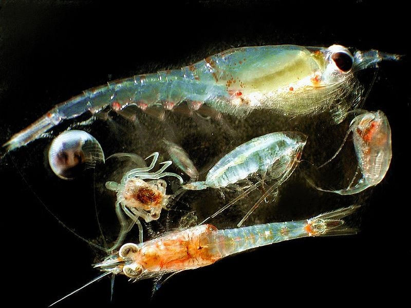
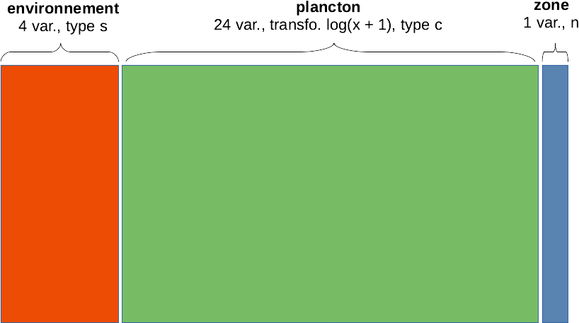

# AFM, biodiversité et Open Data {#afm}

```{r setup, include=FALSE, echo=FALSE, message=FALSE, results='hide'}
SciViews::R
```

##### Objectifs {.unnumbered}

-   Être capable d'analyser des données présentes dans des tableaux multiples et/ou hétérogènes simultanément à l'aide de l'analyse factorielle multiple

-   Comprendre et pouvoir utiliser en pratique les principaux indices de biodiversité

-   Se sensibiliser aux données ouvertes : quand et pourquoi rendre ses données ouvertes ? Comment le faire correctement (format, métadonnées, dictionnaire des données, licences, principe FAIR, DMP, ...)

##### Prérequis {.unnumbered}

-   Les modules 5, 6 et 7 doivent être assimilés avant d'attaquer le présent module.

## Analyse factorielle multiple (AFM)

Jusqu'ici nous avons étudié différentes techniques pour explorer des données multivariées *soit* quantitatives (ACP), *soit* qualitatives (AFC). Nous n'avons pas abordé encore la question de données *mixtes* avec des tableaux qui contiennent *à la fois* des variables quantitatives et des données qualitatives.

Une première approche consiste à convertir des variables afin d'homogénéiser le tableau. La conversion ne peut se faire qu'en dégradant l'information, soit dans le sens quantitatif continu -\> quantitatif discret -\> qualitatif ordonné -\> qualitatif non ordonné -\> binaire. Ainsi, dans un tableau contenant quelques variables quantitatives, nous pouvons créer des classes pour convertir les variables quantitatives en qualitatives. C'est par exemple ce que nous faisons quand nous remplaçons les indices de masse corporelle IMC dans nos données de biométrie humaine (quantitatif) en classes (tableau des classes proposées par l'OMS[^08-afm-1]).

[^08-afm-1]: OMS = Organisation Mondiale de la Santé, voir [ici](https://apps.who.int/bmi/index.jsp?introPage=intro_3.html).

| IMC [kg/m^2^] | Classification OMS |
|:-------------:|:-------------------|
|    \< 16,5    | sous-poids sévère  |
|    16 - 17    | sous-poids modéré  |
|   17 - 18,5   | sous-poids léger   |
|   18.5 - 25   | normal             |
|    25 - 30    | préobésité         |
|    30 - 35    | obésité classe I   |
|    35 - 40    | obésité classe II  |
|     \> 40     | obésité classe III |

A l'extrême, il est toujours possible d'encoder n'importe quelle variable sous forme binaire. C'est ce qu'on appelle le **codage disjonctif complet** (voir, par exemple, [ici](https://mtes-mct.github.io/parcours_r_module_analyse_multi_dimensionnelles/lacm.html)). Cette approche a non seulement l'avantage de transformer des variables différentes en 0 ou 1 dans un tableau homogène, mais permet aussi de comparer plus de deux variables qualitatives selon une extension de l'AFC dit **Analyse en Composantes Multiples** ou ACM que nous ne verrons pas dans ce cours mais qu'il est important de mentionner pour mémo ici[^08-afm-2].

[^08-afm-2]: Si vous êtes intéressé par l'ACM et le codage disjonctif complet, voyez [cette vidéo](https://www.youtube.com/watch?v=bihScz3OXbw).

L'analyse factorielle multiple (AFM, *multiple factorial analysis* ou MFA en anglais) va permettre d'analyser simultanément plusieurs tableaux de données multivariés, et éventuellement mélanger des tableaux quantitatifs et qualitatifs (pour autant que les variables soient homogènes au sein de chaque tableau).

### AFM dans SciViews::R

L'AFM n'est pas encore intégrée dans `SciViews::R`. Le code suivant permet de réaliser notre analyse via l'interface habituelle, soit `mfa(data = ...., formula)` pour construire l'analyse (calculs en internes basés sur `FactoMineR::MFA()`), et ensuite nous utiliserons `summary()` et `chart$type()` pour les graphiques, où `type` pourra être `screeplot`, `altscreeplot`, `loadings`, `scores`, `groups`, `axes`, `frequences` ou `ellipses` (nous verrons plus loin ce que représentent tous ces graphiques). Vous pouvez copier-coller le code du chunk suivant au début de vos scripts ou dans un chunk de vos documents R Markdown/Notebook pour l'utiliser (cliquez sur "voir le code" pour le dérouler).

```{r, class.source='hidden-code'}
# Code mfa() version 2
SciViews::R()

mfa <- function(data, formula, nd = 5, suprow = NA, ..., graph = FALSE) {
  # TODO: rework Call in the final MFA object
  if (is.na(suprow)) suprow <- NULL # MFA uses NULL instead of NA!
  if (!rlang::is_formula(formula))
    stop("'formula' must be a formula object")
  if (!is.null(rlang::f_lhs(formula)))
    stop("'formula cannot have left-hand side (must be ~ n1 * type...")
  params <- get_groups(list(expr = rlang::f_rhs(formula)))
  
  # data must be a data frame
  if (!inherits(data, "data.frame"))
    stop("'data' must be a data.frame")
  data <- as.data.frame(data) # No tibble or data.table!
  # Number of columns in  data must match specifications in the formula
  if (ncol(data) != sum(params$groups))
    stop("You must specify groups in 'formula' for all the columns in 'data'")
  
  # Call FactoMineR::MFA() with corresponding arguments
  FactoMineR::MFA(base = data, group = params$groups, type = params$types,
    ind.sup = suprow, ncp = nd, name.group = params$names,
    num.group.sup = params$suppl, ..., graph = graph)
}

# x is a list with: expr, groups, types, names, suppl
# Note: this is a mess, I need to clean up this code!
get_groups <- function(x) {
  items <- as.list(x$expr)
  # We should have here '+', '-' or something else in case of last expression
  if (items[[1]] == "+") {
    x$suppl <- c(FALSE, x$suppl) # Not a supplementary variable
    x$expr <- items[[2]] # Second item is next expression
    # Third item is the information for that group
    # (n, or n * type, or n * type %as% name)
    item <- as.list(items[[3]])
  } else if (items[[1]] == "-") {
    x$suppl <- c(TRUE, x$suppl) # A supplementary variable
    x$expr <- items[[2]] # Second item is next expression
    # Third item is the information for that group
    # (n, or n * type, or n * type %as% name)
    item <- as.list(items[[3]])
  } else {
    # Last expression
    x$expr <- NULL
    item <- items
  }
  if (length(item) < 3) { # either n, or +n or -n
    if (length(item) == 2) {
      x$suppl <- switch(as.character(item[[1]]),
        "-" = c(TRUE, x$suppl),
        "+" = c(FALSE, x$suppl),
        stop("Bad 'formula', see help"))
      n <- item[[2]]
    } else n <- item[[1]]
    if (!is.numeric(n)) 
      stop("Bad 'formula', see help")
    x$groups <- c(as.integer(n, x$groups))
    x$types <- c("s", x$types)
    x$names <- c(NA, x$names)
  } else if (item[[1]] == "*") { # n * type or n * type %as% name
    if (length(item[[2]]) > 2)
      stop("Bad 'formula', see help")
    if (length(item[[2]]) == 2) {
      x$suppl <- switch(as.character(item[[2]][[1]]),
        "-" = c(TRUE, x$suppl),
        "+" = c(FALSE, x$suppl),
        stop("Bad 'formula', see help"))
      n <- item[[2]][[2]]
    } else n <- item[[2]]
    if (!is.numeric(n))
      stop("Bad 'formula', see help")
    x$groups <- c(as.integer(n), x$groups)
    # Right-hand side after '*': type or type %as% name
    subitem <- as.list(item[[3]])
    if (subitem[[1]] == "%as%") { # type %as name
      x$types <- c(as.character(subitem[[2]]), x$types)
      x$names <- c(as.character(subitem[[3]]), x$names)
    } else if (length(subitem) == 1 && is.name(subitem[[1]])) { # type only
      x$types <- c(as.character(subitem[[1]]), x$types)
      x$names <- c(NA, x$names)
    } else stop("Bad 'formula', see help") # Error
  } else if (item[[1]] == "%as%") { # n %as% name
    if (length(item[[2]]) == 2) {
      x$suppl <- switch(as.character(item[[2]][[1]]),
        "-" = c(TRUE, x$suppl),
        "+" = c(FALSE, x$suppl),
        stop("Bad 'formula', see help"))
      n <- item[[2]][[2]]
    } else n <- item[[2]]
    if (!is.numeric(n))
      stop("Bad 'formula', see help")
    x$groups <- c(as.integer(n), x$groups)
    x$types <- c("s", x$types) # type by default (s)
    x$names <- c(as.character(item[[3]]), x$names)
  } else stop("Bad 'formula', see help") # Error
  # Is there another expression to evaluate?
  if (!is.null(x$expr)) {
    x <- get_groups(x)
  } else {
    # Get correct vector for suppl
    if (length(x$suppl) < length(x$groups))
      x$suppl <- c(FALSE, x$suppl)
    # We need the group indices for the supplementary variables instead
    x$suppl <- (1:length(x$groups))[x$suppl]
    if (!length(x$suppl)) x$suppl <- NULL
    # Fix names
    def_names <- paste("group", 1:length(x$groups), sep = ".")
    names <- x$names
    names[is.na(names)] <- def_names[is.na(names)]
    x$names <- names
  }
  x
}
#form <- ~ -4 %as% Environnement -24*f %as% Plancton +1*f +18
#get_groups(list(expr = rlang::f_rhs(form)))

# TODO: methods for broom...

autoplot.MFA <- function(object,
type = c("screeplot", "altscreeplot", "loadings", "scores", "groups", "axes", "frequences", "ellipses"),
choices = 1L:2L, name = deparse(substitute(object)), col = "black",
fill = "gray", title, ..., env) {
  type = match.arg(type)

  if (missing(title))
    title <- paste(name, type, sep = " - ")

  res <- switch(type,
    screeplot = object %>.% # Classical screeplot
      tibble::tibble(eig = .$eig[, 1], PC = 1:nrow(.$eig)) %>.%
      chart(data = ., eig ~ PC) +
      geom_col(col = col, fill = fill) +
      labs(y = "Eigenvalues", title = title),

    altscreeplot = object %>.% # screeplot represented by dots and lines
      tibble::tibble(eig = .$eig[, 1], PC = 1:nrow(.$eig)) %>.%
      chart(data = ., eig ~ PC) +
      geom_line(col = col) +
      geom_point(col = "white", fill = col, size = 2, shape = 21, stroke = 3) +
      labs(y = "Eigenvalues", title = title),

    loadings = object %>.% # Plots of the variables
      plot(., axes = choices, choix = "var", title = title, ...),

    scores = object %>.% # Plot of the individuals
      plot(., axes = choices, choix = "ind", title = title, ...),

    groups = object %>.% # Plot of the groups
      plot(., axes = choices, choix = "group", title = title, ...),
    
    axes = object %>.% # Plot of the loadings for the various groups
      plot(., axes = choices, choix = "axes", title = title, ...),
    
    frequences = object %>.% # Plot of the correpondance analyses
      plot(., axes = choices, choix = "freq", title = title, ...),
    
    ellipses = object %>.% # Plot of the individuals with ellipses
      FactoMineR::plotellipses(., axes = choices, title = title, ...),

    stop("Unrecognized type, must be 'screeplot', 'altscreeplot',
      'loadings', 'scores', 'groups', 'axes', 'frequences', or 'ellipses'")
  )
  if (inherits(res, "ggplot")) {
    res
  } else {
    invisible(res)
  }
}

chart.MFA <- function(data, choices = 1L:2L, name = deparse(substitute(data)),
..., type = NULL, env = parent.frame())
  autoplot.MFA(data, choices = choices, name = name, ..., type = type, env = env)
class(chart.MFA) <- c("function", "subsettable_type")
```

Nous allons aborder cette technique puissante mais un peu plus complexe qu'est l'AFM sur la base d'un jeu de données que nous connaissons bien maintenant via nos exercices précédents : la communauté de plancton le long d'un transect entre Nice et la Corse.

### Plancton en Méditerranée

Les jeux de données `marphy` et `marbio` dans le package R {pastecs} présentent deux tableaux de données complémentaires. Le premier, `marphy` reprend les mesures environnementales de base (température, salinité et densité des masses d'eaux), ainsi qu'une information indirecte sur la concentration en phytoplancton : la fluorescence de la chlorophylle. Le second tableau `marbio` reprend les effectifs observés dans 24 groupes de zooplancton mesurés sur des échantillons issus des mêmes stations que `marphy`. Ces stations sont réparties de manière équidistante le long d'un transect entre le continent (vers Nice, station n°1) et la Corse (à Calvi, station n°68).



Jusqu'à présent, nous avions utilisé ces deux tableaux séparément. Notre objectif ici est de les analyser ensemble. Nous allons commencer par considérer ces deux tableaux comme **quantitatifs**. Dans ce cas, l'AFM réalisera deux ACP, une par tableau. Ensuite, elle pondérera les données de chacun en fonction de la part de variance sur le premier axe respectif. Pour finir, elle réalisera une ACP globale avec toutes les données qui conservera la structure de chacun des deux tableaux initiaux grâce à la pondération appliquée en interne.

Les données environnementales dans `marphy` étant mesurées dans des unités différentes, nous les standardiserons. Concernant le plancton dans `marbio`, nous allons pondérer les espèces rares par rapport aux espèces abondantes en transformant $log(x + 1)$ les abondances observées avec la fonction `log1p()`. Enfin, nous rajouterons les différentes masses d'eaux identifiées par ailleurs (voir l'aide `?pastecs::marphy`) dans `marzones` que nous utiliserons comme troisième tableau de **variables supplémentaires** (un tableau que nous n'utilisons *pas* dans l'analyse, mais que nous représenterons dans les graphiques afin d'aider à leur interprétation). Voici donc la constitution d'un gros tableau qui reprend toutes les données dans la variable `mar` :

```{r}
marzones <- factor(c(
  rep("périphérique", 16),
  rep("divergente1", 8),
  rep("convergente", 5),
  rep("frontale", 11),
  rep("divergente2", 5),
  rep("centrale", 23)),
  levels = c("périphérique", "divergente1", "convergente",
    "frontale", "divergente2", "centrale"))

bind_cols(
  read("marphy", package = "pastecs"),
  log1p(read("marbio", package = "pastecs"))) %>.%
  mutate(., Zone = marzones) %->%
  mar
```

Ce tableau n'a aucunes valeurs manquantes et il contient 29 variables :

```{r}
names(mar)
```

Il y a trois groupes distincts :

-   les 4 premières colonnes comme variables quantitatives continues pour l'**environnement**,
-   les 24 colonnes suivantes comme quantitatives pour le **plancton**,
-   la dernière colonne qui caractérise les masses d'eaux (**zone**) comme variable qualitative supplémentaire.



Avant de pouvoir réaliser notre AFM, nous devons comprendre comment écrire la formule qui va décrire nos données. Pour chaque groupe, nous ajouterons un terme à la formule qui contient trois composante :

1.  Le nombre `n` de colonnes constituant le groupe (les colonnes du tableau composite sont comptées de gauche à droite),
2.  Le `type` de variable considérée. Quatre types sont possibles. Les variables continues à standardiser avant d'être utilisées dans une ACP sont de type **s**. Les variables quantitative également à utiliser selon l'ACP mais *sans* standardisation sont de type **c**. Les données qualitatives assimilables à un tableau de contingence à double entrée (données de fréquences d'observations, dénombrements, etc.) sont de type **f** et seront traitées comme une AFC, et enfin, les variables qualitatives classiques sont de type **n** et seront traitées selon une analyse factorielle multiple AFM.
3.  Le `nom` que l'on veut donner à chaque groupe de variables pour l'identifier dans l'analyse.

Un groupe est décrit dans la formule comme `n * type %as% nom` (donc avec les opérateurs `*` et `%as%`). Chaque groupe inclus dans l'analyse est précédé d'un signe plus `+` (le premier plus peut être omis de la formule). Les groupes supplémentaires (à soustraire à l'analyse) sont précédés d'un signe moins `-`. Et enfin, tous les groupes sont décrits à la droite de la formule, donc, après le `~`.

##### À vous de jouer ! {.unnumbered}

`r h5p(120, height = 270, toc = "Formule de l'AFM")`

Dans notre cas concret ici, cela donne :

    ~ 4*s %as% environnement + 24*c %as% plancton - 1*n %as% zone

L'analyse se fait en appelant `mfa(data = ...., formula)`. Nous assignons le résultat du calcul à `mar_mfa` :

```{r}
mar_mfa <- mfa(data = mar,
  ~ 4*s %as% environment + 24*c %as% plancton - 1*n %as% zone)
```

Le résumé de l'analyse renvoyé par `summary()` donne beaucoup d'information.

```{r}
summary(mar_mfa)
```

Ne nous intéressons pour l'instant qu'au tableau `Eignenvalues` qui reprend les valeurs propres, c'est-à-dire, la part de variance sur les axes de l'ACP globale réalisée. Nous voyons qu'une variance cumulée de 74% (`Cumulative % of var.`) est représentée sur les deux premiers axes `Dim.1` et `Dim.2`. Le graphe des éboulis nous représente la partition de la variance sur les différents axes comme pour l'ACP :

```{r}
chart$scree(mar_mfa, fill = "cornsilk")
```

Ici, on voit très clairement que deux axes suffisent. La suite de l'analyse se fait à peu près comme une ACP, mais des données et graphes supplémentaires nous permet d'interpréter les groupes de variables les uns par rapport aux autres. Le graphique des variables s'obtient comme pour l'ACP avec `chart$loadings()`. Il est ici plus encombré car nous avons 28 variables. La direction des différents vecteurs par rapport aux dimensions de l'AFM et entre eux nous indique la corrélation directe (même sens), inverse (opposition), ou l'absence de corrélation (vecteurs orthogonaux). Ce graphique permet aussi d'orienter le plan de l'AFM pour nos graphiques ultérieurs.

```{r}
chart$loadings(mar_mfa, choices = c(1, 2))
```

Toutes les variables environnementales sont très bien représentées dans le premier plan de l'AFM (normes quasiment de un). Nous observons une corrélation inverse entre la température (en bas à gauche du premier plan de l'AFM) et la fluorescence (qui pointe en haut à droite du plan). La salinité et la densité sont corrélées positivement entre elles, mais ne le sont pas avec les deux autres variables environnementales. Les salinités et densités élevées sont en bas à droite sur le plan de l'AFM.

Pour le plancton, nous avons pas mal de choses car plusieurs vecteurs ont une norme importante (nous ignorons les autres, trop mal représentés dans le premier plan de l'AFM). Il faut pointer l'opposition entre des groupes comme GasteropodsLarvae, EchinodermLarvae, Cladocerans et Pteropods qui pointent vers la gauche, et les copépodes (Calanus, Clausocalanus, CopepoditsX, etc.) qui pointent vers la droite. Le découpage selon le second axe pour le plancton est moins net.

D'autre part, les variables environnementales pour lesquelles deux dimensions fortes se dégagent sont placées en oblique par rapport à la dimension forte du plancton sur Dim 1. cela signifie que les deux dimensions environnementales sont partiellement corrélées avec la présence de ces groupes planctoniques.

L'AFM est en fait un compromis réalisé entre des analyses indépendantes faites sur chaque groupe. Le graphique suivant montre comment ce compromis a été construit :

```{r}
chart$axes(mar_mfa, choices = c(1, 2))
```

Ce graphique est similaire au précédent, si ce n'est qu'au lieu de projeter les variables initiales dans le plan de l'AFM, il projette les composantes principales des différentes ACP séparées dans ce même plan. Il montre comment un *compromis* entre les différentes ACP est réalisé dans l'AFM globale. Ici, nous voyons que ce compromis est relativement proche de l'ACP plancton (Dim.1 et Dim.2 plancton en vert pointant dans la même direction que les axes de l'AFM). Nous voyons aussi que les deux premières dimensions de l'ACP environnement (Dim.1 et Dim.2 environnement en rouge) pointent en oblique par rapport à ces mêmes axes. La variable supplémentaire zone est également projetée, mais elle est moins corrélée avec les autres axes (sauf sa Dim. 5 avec l'axe 1).

Tout comme pour l'ACP, nous pouvons maintenant interpréter le graphique dans l'espace des individus, normalement avec `chart$scores()`.

```{r}
chart$scores(mar_mfa, choices = c(1, 2))
```

Cependant, nous pouvons aussi profiter de la variable supplémentaire zone pour colorer les points en fonction des masses d'eaux et représenter des ellipses pour chaque masse d'eau sur le graphique. La variante avec ces ellipses se réalise avec `chart$ellipses()` et il est plus clair dans pareil cas.

```{r}
chart$ellipses(mar_mfa, choices = c(1, 2), keepvar = "Zone")
```

Les différentes zones sont bien individualisées, à l'exception de :

-   Certaines stations en bordure de zones (par exemple, la 16 est dans la zone de convergence1 sur le graphique alors qu'elle est libellée comme zone périphérique). La dynamique des masses d'eaux est complexe autour d'une zone frontale comme ici. Il y a des turbulences, et les frontières ne sont toujours très nettes. Ce graphique propose clairement un découpage légèrement différent... intéressant !

-   La zone de divergence2 n'est pas fondamentalement différente de la zone centrale.

Notez qu'on a une progression le long du transect de la gauche (Nice) vers le centre, puis vers le haut à droite (le front) et puis vers le bas à droite (Calvi).

Si on interprète ce graphique des individus en fonction de l'orientation donnée sur base des variables, on peut dire que :

-   Nice (zone périphérique) s'individualise très fort du reste, et c'est le plancton qui explique essentiellement cette différence avec les groupes identifiés tirant vers la gauche (GasteropodsLarvae, EchinodermLarvae, Cladocerans et Pteropods). Nice est aussi à une température et fluorescence moyenne.

-   Toutes les autres zones sont caractérisées par une communauté planctonique différente de Nice, mais homogène, avec la zone divergente1 qui est logiquement intermédiaire (zone de mélange des masses d'eaux périphérique et frontale).

-   La zone frontale est caractérisée par la température la plus basse et la fluorescence la plus élevée alors que la salinité est moyenne. C'est logique : on a une remontée d'eaux froides des profondeurs riches en nutriments que le phytoplancton utilise (fluorescence élevée signifie phytoplancton élevé).

-   La zone centrale en Corse à Calvi est caractérisée par la salinité la plus élevée, une température élevée et une fluorescence basse, caractéristiques d'une zone oligothrophe. Comme nous l'avons déjà noté, la communauté planctonique est similaire à ce qu'on rencontre au large au milieu du transect, et elle tranche sensiblement avec celle rencontrée du côté niçois.

Revenons sur la façon dans l'AFM est construite (le fameux "compromis"), et son interprétation par rapport aux masses d'eaux. Le graphique suivant montre les relations entre les groupes.

```{r}
chart$groups(mar_mfa, choices = c(1, 2))
```

Ce graphique représente les groupes proches des axes dont ils sont responsables dans la structure générale de l'AFM. Nous voyons ici plancton proche de l'axe 1. Part contre, environnement est bien représenté (car il est loin du centre), mais est entre l'axe 1 et l'axes 2. Nous avons déjà noté cela précédemment.

La variable supplémentaire zone est aussi représentée à proximité de la structure qui lui correspond le mieux. Nous voyons que zone est plus proche d'environnement, ce qui signifie que les masses d'eau sont plutôt structurées en rapport avec les variables environnementales qu'en rapport avec les communautés planctoniques.

### AFM avec données mixtes

Jusqu'ici, nous avons réalisé une AFM avec uniquement des données quantitatives, mais l'AFM peut aussi traiter des données qualitatives, sous forme de tableaux de contingence à double entrée, ou sous forme de variables facteurs. Nous allons tester cette variante sans sortir de notre exemple du plancton méditerranéen. En effet, le tableau plancton peut *aussi* être considéré comme un tableau de contingence à double entrée. Il nous suffit de changer le type de **c** à **f** (pour l'analyse des fréquences) dans la formule pour traiter à présent le plancton sous la forme d'une AFC dans `mar_mfa2` :

```{r}
mar_mfa2 <- mfa(data = mar,
  ~ 4*s %as% environment + 24*f %as% plancton - 1*n %as% zone)
```

Rappelons-nous que l'AFC se ramène à une étape de son analyse à une ACP. C'est comme cela qu'il est possible de l'introduire dans l'AFM : à partir de l'étape ACP, les pondérations sont calculées et ajustées, et ensuite, une ACP globale est réalisée en la mélangeant avec les autres ACP.

Au lieu d'imprimer tout à l'aide de `summary()`, si nous souhaitons seulement les premières valeurs propres, nous pouvons aussi les extraire de l'objet comme ceci :

```{r}
head(mar_mfa2$eig)
```

Ici, les deux premiers axes comptent pour 74,6% de variance cumulée. Le graphe des éboulis confirme que deux axes suffisent :

```{r}
chart$scree(mar_mfa2, fill = "cornsilk")
```

Le graphique des variables ne montre plus que celles relatives à l'ACP, donc seulement le groupe environnement. Les conclusions à leur sujet sont les mêmes, mais attention, le premier plan de la nouvelle AFM se présente en miroir haut-bas par rapport à notre première analyse[^08-afm-3].

[^08-afm-3]: Les ACP sont définies au signe près. or une inversion de signe dans une dimension a pour effet de faire apparaître les graphiques en miroir.

```{r}
chart$loadings(mar_mfa2, choices = c(1, 2))
```

```{r}
chart$axes(mar_mfa2, choices = c(1, 2))
```

Les conclusions sont similaires sur les axes. Voyons maintenant l'espace des individus, toujours avec les couleurs et les ellipses par zones :

```{r}
chart$ellipses(mar_mfa2, choices = c(1, 2), keepvar = "Zone")
```

Encore une fois ici, le résultat est sensiblement le même (gardez à l'esprit que ce graphique est la visualisation en miroir haut-bas par rapport à l'analyse précédente).

Les groupes montrent toujours le groupe zone plus proche d'environnement que de plancton.

```{r}
chart$groups(mar_mfa2, choices = c(1,2))
```

La partie AFC de l'analyse est accessible via `chart$frequences()` :

```{r}
chart$frequences(mar_mfa2, choices = c(1, 2))
```

Ici aussi les quatre classes de plancton `EchinodermLarvae`, `GasteropodsLarvae`, `Cladocerans` et `Pteropods` s'individualisent à gauche, contre tous les autres à droite. Également les stations proches de Nice se retrouvent à la gauche, et toutes les autres à droite.

```{block2, type='note'}
Nous voyons ici que le traitement sous forme ACP ou sous forme AFC (pour le comptage exhaustif d'espèces ou de classes taxonomiques par station, les deux sont envisageables) ne donne pas de résultats franchement différents ici. Il n'en est pas forcément toujours le cas. Veuillez à bien choisir vos types de variables dans l'AFM.
```

##### Pour en savoir plus {.unnumbered}

-   Des [slides](http://factominer.free.fr/more/tutorial_2010_MFA.pdf) (en anglais) qui détaillent les calculs sous-jacents à l'AFM, ainsi que d'autres calculs non abordés ici (le RV, les points partiels, ...),

-   Une [vidéo d'introduction à l'AFM](https://www.youtube.com/watch?v=1U-s8u1rcpo) en français (8:37, première partie d'une série de 4 vidéos),

-   La [résolution de l'exemple sur les vins de Loire](http://www.sthda.com/english/articles/31-principal-component-methods-in-r-practical-guide/116-mfa-multiple-factor-analysis-in-r-essentials/) présenté dans la vidéo ci-dessus dans R (en anglais).

-   Le site de [FactoMineR](http://factominer.free.fr/index.html) qui implémente la fonction `MFA()` sur laquelle notre analyse se base,

-   Un exemple d'[application en biologie avec des données de génomique](https://link.springer.com/article/10.1186/s13059-017-1362-4) faisant intervenir une AFM,

-   [Numerical Ecology with R](https://www.springer.com/gp/book/9781441979766) traite en détail de nombreuses méthodes multivariées avec illustrations dans R (ouvrage recommandé pour tous ceux qui explorent des données multivariées en écologie, en anglais).

##### À vous de jouer ! {.unnumbered}

`r learnr("B08La_mfa", title = "Analyse factorielle multiple", toc = "Analyse factorielle multiple")`

```{r assign_B08Ia_mfa, echo=FALSE, results='asis'}
if (exists("assignment"))
  assignment("B08Ia_mfa", part = NULL,
    url = "https://github.com/BioDataScience-Course/B08Ia_mfa",
    course.ids = c(
      'S-BIOG-061' = !"B08Ia_{YY}M_mfa", 
      'S-BIOG-937-958-959' = !"B08Ia_{YY}C_mfa"),
    course.urls = c(
      'S-BIOG-061' = "https://classroom.github.com/a/gFTAJFW6", 
      'S-BIOG-937-958-959' = "https://classroom.github.com/a/..."),
    course.starts = c(
      'S-BIOG-061' = !"{W[28]+1} 15:00:00"),
    course.ends = c(
      'S-BIOG-061' = !"{W[29]+5} 23:59:59"),
    term = "Q2", level = 3,
    toc = "AFM sur oiseaux alpins")
```

**Continuez votre projet par groupe de quatre sur l'étude de la rivière Doubs.**

```{r assign_B07Ga_doubs_II, echo=FALSE, results='asis'}
if (exists("assignment2"))
  assignment2("B07Ga_doubs", part = "II",
    url = "https://github.com/BioDataScience-Course/B07Ga_doubs",
    course.ids = c(
      'S-BIOG-061' = !"B07Ga_{YY}M_doubs", 
      'S-BIOG-937-958-959' = !"B07Ga_{YY}C_doubs"),
    course.urls = c(
      'S-BIOG-061' = "https://classroom.github.com/a/V9LRaz2i", 
      'S-BIOG-937-958-959' = "https://classroom.github.com/g/..."),
    course.starts = c(
      'S-BIOG-061' = !"{W[26]+1} 08:00:00"),
    course.ends = c(
      'S-BIOG-061' = !"{W[37]+5} 23:59:59"),
    term = "Q2", level = 4, n = 4,
    toc = "Étude écologique sur le Doubs (II)")
```

## Indices de biodiversité

Au premier abord, la notion de biodiversité est simple. Elle représente toute la variété des formes de la vie des gènes jusqu'à l'écosystème. Cependant réduire toute cette richesse à un seul chiffre n'est pas quelque chose d'évident. Les scientifiques vont donc avoir recours à ce que l'on appelle des **indices de diversité** pour tenter de la quantifier. Ces indices sont des paramètres qui sont fréquemment utilisés pour obtenir des informations sur l'état de communautés végétales ou animales, leur viabilité ou leur évolution dans le temps par exemple. Ils permettront également d'apprécier la diversité qui peut exister entre des zones ou des milieux différents. Le choix d'un indice dépendra de la taille de l'échantillon, du type de données et de la résolution spatiale. Dès lors, il existe différentes expressions de la diversité :

-   la **diversité alpha** ($\alpha$) ou diversité locale, entre les différents relevés à l'intérieur d'une zone (diversité intrazone),
-   la **diversité bêta** ($\beta$) : diversité de relevé entre des zones différentes (diversité interzone),
-   la **diversité gamma** ($\gamma$) qui représente la richesse spécifique globale.

### Diversité alpha

#### Richesse spécifique

Le premier indice et le plus simple à calculer correspond à la **richesse spécifique** (S) et représente le nombre d'espèce que compte une communauté sans tenir compte de l'abondance relative de chacune des espèces. Vous pouvez l'obtenir très facilement avec la fonction `vegan::specnumber()`.

Le jeu de données `BCI` du package {vegan} contient les valeurs de dénombrement obtenues suite au recensement des arbres sur 50 parcelles de 1 hectare sur l'île de Barro Colorado (BCI = Barro Colorado Island). Le nombre total d'espèces recensée sur les 50 parcelles est de 225. Prenons, un sous-ensemble de cinq parcelles de ce jeu de données et cherchons à identifier la richesse spécifique pour chacune d'entre-elles.

```{r}
SciViews::R

bci <- read("BCI", package = "vegan")

#library(vegan)
#data("BCI")

set.seed(2003)
bci_sub %<-% sample_n(bci, 5) 

# Exploration partielle des données (15 premières espèces)
skimr::skim(bci_sub[, 1:15])

# Calcul de la Richesse spécifique pour chacune des parcelles
vegan::specnumber(bci_sub)
```

Comme on peut le voir, cet indice permet de connaître le nombre d'espèce présent sur chaque parcelle. Mais est-ce que chaque espèce est présente de manière équitable ? Ou est-ce que certaines espèces sont plus abondante que d'autres ? Cet indice ne tient pas compte de cette abondance dans son calcul et ne permet donc pas de répondre à ces questions. Par contre, l'indice de Shannon peut nous aider à répondre à cette question.

#### Indice de Shannon

L'**indice de Shannon** ou de Shannon-Weaver, introduit en écologie comme une mesure de la stabilité des communautés, prend en compte lors de son calcul la richesse et l'abondance relative des espèces contrairement à la richesse spécifique. La formule mathématique de l'indice de Shannon est la suivante :

$$H = - \sum_{i=1}^S p_i \ log_b\ p_i$$ où : - $p_i$ représente l'abondance proportionnelle de l'espèce et est compris entre 0 et 1 : $p_i = \frac{n_i}{N}$ - $S$ est la richesse spécifique - $b$ la base du logarithme - $n_i$ est le nombre d'individus d'une espèce dans l'échantillon - $N$ est le nombre total d'individu de toutes les espèces dans l'échantillon : $N = \sum_{i=1}^S n_i$

L'indice H de Shannon varie donc en fonction du nombre d'espèce et de la proportion relative de ces différentes espèces. H vaudra 0 quand l'échantillon ne contient qu'une seule espèce et augmente lorsque le nombre d'espèce augmente. Plus l'indice H est élevé, plus la diversité est grande. H sera maximal et vaudra $log_b S$ quand toutes les espèces sont également représentées.

Pour calculer l'indice de Shannon avec R, vous pouvez utiliser la fonction `vegan::diversity()`. Celle-ci demande comme argument :

-   x : des données sur une communauté sous la forme d'un vecteur ou d'une matrice
-   index : le choix d'un indice de biodiversité, ici `"shannon"` (valeur pas défaut, donc, pouvant être omis ici)
-   base : la base du logarithme lors du calcul de l'indice de Shannon. Par défaut, la fonction utilise le logarithme népérien.

```{r}
bci_sub_h <- vegan::diversity(bci_sub)
bci_sub_h
```

#### Indice d'équitabilité de Piélou

L'indice de Shannon est rarement utilisé seul. Il est souvent accompagné de l'**indice d'équitabilité de Piélou** qui permet de mesurer la répartition des individus au sein des espèce. Il s'agit là d'un paramètre plus rigoureux et très utile pour comparer des dominances potentielles entre sites puisqu'il est indépendant de la richesse spécifique. Il traduit donc le degré de diversité qui est atteint par un peuplement et se calcul comme suit :

$$J = \frac{H}{H_{max}}$$

où :

-   $H$ correspond à l'indice de Shannon
-   $H_{max}$ correspond à la valeur de la diversité théorique maximale ($log_b\ S$)
-   $S$ est la richesse spécifique

La valeur de l'indice d'équitabilité de Piélou (J) varie donc entre 0 et 1 où 0 correspond à la dominance d'une des espèces et 1 à l'équirépartition des individus entre les différentes espèces.

Il n'existe pas de fonction pour calculer cette indice dans R mais on peut le calculer facilement à partir de l'indice de Shannon que l'on vient de calculer et avec la fonction `vegan::specnumber()` pour connaitre la richesse spécifique.

```{r}
bci_sub_s <- vegan::specnumber(bci_sub)
bci_sub_s
bci_sub_j <- bci_sub_h / ln(bci_sub_s)
bci_sub_j  
```

Il est important de noter que ces deux indices restent dépendants de la taille des échantillons et sont sensibles aux espèces rares.

#### Indice de Simpson

Il existe plusieurs indices permettant d'évaluer la biodiversité parmi lesquels on retrouve l'**indice de Simpson**. Cet indice aussi appelé indice de dominance mesure la probabilité que deux individus tirés au hasard à partir d'un échantillon appartiennent à la même espèce. Avec cet indice, on donne plus de poids aux espèces abondantes par rapport aux espèces rares. Dès lors, l'ajout d'une espèce rare à un échantillon ne modifiera pratiquement pas la valeur de l'indice de diversité.

$$D = \sum_{i=1}^S p_i^2$$

où :

-   $p_i$ représente l'abondance proportionnelle de l'espèce et est compris entre 0 et 1 : $p_i = \frac{n_i}{N}$
-   $S$ est la richesse spécifique

Sous cette forme, l'indice est inversement proportionnel à la diversité. La formulation suivante a donc été proposée pour que l'indice soit directement représentatif de la diversité. $$E = 1 - \sum_{i=1}^S p_i^2$$

L'indice de Simpson varie dans l'intervalle $[0,1[$. Cet indice tend donc vers 0 lorsque la diversité est minimale et vers $1 - \frac{1}{S}$ lorsque la diversité est maximale. Il vaudra donc 0 si une seule espèce est présente et donc une probabilité de $p_i = 1$ et $1 - \frac{1}{S}$ si les différentes espèces présentes ont la même probabilité $p_i = \frac{1}{S}$. Le calcul de cet indice dans R se fait aussi avec la fonction `vegan::diversity(, index = "simpson")`.

```{r}
bci_sub_e <- vegan::diversity(bci_sub, index = "simpson")
bci_sub_e
```

##### À vous de jouer ! {.unnumbered}

`r h5p(121, height = 270, toc = "Indices de diversité alpha")`

### Diversité beta

La diversité $\beta$ traduit la diversité inter-formation. Pour identifier le degré de similarité, d'association entre des groupes ou la diversité de différenciation des espèces entre différents habitats, on utilise les coefficient ou indice de similarité ou de similitude. Le choix adéquat d'un indice de similarité, n'est pas évident et la question à se poser est de savoir si le fait qu'une espèce soit absente ou non contribue à augmenter la dissimilarité. Il existe plusieurs indices de similarité qui s'appliquent sur des données de présence-absence comme l'**indice de Jaccard** que nous allons vous présenter ici.

Cet indice permet une comparaison entre deux sites car il évalue la ressemblance en calculant le rapport entre les espèces communes aux deux sites et celles propre à chaque relevé. La formule est la suivante :

$$I = \frac{N_c}{N_1 + N2 – N_c}$$

où :

-   $N_c$ correspond au nombre de taxon commun entre les deux sites
-   $N_1$ et $N_2$ le nombre de taxons présents sur le site 1 et 2, respectivement

Les valeurs de l'indice varient entre 0 lorsque les deux sites n'ont aucune espèce en commun, et 1 quand les deux sites ont toutes leurs espèce en commun. Dès lors plus la valeur est proches de 1, plus les sites sont similaire.

Dans R, l'indice qui est calculé avec la fonction `vegan::vegdist()` est un indice de dissimilarité. L'indice de similarité est complémentaire à l'indice de dissimilarité et se calcule comme suit :

$$ similarité = 1 – dissimilarité$$

Regardons comment calculer l'indice de Jaccard pour nos cinq parcelles avec R :

```{r}
1 - vegan::vegdist(bci_sub, method = "jaccard", binary = TRUE)
```

##### À vous de jouer ! {.unnumbered}

`r h5p(122, height = 270, toc = "Indices de Jaccard")`

##### Pour en savoir plus {.unnumbered}

-   [L'introduction des indices de diversité](https://cran.r-project.org/web/packages/vegan/vignettes/diversity-vegan.pdf) dans `vegan` par son auteur (en anglais),

-   Un [document très détaillé décrivant les différents indices de diversité](http://www.ecofog.gf/fr/enseignement/fth2010/Cours/4-Biodiversite/Mesures%20de%20la%20biodiversité.pdf) en français,

-   [Numerical Ecology with R](https://www.springer.com/gp/book/9781441979766) traite en détail de nombreuses méthodes multivariées avec illustrations dans R (ouvrage recommandé pour tous ceux qui explorent des données multivariées en écologie, en anglais).

## Données ouvertes

L'*"Open Data"* ou données ouvertes est un phénomène en pleine expansion. Vous y serez certainement confrontés dans votre carrière. Autant bien comprendre de quoi il s'agit et rendre vos données accessibles et publiques de la meilleure façon qui soit. Cette dernière partie est une brève introduction en la matière, qui devrait vous permettre de bien démarrer.

### Gestion des données

Lors de la préparation d'une expérience, vous devez réfléchir à un plan d'expérience. Vous avez donc défini des protocoles d'expérience, le nombre de répliquas,... Vous devez cependant intégrer à votre réflexion, un plan de gestion de vos données. Dans ce plan, vous aurez à définir l'acquisition, la description ou encore le partage des données.

#### Principe FAIR

Pour assurer une gestion cohérente des données scientifiques, il faut respecter le plus possible l'acronyme en anglais **FAIR** : *Findable, Accessible, Interoperable, Reusable* [@Wilkinson2016].

| Acronyme en anglais | Acronyme en français | Description                                                                                  |
|---------------------|----------------------|----------------------------------------------------------------------------------------------|
| *Findable*          | Facile à trouver     | Les données ont besoin d'un code unique et persistant pour les retrouver                     |
| *Accessible*        | Accessible           | Les données et surtout les métadonnées avec une licence sont mises à disposition.            |
| *Interoperable*     | Intéropérable        | Les données et les métadonnées doivent respecter les standards internationaux                |
| *Reusable*          | Réutilisable         | Les données doivent être réutilisable grâce à des métadonnées riches et des licences claires |

##### Facile à retrouver (*Findable*)

Vos données et vos métadonnées détaillées doivent être facile à retrouver. Vous devez donc fournir un identifiant **unique et permanent**. Il existe de nombreux identifiants comme ISBN, ISSN, DOI, ...

Dans le cadre de la recherche scientifique, Le Digital Object Identifier (*DOI*) est la méthode standardisée conseillée. Vous avez déjà été confronté à des DOI. Par exemple, le DOI suivant <https://doi.org/10.1038/sdata.2016.18> fait référence à l'article *The FAIR Guiding Principles for scientific data management and stewardship*. Ce code est unique et persistant. Ce code va toujours renvoyer vers cet article de la revue Scientific Data. Imaginons que la revue Scientific Data disparaissent, le DOI sera toujours associé à cet article. Ainsi, la publication pourra être retrouvée ailleurs sur Internet grâce à ce DOI.

Le DOI ne couvre pas que les articles scientifiques, il est également utilisé pour les données. Par exemple, le DOI suivant <https://doi.org/10.5281/zenodo.3711592> fait référence au données intitulé. *Dataset: Number of diagnoses with coronavirus disease (COVID-19) in The Netherlands* publié par Zenodo. Nous reviendrons dans les sections suivantes sur [zenodo](https://zenodo.org).

##### Accessible (*Accessible*)

Les données et les métadonnées que vous collectez doivent de plus en plus souvent être rendue disponible. Certaines revues scientifiques requièrent la mise à disposition des données. Les recherches financées par des fonds publics (nationaux, Européen,...) requièrent également la mise à disposition des données. Les données ne doivent pas être disponible à tous. Par contre les métadonnées doivent l'être. Il est, de plus, important de préciser la procédure afin d'obtenir les données.

Il parait presque logique et évident de mettre à disposition ces données afin d'en faire profiter la recherche académique dans son ensemble. La recherche va progresser plus rapidement si les chercheurs collaborent. Un scientifique seul dans son laboratoire ne peut pas espérer progresser plus rapidement que 20 scientifiques qui collaborent et utilisent les données.

Il ne s'agit cependant pas de donner ces données sans aucune sécurité. En effet, il serait frustrant de travailler très dur sur un sujet précis et qu'un autre scientifique vole le fruit de ces nombreuses heures de travail et publie un article avant vous. Il existe une solution pour spécifier les droits d'utilisation de vos données. Vous devez associer une **licence** à vos données et métadonnées.

Vous avez très certainement déjà entendu parlé des licences [Creative Commons](https://creativecommons.org). Il est de plus en plus courant de voir apparaître ce genre d'information sur des sites web comme [CC0](https://creativecommons.org/share-your-work/public-domain/cc0), [CC-by](https://creativecommons.org/licenses/by/4.0/), ou encore [CC-by-sa](https://creativecommons.org/licenses/by-sa/4.0/).

Vous êtes peut être plus familié avec les logos ci-dessous :

<a rel="license" href="http://creativecommons.org/licenses/by/4.0/"></a>

<a rel="license" href="http://creativecommons.org/licenses/by-sa/4.0/"></a>

<a rel="license" href="http://creativecommons.org/licenses/by-nc-sa/4.0/"></a>

<a rel="license" href="http://creativecommons.org/licenses/by-nc-nd/4.0/"></a>.

**Que se cache-t-il derrière ces logos ? Nous allons détailler ensemble ces abréviations.** Nous pouvons résumer cela de manière simple en se posant deux questions :

-   Souhaitez-vous autoriser le partage des adaptations de votre œuvre ?
    -   Oui
    -   Non
    -   Oui, sous condition de partage dans les mêmes conditions.
-   Autorisez-vous les utilisations commerciales de votre œuvre ?
    -   Oui
    -   Non

Ces deux questions proviennent de l'outil mis à disposition sur le site Creative Commons <https://creativecommons.org/choose/> pour définir la licence la plus adaptée pour vous.

Dans le cadre de la recherche, tout n'est pas si simple. Vous devez tenir compte l'avis de vos supérieurs hiérarchiques, de votre institution et de la ou des institutions qui financent le travail. La bonne pratique est donc de discuter avec l'ensemble des acteurs pour décider de la bonne licence à employer, *le plus tôt possible, c'est-à-dire, déjà lors de l'élaboration du projet de recherche*.

Repartons de notre jeu de données sur la COVID-19 : [Dataset: Number of diagnoses with coronavirus disease (COVID-19) in The Netherlands](https://doi.org/10.5281/zenodo.3711592). Nous pouvons voir que l'auteur a décidé d'employer la licence

<a rel="license" href="http://creativecommons.org/licenses/by/4.0/"></a><br />Ce(tte) œuvre est mise à disposition selon les termes de la <a rel="license" href="http://creativecommons.org/licenses/by/4.0/">Licence Creative Commons Attribution 4.0 International</a>.

Il est donc autorisé d'adapter l'œuvre et de l'utiliser à des fins commerciales. Il s'agit d'une licence très peu contraignantes. Il suffit simplement de créditer l'auteur de l'œuvre originale.

Il existe également des licences plus spécifiques aux bases de données, de la moins contraignante à la plus contraignante [PDDL](https://opendatacommons.org/licenses/pddl/) , [ODC-by](https://opendatacommons.org/licenses/by/) et [ODbL](https://opendatacommons.org/licenses/odbl/)

##### À vous de jouer ! {.unnumbered}

`r h5p(123, height = 270, toc = "Choix des licenses")`

##### Intéropérable (*Interoperable*)

Les données sont associées à des métadonnées riches. Sur base des métadonnées, les données doivent être utilisable, compréhensible et *combinable avec d'autres données*. Le choix du format des données est également important Ce principe est difficile à mettre en place et requiert donc une réflexion approfondie.

##### À vous de jouer ! {.unnumbered}

`r h5p(124, height = 270, toc = "Choix du format des données")`

##### Réutilisable (*Reusable*)

Les données doivent autant que possible être associées à des métadonnées riches avec une licence claire afin de pouvoir être *réutilisées*, nous l'avons déjà vu.

Vous avez certainement le sentiment que ces quatre principes se mélangent un peu. En effet, ils insistent avec des petites nuances sur des concepts particuliers.

En Résumé :

$$Données \ inutilisables = données \ seules$$

$$Données \ utilisables = données + contexte$$

Le contexte c'est :

-   un code unique et persistant associé aux données et au contexte,
-   une description du projet associée aux données,
-   des métadonnées riches (y compris un dictionnaire des données[^08-afm-4]),
-   la licence associée aux données

[^08-afm-4]: Vous avez déjà rédigé un dictionnaire des données lorsque vous avez planifié vos mesures concernant la biométrie humaine l'an dernier au cours de science des données biologiques I.

Dans le cadre de vos futures recherches, un outil comme Zenodo est très intéressant pour publier vos donnes sur l'Internet tout en suivant au mieux le principe **FAIR**.

##### À vous de jouer ! {.unnumbered}

`r h5p(125, height = 270, toc = "Principe FAIR")`

#### DMP

Afin de respecter ces principes **FAIR**, des outils ont été développés. Il s'agit des plans de gestion des données (ou Data Management Plan, **DMP**). L'Université de Mons dispose d'un [DMP](https://dmponline.be). Cet outil est partagé par l'ensemble des universités de Belgique.

Lorsque vous allez concevoir un plan d'expérience, n'oubliez pas de concevoir votre plan de gestion des données en même temps. Voici une check-list pour un plan de gestion des données efficaces <http://www.dcc.ac.uk/sites/default/files/documents/resource/DMP_Checklist_2013.pdf>

### Utilisation de données ouvertes

Il existe de nombreux sites qui regroupent un ensemble de données ouvertes. Nous avons parlé précédemment de Zenodo mais de nombreuses bases de données sont également disponibles comme le [Portail européen de données](https://www.europeandataportal.eu/fr), [Portail belge de données](https://data.gov.be/fr), ...

Afin de connaître la qualité des données voici une check-list très utile pour appréhender des données ouvertes. Vous devez être capable de trouver facilement :

-   But des données
-   Code unique et persistant des données
-   Licence des données
-   Format des données
-   Qualité des données

**A nouveau, vous vous rendez compte que nous revenons à notre principe FAIR expliqué plus haut.** Prenons notre exemple sur le *Dataset: Number of diagnoses with coronavirus disease (COVID-19) in The Netherlands* et appliquons notre check-list.

-   Le but des données

Une description des données est proposée. Le nom de l'auteur est spécifié. Il est également précisé la date de publication avec la version des données. Le 16 mars 2020, la version est `v2020.3.16`. Les données sont également associées à un dépôt GitHub qui les traitent : [J535D165/CoronaWatchNL](https://github.com/J535D165/CoronaWatchNL)

-   Un code unique et persistant

Ces données ont un DOI : [](https://doi.org/10.5281/zenodo.3711592)

-   La licence

Les données sont mise à disposition avec la licence [Creative Commons Attribution 4.0 International](https://creativecommons.org/licenses/by/4.0/legalcode)

-   le format

Les données sont proposées sous le format `csv`. Ce format est un standard très employé. Il est à privilégier par rapport au format `.xls` ou `.xlsx`. Il est à la fois interopérable et réutilisable facilement.

-   La qualité

Ce dernier critère est le plus difficile à déterminer. Une première chose à vérifier concerne les métadonnées associées à chaque variable. Nous pouvons voir que l'auteur peut encore améliorer les métadonnées associées à ses données. Le nom des variables reste cependant tout à fait compréhensible.

Comme vous venez de le voir, Zenodo de part sa structuration permet de remplir très simplement cette check-list.

##### Pour en savoir plus {.unnumbered}

-   [Qu'est ce que les données ouvertes ?](https://www.europeandataportal.eu/fr/training/what-open-data)

-   [Aide sur l'interprétation et le choix des licences](https://www.europeandataportal.eu/en/training/licensing-assistant)

-   [Choisir la bonne licence Open Source](https://choosealicense.com)

-   [Guide sur les licences Open Data](https://theodi.org/article/publishers-guide-to-open-data-licensing/)

-   Des stockages spécifiques ont été mis en place pour les données scientifiques comme [Zenodo (dépot des données hebergé par le CERN)](https://zenodo.org), [Dataverse](https://dataverse.org), ou encore [Figshare](https://figshare.com)

-   [Data Management Plan](https://www.unil.ch/openscience/fr/home/menuinst/open-research-data/gerer-ses-donnees-de-recherche/data-management-plan-dmp.html)

-   Le [Principe FAIR](https://ogsl.ca/fr/principes-fair) expliqué par l'Observatoire Global du Saint-Laurent

-   Article scientifique sur le FAIR plan : [The FAIR Guiding Principles for scientific data management and stewardship](https://www.nature.com/articles/sdata201618)

-   L'outil institutionnel de l'Université de Mons afin de réaliser un plan de gestion de données est disponible [DMPonline.be](https://dmponline.be)

## Récapitulatif des exercices

Ce module 8 vous a permis de découvrir l'AFM, les indices courants en écologie et les données ouvertes.

Pour évaluer votre compréhension de cette matière vous aviez les exercices suivants à réaliser :

`r show_ex_toc()`

##### Progression {.unnumbered}

`r launch_report("08", height = 800)`
