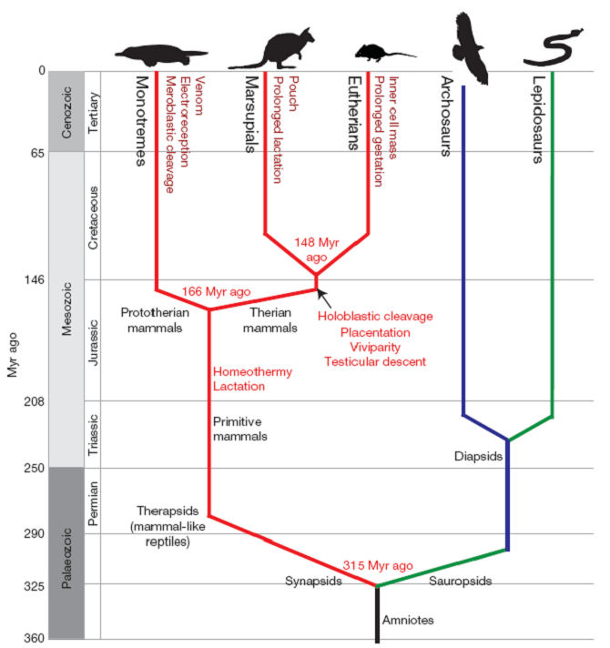

# Classification hiérarchique & k-moyennes {#hierarchique}

```{r setup, include=FALSE, echo=FALSE, message=FALSE, results='hide'}
SciViews::R
```

##### Objectifs {.unnumbered}

-   Comprendre la notion de distance et la matrice de distance.

-   Maîtriser la classification ascendante hiérarchique et le dendrogramme.

-   Être capable d'effectuer un regroupement pertinent à partir d'un jeu de données multivarié à l'aide de ces techniques.

##### Prérequis {.unnumbered}

Vous devez être à l'aise avec l'utilisation de R et RStudio, en particulier pour l'importation, le remaniement et la visualisation de données multivariées. Ceci correspond au cours SDD I. Cette partie est relativement indépendant de **SDD II : modélisation** qui forme la première section de cet ouvrage. Par conséquent, ces deux sections peuvent très bien être inversées si vous le souhaitez (si vous êtes en dehors d'un cours qui impose un ordre bien défini, bien entendu).

## Analyse de données

L'analyse de données (on parle aussi d'*analyse exploratoire des données*, EAD ou **statistiques exploratoires**) mets en œuvre des méthodes statistiques multivariées visant à découvrir de l'information pertinente dans un gros jeu de données via des approches multidimensionnelles et essentiellement descriptives. Ces méthodes se regroupent en deux grandes familles :

-   Celles visant à **réduire la dimensionnalité** (travailler avec des tableaux ayant moins de colonnes). Elles permettent ensuite de présenter les données de manière synthétique pour observer des relations entre les variables ou les individus via des **représentations graphiques**. Nous aborderons ces techniques dans les modules suivants.

-   Celles cherchant à **classifier** (ou regrouper) les individus. Il s'agit ici de synthétiser le gros tableau de données dans l'autre sens, selon les lignes. L'approche via la *classification hiérarchique* sera détaillée ici.

La vidéo suivante introduit l'EAD (jusqu'à 2:11) :

```{r, echo=FALSE}
vembedr::embed_youtube("q-IVQoh1nxA", width = 770, height = 433, query = "end=131")
```

##### À vous de jouer ! {.unnumbered}

`r h5p(75, height = 270, toc = "Objectif des statistiques exploratoires")`

## Distance entre individus

Pour partir d'un exemple concret, imaginez que vous êtes en train d'analyser des données concernant les échantillons de plancton que vous avez prélevé sur votre lieu de recherche. Ce plancton a été numérisé (photo de chaque organisme) et les images ont été traitées avec un logiciel qui mesure automatiquement une vingtaine de variables telles que la surface de l'objet sur l'image, son périmètre, sa longueur, ... Vous vous trouvez donc face à un jeu de données qui a une taille non négligeable : 20 colonnes par 1262 lignes, soit le nombre d'individus mesurés dans vos échantillons.

```{r}
zoo <- read("zooplankton", package = "data.io")
zoo
```

Vous voulez regrouper votre plancton en fonction de la ressemblance entre les organismes, c'est-à-dire, en fonction des écarts entre les mesures effectuées pour les 19 variables quantitatives, à l'exclusion de la vingtième colonne `class` qui est une variable `factor`). En raison de la taille du tableau, il est évident que cela ne pourra pas se faire de manière manuelle. Nous pouvons raisonnablement considérer que plus les mesures sont similaires entre deux individus, plus ils ont des chances d'être semblables, c'est-à-dire, d'appartenir au même groupe taxonomique. **Mais comment faire pour synthétiser l'information de similarité ou différence contenue dans 19 paires de valeurs** (une paire par variable)  ? Nous avons besoin d'une **mesure de distance** qui quantifie la similarité (ou à l'inverse la dissimilarité) en un seul nombre. Celle qui vient naturellement à l'esprit est la **distance euclidienne**. Prenons un cas simplifié. Quelle est la distance qui sépare deux individus *A* et *B* par rapport à trois variables *x*, *y*, *z* ? Ici, nous pouvons représenter l'information graphiquement dans un espace à trois dimensions. La distance qui nous intéresse est la distance linéaire entre les deux points dans l'espace. Autrement dit, c'est la longueur du segment de droite qui relie les deux points dans l'espace. Cette distance, nous pouvons la calculer à l'aide de la formule suivante (voir par exemple [ici](http://www.mathematiques-lycee.com/geometrie/2nde-01-longueur-segment.html) pour une résolution dans le plan) :

$$\mathrm{D_{Euclidean}}_{A, B} = \sqrt{(x_A - x_B)^2 + (y_A - y_B)^2 + (z_A - z_B)^2}$$

Notez que cette formule se généralise à *n* dimensions et s'écrit alors, pour n'importe quelle paire d'individus indicés *j* et *k* dans notre tableau et pour les différentes mesures de 1 à *i* notées *y~i~* :

$$\mathrm{D_{Euclidean}}_{j, k} = \sqrt{\sum_{i=1}^{n}(y_{ij}-y_{ik})^2}$$

C'est la racine carré de la somme dans les *n* dimensions des écarts entre les valeurs au carré pour toutes les variables *y~i~*. Plus sa valeur est grande, plus les individus sont éloignés (différents). Pour cette raison, nous appellerons cette distance, une mesure de **dissimilarité**.

### Matrice de distances

Nous avons maintenant la possibilité de quantifier la similitude entre nos organismes planctoniques... mais nous en avons un grand nombre. Cela va être impossible à gérer autant de mesures qu'il y a de paires possibles parmi 1262 individus[^09-cah-kmeans-1]. La **matrice de distance** est une matrice ici 1262 par 1262 qui rassemble toutes les valeurs possibles. Notez que sur la diagonale, nous comparons chaque individu avec lui-même. La distance euclidienne vaut donc systématiquement zéro sur la diagonale.

[^09-cah-kmeans-1]: Le nombre de paires uniques et distinctes (pas *j*, *j* ou *k*, *k*) possibles parmi *n* items est $n(n-1)/2$, soit ici pour 1262 éléments nous avons 795.691 paires.

$$\mathrm{D_{Euclidean}}_{j, j} = 0$$

De plus, de part et d'autre de cette diagonale, nous trouvons les paires complémentaires (*j versus k* d'un côté et *k versus j* de l'autre). Or qu'elle soit mesurée dans un sens ou dans l'autre, la distance du segment de droite qui relie deux points dans l'espace est toujours la même.

$$\mathrm{D_{Euclidean}}_{j, k} = \mathrm{D_{Euclidean}}_{k, j}$$

Par conséquent, seulement une portion (soit le triangle inférieur, soit le triangle supérieur hors diagonale) est informative. La diagonale ne porte aucune information utile, et l'autre triangle est redondant. Nous avons donc pour habitude de ne calculer et représenter que le triangle inférieur de cette matrice.

##### À vous de jouer ! {.unnumbered}

`r h5p(76, height = 270, toc = "Objectif de la matrice de distance")`

Avant de poursuivre, nous allons utiliser des fonctions personnalisées qui nous faciliteront le travail. Le code qui suit (dépliez la zone de code si vous êtes curieux) va nous créer ces fonctions. Pour un document R Markdown, nous mettrons ce code dans un script R séparé, placé dans `R/functions.R` dans notre projet, et nous ferons `source("../R/functions.R")` dans un chunk de setup. A terme, ces fonctions seront intégrées directement dans la surcouche `SciViews::R` par dessus R.

```{r, class.source='hidden-code'}
# CAH for SciViews, version 1.2.0
# Copyright (c) 2021, Philippe Grosjean (phgrosjean@sciviews.org)

SciViews::R

# dist is really a dissimilarity matrix => we use dissimilarity() as in the
# {cluster} package, i.e., class is c("dissimilarity", "dist")
# TODO: also make a similarity object and convert between the two
# fun can be stats::dist, vegan::vegdist, vegan::designdist, cluster::daisy
# factoextra::get_dist and probably other dist-compatible functions
# Depending on method =, use either vegan::vegdist or stats::dist as default fun
dissimilarity <- function(data, formula = ~ ., subset = NULL,
  method = "euclidean", scale = FALSE, rownames.col = "rowname",
  transpose = FALSE, fun = NULL, ...) {
  # TODO: get more meaningful warnings and errors by replacing fun by actual
  # name of the function
  if (is.null(fun)) {# Default function depends on the chosen method
    if (method %in% c("maximum", "binary", "minkowski")) {
      fun <- stats::dist
    } else {
      fun <- vegan::vegdist # Note: euclidean/manhattan/canberra in both, but
      # we prioritize vegdist, and canberra is not calculated the same in dist!
    }
  }
  # We accept only formulas with right-hand side => length must be two
  if (length(formula) == 3)
    stop("The formula cannot have a left-hand term")

  # With matrices, we don't use rownames.col: rownames are already correctly set
  if (!is.matrix(data)) {# row names may be in a column (usual for tibbles)
    data <- as.data.frame(data)
    if (rownames.col %in% names(data)) {
      rownames(data) <- data[[rownames.col]]
      data[[rownames.col]] <- NULL
    } else {# rownames.col is NOT used
      rownames.col <- NULL
    }
    if (as.character(formula[2] != ".")) {
      # Subset the columns
      data <- model.frame(formula, data = data, subset = subset)
    } else if (!is.null(subset)) {
      data <- data[subset, ]
    }
  } else {# A matrix
    rownames.col <- NULL
    if (as.character(formula[2] != ".")) {
      # Subset the columns (and possibly the rows)
      if (is.null(subset)) {
        data <- data[, all.vars(formula)]
      } else {
        data <- data[subset, all.vars(formula)]
      }
    }
  }

  if (isTRUE(transpose))
    data <- t(data)

  # Arguments method =/metric = and stand = not always there
  if (!is.null(as.list(args(fun))$metric)) {# metric = instead of method =
    dst <- fun(data, metric = method, stand = scale, ...)
  } else if (isTRUE(scale)) {
    if (is.null(as.list(args(fun))$stand)) {# fun has no stand = argument
      data <- scale(data)
      dst <- fun(data, method = method, ...)
    } else {# We don't standardise ourself because there may be also qualitative
      # or binary data (like for cluster::daisy, for instance)
      dst <- fun(data, method = method, stand = scale, ...)
    }
  } else {# Just method = and scale = FALSE
    dst <- fun(data, method = method, ...)
  }
  attr(dst, "call") <- match.call()
  # Depending if it is a dist or dissimilarity object, the method is stored in
  # method or in Metric, but we use metric in our own version to avoid a clash
  # with the method item in cluster()/hclust() further on (hclust change it
  # into dist.method, but it is better to have the right name right now)
  attr(dst, "metric") <- method
  # dist or dissimilarity object use Labels, but we use labels everywhere else
  # including in cluster()/hclust()
  # So, we make sure labels is present (in hclust, it is labels anyway!)
  attr(dst, "labels") <- rownames(data)
  # Default values for Diag and Upper set to FALSE
  if (is.null(attr(dst, "Diag"))) attr(dst, "Diag") <- FALSE
  if (is.null(attr(dst, "Upper"))) attr(dst, "Upper") <- FALSE
  # Keep info about how raw data were transformed
  attr(dst, "rownames.col") <- rownames.col
  attr(dst, "transpose") <- transpose
  attr(dst, "scale") <- scale
  class(dst) <- unique(c("dissimilarity", class(dst)))
  dst
}

as.dissimilarity <- function(x, ...)
  UseMethod("as.dissimilarity")
as_dissimilarity <- as.dissimilarity # Synonym

as.dissimilarity.matrix <- function(x, ...) {
  dst <- as.dist(x, ...)
  attr(dst, "call") <- match.call()
  attr(dst, "metric") <- attr(dst, "method") # Make sur metric is used
  class(dst) <- unique(c("dissimilarity", class(dst)))
  dst
}

# We want to print only the first few rows and columns
print.dissimilarity <- function(x, digits.d = 3L, rownames.lab = "labels",
...) {
  mat <- as.matrix(x)
  mat <- format(round(mat, digits.d))
  diag(mat) <- ""
  mat[upper.tri(mat)] <- ""
  class(mat) <- c("dst", "matrix")
  tbl <- tibble::as_tibble(mat)
  #tbl <- tibble::add_column(tbl, {{rownames.lab}} = rownames(mat), .before = 1)
  # I prefer this
  tbl <- dplyr::bind_cols(
    as_tibble_col(rownames(mat), column_name = rownames.lab), tbl)
  tbl <- tbl[, -ncol(tbl)]
  more_info <- ""
  if (isTRUE(attr(x, "scale"))) {
    if (isTRUE(attr(x, "transpose"))) {
      more_info <- " (transposed then scaled data)"
    } else {# Only scaled
      more_info <- " (scaled data)"
    }
  } else {
    if (isTRUE(attr(x, "transpose")))
      more_info <- " (transposed data)"
  }
  cat("Dissimilarity matrix with metric: ", attr(x, "metric"),
    more_info, "\n", sep = "")
  print(tbl)
  invisible(x)
}

labels.dissimilarity <- function(object, ...) {
  labs <- object$labels
  if (is.null(labs)) object$Labels
}

nobs.dissimilarity <- function(object, ...)
  attr(object, "Size")

# TODO: `[` by first transforming into a matrix with as.matrix()

autoplot.dissimilarity <- function(object, order = TRUE, show.labels = TRUE,
lab.size = NULL, gradient = list(low = "red", mid = "white", high = "blue"),
...) {
  factoextra::fviz_dist(object, order = order, show_labels = show.labels,
    lab_size = lab.size, gradient = gradient)
}

chart.dissimilarity <- function(data, ...,
type = NULL, env = parent.frame())
  autoplot(data, type = type, ...)

# cluster object (inheriting from hclust)
cluster <- function(x, ...)
  UseMethod("cluster")

cluster.default <- function(x, ...)
  stop("No method for object of class ", class(x)[1])

# Cluster uses hclust() by default, ... but it looks first for a faster
# implementation in either {fastcluster} or {flashClust} before falling back
# to the {stats} version.
# The functions cluster::agnes() and cluster::diana() should be compatible too,
# as well as any function that returns an object convertible into hclust
# by as.hclust() (but not tested yet)
# Also, a version where the raw data are provided and the disimilarity matrix
# is internally calculated should be also provided (see cluster::agnes)
# See also {ape} for phylogenetic trees methods
cluster.dist <- function(x, method = "complete", fun = NULL, ...) {
  if (is.null(fun)) {
    # We try fastcluster, then flashClust, then stats
    fun <- try(fastcluster::hclust, silent = TRUE)
    if (inherits(fun, "try-error"))
      fun <- try(flashClust::hclust, silent = TRUE)
    if (inherits(fun, "try-error"))
      fun <- try(stats::hclust, silent = TRUE)
  }
  clst <- fun(x, method = method, ...)
  clst <- as.hclust(clst)
  clst$call <- match.call()
  # hclust has to give a different name to the distance metric: dist.method
  # but we use metric. Again, keep both for maximum compatibility
  clst$metric <- clst$dist.method
  # If the original data were scaled or transposed, get the info also
  clst$rownames.col <- attr(x, "rownames.col")
  clst$scale <- attr(x, "scale")
  clst$transpose <- attr(x, "transpose")
  class(clst) <- unique(c("cluster", class(clst)))
  clst
}

# A couple of useful methods for our cluster object
# str() method is gathered from a dendrogram object
str.cluster <- function(object, max.level = NA, digits.d = 3L, ...)
  str(as.dendrogram(object), max.level = max.level, digits.d = digits.d, ...)

labels.cluster <- function(object, ...)
  object$labels

nobs.cluster <- function(object, ...)
  length(object$order)

# Other methods by first transforming into dendrogram: rev, reorder, order, [[

# cutree() is an explicit name, but it does not follow the rule of using
# known methods... and here, it really something that predict() is made for,
# except it cannot handle newdata =, but that argument is not in its definition
predict.cluster <- function(object, k = NULL, h = NULL, ...)
  cutree(object, k = k, h = h)

# There is no broom::glance() or broom::tidy() yet (what to put in it?),
# but broom:augment() should be nice = add the clusters as .fitted in the tibble
library(broom)
augment.cluster <- function(x, data, k = NULL, h = NULL, ...) {
  # Should we transpose the data (note: this is against augment() rules, but...)
  if (isTRUE(x$transpose)) {
    # We first have to make sure rownames are correct before the transposition
    if (!is.matrix(data) && !is.null(data[[x$rownames.col]])) {
      rownames(data) <- data[[x$rownames.col]]
      data[[x$rownames.col]] <- NULL
    }
    data <- t(data)
    msg <- "transposed data"
  } else {
    msg <- "data"
  }
  data <- as_tibble(data)

  # Get clusters
  clst <- predict(x, k = k, h = h, ...)
  if (nrow(data) != length(clst)) {
    stop("Different number of items in ", msg, " (",nrow(data) ,
      ") and in the clusters (", length(clst), ")")
  }
  tibble::add_column(data, .fitted = clst)
}

# Instead of the default plot.hclust(), we prefer the plot.dendrogram() version
# that allows for more and better variations of the dendrogram (horizontal or
# circular), see http://www.sthda.com/english/wiki
# /beautiful-dendrogram-visualizations-in-r-5-must-known-methods
# -unsupervised-machine-learning
plot.cluster <- function(x, y, labels = TRUE, hang = -1, check = TRUE,
type = "vertical", lab = "Height", ...) {
  type <- match.arg(type[1], c("vertical", "horizontal", "circular"))
  # type == "circular" is special because we need to transform as ape::phylo
  if (type == "circular") {
    if (!missing(hang))
      warning("'hang' is not used with a circular dendrogram")
    phylo <- ape::as.phylo(x)
    plot(phylo, type = "fan", font = 1, show.tip.label = labels, ...)
  } else {# Use plot.dendrogram() instead
    # We first convert into dendrogram objet, then we plot it
    # (better that plot.hclust())
    if (isTRUE(labels)) leaflab <- "perpendicular" else leaflab <- "none"
    dendro <- as.dendrogram(x, hang = hang, check = check)
    if (type == "horizontal") {
      plot(dendro, horiz = TRUE, leaflab = leaflab, xlab = lab, ...)
    } else {
      plot(dendro, horiz = FALSE, leaflab = leaflab, ylab = lab, ...)
    }
  }
}

# This is to draw circles in a plot (where to cut in a circular dendrogram)
# TODO: should be nice to do similar function for other symbols too in SciViews
circle <- function(x = 0, y = 0, d = 1, col = 0, lwd = 1, lty = 1, ...)
  symbols(x = x, y = y, circles = d / 2, fg = col, lwd = lwd, lty = lty,
    inches = FALSE, add = TRUE, ...)

# TODO: make sure the dendrogram is correct with different ggplot themes
autoplot.cluster <- function(object, labels = TRUE, type = "vertical",
circ.text.size = 3, theme = theme_sciviews(), xlab = "", ylab = "Height", ...) {
  if (is.null(type))
    type <- "vertical"
  type <- match.arg(type[1], c("vertical", "horizontal", "circular"))

  # Create the dendrogram
  ddata <- ggdendro::dendro_data(object, type = "rectangle")
  dendro <- ggplot(ggdendro::segment(ddata)) +
    geom_segment(aes(x = x, y = y, xend = xend, yend = yend)) +
    theme + xlab(xlab) + ylab(ylab)

  if (type == "circular") {
    if (isTRUE(labels)) {
      # Get labels (need one more to avoid last = first!)
      label_df <- tibble::tibble(labels = c(labels(object)[object$order], ""))
      xmax <- nobs(object) + 1
      label_df$id <- 1:xmax
      angle <-  360 * (label_df$id - 0.5) / xmax
      # Left or right?
      label_df$hjust <- ifelse(angle < 270 & angle > 90, 1, 0)
      # Angle for more readable text
      label_df$angle <- ifelse(angle < 270 & angle > 90, angle + 180, angle)
    }

    # Make the dendrogram circular
    dendro <- dendro +
      scale_x_reverse() +
      scale_y_reverse() +
      coord_polar(start = pi/2)
    if (isTRUE(labels))
      dendro <- dendro +
        geom_text(data = label_df,
          aes(x = id, y = -0.02, label = labels, hjust = hjust),
          size = circ.text.size, angle = label_df$angle, inherit.aes = FALSE)
    dendro <- dendro +
      theme(panel.border = element_blank(),
        axis.text = element_blank(),
        axis.line = element_blank(),
        axis.ticks.y = element_blank()) +
      ylab("")

  } else if (type == "vertical") {# Vertical dendrogram
    dendro <- dendro +
      scale_x_continuous(breaks = seq_along(ddata$labels$label),
        labels = ddata$labels$label) +
      scale_y_continuous(expand = expansion(mult = c(0, 0.02))) +
      theme(panel.border = element_blank(),
        axis.text.x = element_text(angle = 90, hjust = 1, vjust = 0.5),
        axis.line.x = element_blank(),
        axis.ticks.x = element_blank(),
        axis.text.y = element_text(angle = 90, hjust = 0.5))
    if (!isTRUE(labels))
      dendro <- dendro +
        theme(axis.text.x = element_blank())

  } else {# Horizontal dendrogram
    dendro <- dendro +
      scale_x_continuous(breaks = seq_along(ddata$labels$label),
        labels = ddata$labels$label, position = "top") +
      scale_y_reverse(expand = expansion(mult = c(0.05, 0))) +
      coord_flip() +
      theme(panel.border = element_blank(),
        axis.line.y = element_blank(),
        axis.ticks.y = element_blank())
    if (!isTRUE(labels))
      dendro <- dendro +
        theme(axis.text.y = element_blank())
  }
  dendro
}

chart.cluster <- function(data, ...,
  type = NULL, env = parent.frame())
  autoplot(data, type = type, ...)

# To indicate where to cut in the dendrogram, one could use `geom_hline()`,
# but when the dendrogram is horizontal or circular, this is suprizing. So,
# I define geom_dendroline(h = ....)
geom_dendroline <- function(h, ...)
  geom_hline(yintercept = h, ...)
```

```{block2, type='note'}

Voici les fonctions à disposition (nous verrons leur usage progressivement dans ce module)\ :

- **`dissimilarity(data, method = "euclidean", scale = FALSE, transpose = FALSE)`**\ : matrice de dissimilarité, voir `?vegan::vegdist`
    + `print()`, `chart()`, `labels()` et `nobs()` sont disponibles
- **`cluster(x, method = "complete")`**\ : CAH à partir d'un objet "dissimilarity", voir `?stats:hclust`
    + `print()`, `str()`, `plot()`, `chart()`, `labels()`, `nobs()`, `predict()` et `augment()`
- **`chart(cluster)`**\ : visualise un cluster (dendrogramme). Utiliser `+ geom_dendroline(h = XX, color = "red")` pour y visualiser la coupure
- **`predict(cluster, h = 5)`** ou **`predict(cluster, k = 5)`** extrait les groupes
- **`augment(data = df, cluster, h =|k = )`** ajoute les groupes dans le tableau `df`

```

Voici comment nous calculons une matrice de distances `zoo6_dist`, ici sur un petit sous-ensemble de six lignes de notre jeu de données (nous devons aussi éliminer la colonne `class` qui ne contient pas de données numériques et qui ne nous intéresse pas pour le moment) :

```{r}
zoo %>.%
  fselect(., -class) %>.% # Élimination de la colonne class
  head(., n = 6) -> zoo6 # Récupération des 6 premiers individus
zoo6_dist <- dissimilarity(zoo6, method = "euclidean")
zoo6_dist
```

Nous voyons bien ici que R n'imprime que le *triangle inférieur* de notre matrice 6 par 6. Notez aussi que les objets `dist` de tailles plus réalistes que vous utiliserez dans vos analyses ne sont **prévue** pour être imprimées et visualisées telles quelles. Il s'agit seulement de la *première étape* vers une représentation utile qui sera réalisée à la page suivante, à l'aide de la classification hiérarchisée.

Nous verrons plus loin comment nous pouvons utiliser l'information que cette matrice de distances contient pour regrouper les individus de manière pertinente. Mais avant cela, nous avons besoin d'un peu de théorie pour bien comprendre quelle **métrique** choisir pour calculer nos distances et pourquoi. On parle aussi d'**indices** de **similarité** ou **dissimilarité**.

```{block2, type='warning'}

**Attention\ :** nous n'avons pas considéré ici les unités respectives de nos variables. Une surface (mm^2^) ou une longeur (mm) ne sont pas mesurées dans les mêmes unités. Nous risquons alors de donner plus de poids dans nos calculs aux variables qui présentent des valeurs élevées. Nous aurions le même effet si nous décidions par exemple d'exprimer une mesure longitudinale en µm au lieu de l'exprimer en mm. Dans ce cas, il vaut mieux standardiser d'abord le tableau (moyenne de zéro et écart type de un) selon les colonnes avant d'effectuer le calcul. Une illustration de cette approche sera discutée plus loin.

```

##### À vous de jouer ! {.unnumbered}

`r h5p(77, height = 270, toc = "Utilisation de la distance euclidienne")`

### Indices de (dis)similarité

Un indice de similarité (*similarity index* en anglais) est une descripteur statistique (nombre unique) de la similitude de deux échantillons ou individus représentés par plusieurs variables dans un échantillon multivarié. Un indice de similarité prend une valeur comprise entre 0 (différence totale) et 1 ou 100% (similitude totale). Un indice de dissimilarité} est le complément d'un indice de similarité (dis = 1 -- sim) ; sa valeur est comprise entre 100% (différence totale) et 0 (similitude totale).

```{block2, type='warning'}

**Attention\ :** dans certains cas, un indice de dissimilarité peut varier de 0 à +$\infty$**. Il n'existe alors pas d'indice de similarité complémentaire. C'est le cas précisément de la distance euclidienne que nous avons exploré jusqu'ici.

```

Tous les indices de similarité / dissimilarité peuvent servir à construire des matrices de distances.

#### Indice de Bray-Curtis

L'indice de dissimilarité de Bray-Curtis, aussi appelé coefficient de Czecanowski est calculé comme suit :

$$\mathrm{D_{Bray-Curtis}}_{j,k}=\frac{\sum_{i=1}^{n}\left|y_{ij}-y_{ik}\right|}{\sum_{i=1}^{n}(y_{ij}+y_{ik})}$$

Dans SciViews R nous utiliserons `dissimilarity(DF, method = "bray")`. cet indice s'utilise pour mesurer, entre autres, la similitude entre échantillon sur base du **dénombrement d'espèces**. Si le nombre d'espèces est très variable (espèces dominantes *versus* espèces rares), nous devons transformer les données pour éviter de donner trop de poids aux espèces les plus abondantes (ex: $log(x+1)$, double racine carrée, ...).

Une caractéristique essentielle de cet indice (contrairement à la distance euclidienne) est que toute double absence n'est pas prise en compte dans le calcul. C'est souvent pertinent dans le cadre de son utilisation comme le dénombrement d'espèces. En effet, quelle information utile retire-t-on de doubles zéros dans un tableau répertoriant la faune belge pour le crocodile du Nil et le tigre de Sibérie par exemple ? Aucune ! Ils sont tous deux systématiquement absents des dénombrements, mais cette double absence n'apporte aucune information utile pour caractériser la faune belge par ailleurs.

L'indices de similarité de Bray-Curtis (*sim*) est complémentaire à l'indices de dssimilarité correspondant (*dis* tel que calculé ci-dessus) :

$$sim = 1 – dis$$

#### Indice de Canberra

L'indice de dissimilarité de Canberra est apparenté à l'indice de Bray-Curtis mais il pondère les individus en fonction du nombre d'occurrences afin de donner le *même* poids à chacune. Il se calcule comme suit :

$$\mathrm{D_{Canberra}}_{j,k}=\frac{1}{nz}\sum_{i'=1}^{nz}\frac{\left|y_{i'j}-y_{i'k}\right|}{\left|y_{i'j}\right|+\left|y_{i'k}\right|}$$

où $nz$ est le nombre de valeurs non nulles simultanément dans le tableau de départ. Toutes les cas contribuent ici de manière égale. C'est un point positif, mais il faut faire attention à ce que cet indice a souvent tendance à donner, au contraire, trop d'importance aux dénombrements très rares observés une seule fois ou un petit nombre de fois ! Dans SciViews R, nous utiliserons `dissimilarity(DF, method = "canberra")`.

Toute double absence n'est pas prise en compte ici également. Seuls les indices ne dépendant pas des doubles zéros sont utilisables pour des dénombrements d'espèces ou des présence-absence. Ainsi pour ce type de données, notre choix se portera sur :

-   Bray-Curtis si l'on souhaite que le résultat soit dominé par les espèces les plus abondantes.

-   Canberra si notre souhait est de donner la même importance à toutes les espèces, mais avec un risque d'importance exagérée des espèces rares par rapport au nombre relatif d'observations pour l'ensemble du jeu de données.

-   Bray-Curtis sur données transformées ($log(x+1)$ ou double racine carrée) pour un compromis entre les deux avec prise en compte de toutes les espèces, mais dépondération partielle des espèces les plus abondantes. C'est souvent un bon compromis.

```{block2, type='warning'}

Attention\ : Si les volumes échantillonnés entre stations ne sont pas comparables, il faut standardiser (moyenne nulle et écart type un) les données selon les échantillons avant de faire les calculs de distances. L'argument `scale = TRUE` pourra être ajouté à l'appel de `dissimilarity()` pour ce faire.

```

De même que pour Bray-Curtis, l'indice de similarité *sim* se calcule à partir de l'indice de dissimilarité *dis* tel que ci-dessus comme $sim = 1 - dis$.

#### Distance Euclidienne

Nous savons déjà que c'est la distance géométrique entre les points dans un espace à *n* dimensions :

$$\mathrm{D_{Euclidean}}_{j,k}=\sqrt{\sum_{i=1}^{n}(y_{ij}-y_{ik})^2}$$

Dans SciViews R, cette distance peut être calculée avec `dissimilarity(DF, method = "euclidean")`. Attention : en anglais, c'est *euclidean* avec un "e", pas *euclidian* ! Cet indice de dissimilarité est utile pour des mesures quantitatives, pour des données environnementales, etc. Il faut que les mesures soient toutes effectuées dans les mêmes unités. Si ce n'est pas le cas, nous devons les standardiser avant le calcul, avec `scale = TRUE`. Il n'existe pas d'indice de similarité complémentaire.

#### Distance de Manhattan

La distance de Manhattan, encore appelée *"city-block distance"* en anglais, est un indice de dissimilarité qui, contrairement à la distance euclidienne ne mesure pas la distance géométrique entre les points en ligne droite, mais via un trajet composé de segments de droites parallèles aux axes. C'est comme si la distance euclidenne reliait les points à vol d'oiseau, alors qu'avec la distance de Manhattan, nous devions contourner les blocs de maisons du quartier pour aller d'un point A à un point B (d'où le nom de cette métrique). Elle se calcule comme suit :

$$\mathrm{D_{Manhattan}}_{j,k}=\sum_{i=1}^{n}|y_{ij}-y_{ik}|$$

Dans SciViews R, nous utiliserons `dissimilarity(DF, method = "manhattan")`. Ici aussi, seul l'indice de dissimilarité est défini. L'indice de similarité complémentaire n'existe pas car la valeur de l'indice de dissimlarité n'est pas borné à droite et peut varier de zéro (dissimilarité nulle, cela signifie alors que les deux individus sont identiques) à l'infini pour une différence maximale.

### Utilisation des indices

-   Les distances euclidienne ou de Manhattan sont à préférer pour les **mesures environnementales** ou de manière générale pour les variables quantitatives continues.

-   Les distances de Bray-Curtis ou Canberra sont meilleure pour les **dénombrements d'espèces** (ou à chaque fois que les double zéros ne portent aucune information utile). Il s'agit souvent de variables quantitatives discrètes prenant des valeurs nulles ou positives.

##### À vous de jouer ! {.unnumbered}

`r h5p(78, height = 270, toc = "Choix des indices")`

### Propriétés des indices

Les indices varient en 0 et 1 (0 et 100%), mais les distances sont utilisées aussi comme indices de dissimilarité et peuvent varier entre 0 et $+\infty$.

Un indice est dit **métrique** si il az les propriétés suivantes :

-   **Minimum 0** : $I_{j, k} = 0$ si $j = k$

-   **Positif** : $I_{j, k}>0$ si $j \neq k$

-   **Symétrique** : $I_{j, k}=I_{k, j}$

-   **Inégalité triangulaire** : $I_{j, k} + I_{k, l} >= I_{j, l}$

La dernière propriété d'inégalité triangulaire est la plus difficile à obtenir, et n'est pas toujours nécessaire. Nous pouvons montrer que certains indices qui ne respectent pas cette dernière propriété sont pourtant utiles dans le contexte. Nous dirons alors d'un indice que c'est une **semi-métrique** s'il répond à toutes les conditions sauf la quatrième. Enfin, un indice est dit **non métrique** dans tous les autres cas. Le tableau suivant reprend les métriques que nous avons vues jusqu'ici, et rajoute d'autres candidats potentiels (la distance Chi carré, l'indice de corrélation ou de variance/covariance) en indiquant leur type :

| **Distance**          | **Type**       |
|-----------------------|----------------|
| Bray-Curtis           | semi-métrique  |
| Canberra              | métrique       |
| Euclidienne           | métrique       |
| Manhattan             | métrique       |
| Chi carré             | métrique       |
| (corrélation)         | (non métrique) |
| (variance/covariance) | (non métrique) |

##### Pour en savoir plus {.unnumbered}

-   Vous pouvez aussi transposer le tableau pour calculer la distance entre ses colonnes en utilisant l'argument `transpose = TRUE` dans `dissimilarity()`. Par exemple, dans le cas d'un tableau "espèces - station" (dénombrement d'espèces en différentes stations), nous pouvons comparer les stations du point de vue de la composition en espèces, mais nous pouvons aussi comparer les espèces du point de vue de leur répartition entre les stations. Pour passer d'un calcul à l'autre, nous transposerons donc le tableau (les colonnes deviennent les lignes et inversement).

-   Pour bien comprendre la logique sous-jacente aux indices, il est utile de comprendre leurs équations. Si elles sont pour vous trop abstraites, une façon efficace de comprendre consiste à faire le calcul à la main. Par exemple dans le cas de l'indice de Canberra, la notion de nombre de données non nulles $nz$ n'est pas évident. Effectuons un calcul à la main détaillé sur le tableau fictif suivant concernant trois espèces `A`, `B`, et `C` dénombrées en trois stations `sta1`, `sta2` et `sta3` dans le tableau nommé `ex1` :

```{r, echo=FALSE}
ex1 <- dtf( # Here we need to use a data.frame explicitly to use row names!
  A = c(4, 3, 1),
  B = c(0, 0, 8),
  C = c(2, 10, 0))
rownames(ex1) <- paste0("sta", 1:3)
ex1bold <- ex1
rownames(ex1bold) <- paste0("**sta", 1:3, "**")
knitr::kable(ex1bold)
```

Pour rappel, la dissimilarité de Canberra se calcule comme suit :

$$\mathrm{D_{Canberra}}_{j,k}=\frac{1}{nz}\sum_{i'=1}^{nz}\frac{\left|y_{i'j}-y_{i'k}\right|}{y_{i'j}+y_{i'k}}$$

où :

-   *nz* est le nombre d'observations non nulles simultanément dans les deux vecteurs comparés (les doubles zéros ne sont pas pris en compte)
-   *i'* est l'itérateur sur toutes les valeurs non double zéros

Voici le détail du calcul (notez bien comment le double zéro pour l'espèce `B` entre les stations `sta1` et `sta2` est pris en compte dans le calcul) :

```{r}
sta1_2 <- (1/2) * ((abs(4 - 3)) / (4 + 3) + (abs(2 - 10)) / (2 + 10))
round(sta1_2, 2)

sta1_3 <- (1/3) * (abs(4 - 1) / (4 + 1) + abs(0 - 8) / (0 + 8) +
  abs(2 - 0) / (2 + 0))
round(sta1_3, 2)

sta2_3 <- (1/3) * (abs(3 - 1) / (3 + 1) + abs(0 - 8) / (0 + 8) +
  abs(10 - 0) / (10 + 0))
round(sta2_3, 2)
```

La matrice finale est la suivante :

```{r, echo=FALSE}
vegan::vegdist(ex1, method = "canberra") %>.%
  round(., 2) %>.%
  as.matrix(.) %>.%
  as_dtf(.) -> dst # We need to use a data.frame explicitly (dtf) to use row names!
dst[!lower.tri(dst)] <- ""
dst <- dst[-1, -3]
rownames(dst) <- c("**sta2**", "**sta3**")
knitr::kable(dst)
```

Vérifions en laissant R faire le calcul :

```{r}
(dissimilarity(ex1, method = "canberra"))
```

## Regroupement avec CAH

À partir du moment où nous avons une matrice de dissimilarités entre toutes les paires d'individus de notre jeu de données, nous pouvons les regrouper en fonction de leurs ressemblances. Deux approches radicalement différentes existent. Soit nous pouvons diviser l'échantillon progressivement jusqu'à obtenir des groupes homogènes (**méthodes divisives, telle que les K-moyennes** que nous aborderons dans le module suivant), soit nous pouvons regrouper les items semblables petit à petit jusqu'à avoir traité tout l'échantillon (**méthodes agglomératives, telle que la classification ascendante hiérarchique** étudiée ici).

##### À vous de jouer ! {.unnumbered}

`r h5p(79, height = 270, toc = "Méthodes divisives ou agglomératives")`

### Dendrogramme

Le **dendrogramme** est une manière très utile de représenter graphiquement un regroupement. Il s'agit de réaliser un arbre dichotomique ressemblant un peu à un arbre phylogénétique qui est familier aux biologistes (par exemple [ici](https://www.futura-sciences.com/planete/definitions/classification-vivant-phylogenie-4372/)) :



Dans l'arbre, nous représentons des divisions dichotomiques (division d'une branche en deux) matérialisant les divergences au cours de l'évolution. Dans l'arbre présenté ici, l'axe des ordonnées est utilisé pour représenter le temps et les branchements sont placées à une hauteur correspondante en face de l'axe. Le dendrogramme est une représentation similaire de la CAH avec l'axe des ordonnées indiquant *à quelle distance* le rassemblement se fait.

Dans R, un dendrogramme se construit en deux étapes :

1)  Son calcul par CAH à l'aide de la fonction `cluster()`, à partir d'une matrice de dissimilarité dans un objet "dissimilarity"

2)  Sa représentation sur un graphique en utilisant `chart()`.

Partons, pour étayer notre raisonnement, d'une matrice de distances euclidiennes sur les données de zooplancton. Au passage, voyons quelques options utiles pour préparer correctement nos données.

-   A la section précédente, nous avons suggéré qu'il peut être utile de *standardiser* nos données préalablement si les données numériques sont mesurées dans des unités différentes, comme c'est le cas ici. La fonction `scale()` ou l'argument `scale = TRUE` de `dissimilarity()` effectuent ce travail.
-   Limitons, pour l'instant notre ambition à la comparaison de six individus. Afin d'observer tous les cas possibles dans le dendrogramme, nous ne prendrons pas les six premières lignes du tableau, mais les lignes 13 à 18. Cela peut se faire à l'aide de la fonction `slice()` que nous n'avons pas encore beaucoup utilisée jusqu'ici. Cette fonction permet de spécifier explicitement les numéros de lignes à conserver, contrairement à `filter()` qui applique un test de condition pour décider quelles ligne(s) conserver. Nous pouvons aussi utilise l'argument `subset =` de `dissimilarity()`.

Voici donc notre matrice de distances euclidiennes sur les données ainsi traitées. Les individus initiaux 13 à 18 sont renumérotés 1 à 6. Nous n'imprimons plus ici la matrice de distance obtenue car ce n'est que la première étape du travail vers une représentation plus utile (le dendrogramme).

```{r}
zoo %>.%
  select(., -class) %>.%   # Élimination de la colonne class
  slice(., 13:18) %->%     # Récupération des lignes 13 à 18
  zoo6

zoo6 %>.% # Matrice de dissimilarité sur données standardisées
  dissimilarity(., method = "euclidean", scale = TRUE) ->
  zoo6std_dist
```

Notre objet `zoo6std_dist` est ensuite utilisé pour calculer notre CAH à l'aide de `cluster()`. Enfin, `chart()`se charge de tracer le dendrogramme.

```{r}
zoo6std_dist %>.%
  cluster(.) -> zoo6std_clust # Calcul du dendrogramme
  chart(zoo6std_clust) +
    ylab("Hauteur")
```

Voici comment interpréter ce graphique. Les deux individus les plus semblables sont le 2 et le 5 (regroupement effectué le plus bas, donc, avec la valeur de l'indice de dissimilarité le plus faible). Ensuite ce groupe formé du 2 et du 5 est le plus similaire au 3. Le 4 se rattache ensuite à ce groupe formé des 2, 3 et 5 mais bien plus haut sur l'axe, indiquant ainsi qu'il s'en différencie un peu plus Enfin, le 1 et le 6 sont rassemblés à un niveau à peu près équivalent. Finalement, le groupe de droite constitué des individus 2, 3, 4 et 5 et celui de gauche contenant le 1 et le 6 sont reliés encore plus haut suggérant ainsi la dissimilitude la plus forte entre ces deux groupes.

```{block2, type='warning'}

**Attention\ :** La position des individus selon l'axe horizontal n'est pas importante. Il faut voir le dendrogramme comme un mobile qui peut tourner librement. C'est-à-dire que le groupe constitué de 2, 3, 4 et 5 aurait très bien pu être placé à la gauche de celui constitué de 1 et 6. De même, le sous-groupe 2, 3 et 5 aurait très bien pu être à la gauche du regroupement avec 4 à la droite, etc. Seul compte la hauteur sur l'axe vertical à laquelle les regroupements se font.

```

Notez que nous n'avons *pas* utilisé l'information concernant les classes taxonomiques auxquelles les individus appartiennent (nous avons éliminé la variable `class` en tout début d'analyse). Ce type de regroupement s'appelle une **classification non supervisée** parce que nous n'imposons pas les groupes que nous souhaitons réaliser[^09-cah-kmeans-2]. Cependant, comme nous possédons cette indication du groupe taxonominque de nos six individus par ailleurs dans `class`, nous pouvons en profiter pour l'utiliser à des fins de vérification :

[^09-cah-kmeans-2]: Les techniques complémentaires de classification supervisées seront abordées dans le cours de Science des Données Biologiques III l'an prochain.

```{r}
zoo$class[13:18]
```

Les individus 2, 3 et 5 ("Poecilostomatoid" ou "Calanoid") sont des [copépodes](http://www.obs-vlfr.fr/~gaspari/copepodes/cop_doc.htm), des crustacés particulièrement abondants dans le zooplancton. Leur forme est similaire. Leur regroupement est logique. L'individu 4 est une [larve de décapode](https://news.ecoledelamer.fr/plancton/observation/fiche/zoe-1), un autre crustacé. Ainsi le regroupement de 2, 3 et 5 avec 4 correspond aux crustacés ici. Enfin, les individus 1 et 6 sont très différents puisqu'il s'agit respectivement d'un [œuf](http://grainesdexplorateurs.ens-lyon.fr/archives-1/2012-2013/projets/tara-2013/pouldreuzic-2013/plancton-de-beg-meil/copy_of_embryon-de-poisson/view) rond probablement de poisson et d'un [appendiculaire](https://scripps.ucsd.edu/zooplanktonguide/species/oikopleura-dioica).

### Séparer les groupes

Si notre dendrogramme est satisfaisant (nous le déterminons en l'étudiant et en vérifiant que les regroupements obtenus ont un sens biologique par rapport à l'objectif de notre étude), nous concrétisons les groupes que nous souhaitons retenir au final en coupant l'arbre horizontalement à une hauteur choisie et en récupérant les groupes avec `predict()`. Nous pouvons matérialiser ce niveau de coupure en traçant un trait horizontal rouge dans le dendrogramme en ajoutant `geom_dendroline(h = XXX, color = "red")`, avec 'XXX' la hauteur de coupure souhaitée. Par exemple, si nous coupons l'arbre à une hauteur de 8, nous obtenons deux groupes :

```{r}
chart(zoo6std_clust) +
  geom_dendroline(h = 8, color = "red")
```

Si nous coupons l'arbre plus bas, par exemple à la hauteur de 5,8, nous obtenons trois groupes :

```{r}
chart(zoo6std_clust) +
  geom_dendroline(h = 5.8, color = "red")
```

Les niveaux de coupure ne sont pas toujours très lisibles sur le dendrogramme, mais ils peuvent être obtenus à l'aide de `str()`.

```{r}
str(zoo6std_clust)
```

À mesure que la hauteur de coupure descend, nous réaliserons quatre, puis cinq groupes. Quel est le meilleur niveau de coupure ? Il n'y en a pas un seul forcément car les différents niveaux correspondent à un point de vue de plus en plus détaillé du regroupement. Néanmoins, lorsque le saut sur l'axe d'un regroupement à l'autre est fort, nous pouvons considérer une séparation des groupes d'autant meilleure. Cela crédibilise d'autant le regroupement choisi. Ainsi la séparation en deux groupes apparaît forte (entre 9.45 et 6.16, sur un intervalle de 3,3 unités donc). De même, la séparation de l'individu 4 par rapport au groupe constitué de 2, 3 et 5 se fait sur un intervalle de 2 unités (entre 6.16 et 4.17). La séparation de l'individu 3 du groupe 2 et 5 est un petit peu moins nette puisqu'elle apparaît aux hauteurs entre 4,17 à 2.38, soit sur un intervalle de 1,8 unités. Ces mesures d'intervalles n'ont aucune valeur absolue. Il faut les considérer uniquement de manière relatives les unes par rapport aux autres, et seulement au sein d'un même dendrogramme.

Ici, deux niveaux de coupure se détachent :

-   en deux groupes, nous avons les crustacés séparés des autres.

```{r}
chart(zoo6std_clust) +
  geom_dendroline(h = 7.5, color = "red")
```

```{r}
(group2 <- predict(zoo6std_clust, h = 7.5))
```

Les individus 1 et 6 sont dans le groupe 1, et les autres dans le groupe 2.

-   en quatre groupes, nous avons les copépodes séparés des trois autres items chacun dans un groupe séparé.

```{r}
chart(zoo6std_clust) +
  geom_dendroline(h = 5, color = "red")
```

Le groupe des individus 2, 3 et 5 est formé. Les trois autres groupes contiennent des individus uniques 1, 6 et 4 respectivement.

```{r}
(group4 <- predict(zoo6std_clust, h = 5))
```

L'individu 1 est dans le groupe 1, les individus 2, 3 et 5 sont dans le groupe 2, l'individu 4 est dans le groupe 3 et enfin l'individu 6 est dans le groupe 4. Donc, `predict()` numérote ses groupes en fonction du premier item de cette catégorie rencontré dans le tableau des données dans l'ordre dans lequel il se présente.

Nous pouvons ajouter cette variable indiquant les groupes dans le tableau de données à l'aide de la méthode `augment()` (son nom est `.fitted`), et utiliser cette information pour en faire d'autres choses utiles. Par exemple, nous représentons un nuage de point à partir de deux variables quantitatives et colorons nos points en fonction de nos groupes comme suit :

```{r}
zoo6g <- augment(data = zoo6, zoo6std_clust, h = 7.5)
names(zoo6g) # Nom des variables dans ce tableau
# Nous transformons ces groupes en variable facteur
zoo6g$group <- factor(zoo6g$.fitted)
chart(data = zoo6g, area ~ circularity %col=% group) +
  geom_point()
```

Nous voyons que les copépodes (groupe 2 en turquoise) sont plus grands (`area`) et moins circulaires (`circularity`) que les deux autres particules du groupe 1 en rouge. Nous pouvons ainsi réexplorer nos données en fonction de ces groupes pour mieux les comprendre.

#### Méthodes de CAH

Tant que l'on compare des individus isolés entre eux, il n'y a pas d'ambiguïté. Par contre, dès que nous comparons un groupe avec un individu isolé, ou deux groupes entre eux, nous avons plusieurs stratégies possible pour calculer leurs distances (argument `method =` de `cluster()`) :

-   **Liens simples** (single linkages en anglais) `cluster(DIS, method = "single")` : la distance entre les plus proches voisins au sein des groupes est utilisée.


```{r}
zoo6std_dist %>.%
  cluster(., method = "single") %>.%
  chart(.)
```

Les données tendent à être agrégées de proche en proche en montrant une gradation d'une extrême à l'autre. Dans le cas d'une variation progressive, par exemple lors d'un passage graduel d'une situation A vers une situation B, le dendrogramme obtenu à l'aide de cette méthode représentera la situation au mieux.

-   **Liens complets** (complete linkages) `cluster(DIS, method = "complete")`, méthode utilisée par défaut si non précisée : la distance entre les plus lointains voisins est considérée. C'est le premier dendrogramme que nous réalisé.


Le dendrogramme a tendance à effectuer des groupes séparés plus nettement les uns des autres qu'avec les liens simples.

-   **Liens moyens** (group-average) `cluster(DIS, method = "average")` encore appelée méthode UPGMA : moyenne des liens entre toutes les paires possibles intergroupes.


Nous obtenons une situation intermédiaire entre liens simples et liens moyens.

```{r}
zoo6std_dist %>.%
  cluster(., method = "average") %>.%
  chart(.)
```

Dans ce cas-ci, le résultat est similaire aux liens simples, mais ce n'est pas forcément le cas tout le temps.

-   **Méthode de Ward D2** `cluster(DIS, method = "ward.D2")`. Considérant le partitionnement de la variance totale du nuage de points (on parle aussi de l'*inertie* du nuage de points) entre variance interclasse et variance intraclasse, la méthode vise à maximiser la variance interclasse et minimiser la variance intraclasse, ce qui revient d'ailleurs au même. Cette technique fonctionne souvent très bien pour obtenir des groupes bien individualisés.

```{r}
zoo6std_dist %>.%
  cluster(., method = "ward.D2") %>.%
  chart(.)
```

Ici nous obtenons un dendrogramme très proche des liens complets. Encore une fois, ce n'est pas forcément le cas dans toutes les situations.

-   Liens **médians**, **centroïdes**, ..., constituent encore d'autre méthodes possibles, mais moins utilisées. Elles ont l'inconvénient de produire parfois des *inversions* dans le dendrogramme, c'est-à-dire qu'un regroupement plus avant se fait parfois à une hauteur plus basse sur l'axe des ordonnées, ce qui rend le dendrogramme peu lisible et beaucoup moins esthétique. Dans notre exemple, la méthode centroïde crée une telle inversion à la hauteur de 5 environ sur l'axe des ordonnées entre l'individu 6 et l'individu 1. Alors, qui est regroupé en premier ? Pas facile à déterminer dans ce cas !

```{r}
zoo6std_dist %>.%
  cluster(., method = "centroid") %>.%
  chart(.)
```

##### À vous de jouer ! {.unnumbered}

`r h5p(80, height = 350, toc = "Ordre des étapes pour obtenir un dendrogramme")`

### Étude complète

Voici ce que cela donne si nous effectuons une CAH sur le jeu `zoo`plancton complet avec ses 1262 lignes. notez que pour visionner les labels lorsque le nombre d'items augmente, vous pouvez combiner comme ici un dendrogramme horizontal et un étirement en hauteur du graphique en indiquant `fig.asp=...` comme paramètre du chunk avec une valeur de `fig.asp` \> 1.

```{r, fig.asp=4/3}
zoo %>.%
  fselect(., -class) %>.% # Élimination de la colonne class
  # Matrice de dissimilarités sur données standardisées
  dissimilarity(., method = "euclidean", scale = TRUE) %>.%
  cluster(., method = "ward.D2") -> # CAH avec Ward D2
  zoo_clust

# Dendrogramme horizontal et sans labels (plus lisible si beaucoup d'items)
chart$horizontal(zoo_clust, labels = FALSE) +
  geom_dendroline(h = 70, color = "red") + # Séparation en 3 groupes
  ylab("Hauteur")
```

Naturellement, avec 1262 branches, notre dendrogramme est très encombré. Cependant, il reste analysable tant que nous nous intéressons aux regroupements de plus haut niveau (vers le haut du dendrogramme). Notez comme les valeurs sur l'axe des ordonnées ont changé par rapport à nos cas simple à six items (ne jamais comparer les hauteurs *entre* dendrogrammes différents).

Notre CAH est terminée, nous pouvons récupérer les groupes dans une variable supplémentaire dans le tableau et l'utiliser ensuite.

```{r}
augment(data = zoo, zoo_clust, h = 70) %>.%
  mutate(., group = as.factor(.fitted)) -> zoog

chart(data = zoog, compactness ~ ecd %col=% group) +
  geom_point() + # Exploration visuelle des groupes (exemple)
  coord_trans(x = "log10", y = "log10") # Axes en log10

```

Et de manière optionnelle, si un classement est disponible par ailleurs (c'est le cas ici avec la variable `class`), nous pouvons réaliser un tableau de contingence à double entrées entre le regroupement obtenu par CAH et le classement obtenu de manière indépendante à cette analyse pour comparaison.

```{r}
table(classe = zoog$class, cah = zoog$group)
```

Ainsi, nous pouvons constater que le groupe 1 contient une fraction importante des annélides, des cladocères, des décapodes, des œufs ronds et des gastéropodes. Le groupe 2 contient un maximum des copépodes représentés par les calanoïdes, les cyclopoïdes, les harpacticoïdes et les poecilostomatoïdes. Il contient aussi tous les appendiculaires, tous les protistes, presque tous les œufs allongés, les poissons, et une majorité des malacostracés. Enfin, le groupe 3 contient une majorité des chaetognathes et des cnidaires. Le regroupement a été réalisé uniquement en fonction de mesures effectuées sur les images. Il n'est pas parfait, mais des tendances se dégagent tout de même.

##### Pour en savoir plus {.unnumbered}

-   La vidéo suivante présente la matière que nous venons d'étudier de manière légèrement différente. Plus d'explications sont également apportées concernant la méthode de Ward.

```{r, echo=FALSE}
vembedr::embed_youtube("SE_4dLh5vXY", width = 770, height = 433, query = list(start = 192, end = 1004))
```

-   Une autre explication encore [ici](http://larmarange.github.io/analyse-R/classification-ascendante-hierarchique.html).

-   Pour bien comprendre la façon dont une CAH est réalisée, il est utile de détailler le calcul étape par étape sur un exemple simple. Voici une matrice de distances euclidiennes fictive entre 6 stations nommées A à F :

```{r, echo=FALSE}
dat <- dtf(
  espece1 = c(0,  9,  2,  1,  1,  7),
  espece2 = c(8,  0,  2,  5,  8,  1),
  espece3 = c(1,  5,  1,  5,  1,  0),
  espece4 = c(2, 10,  3,  1,  7,  5)) 
stations <- c("A", "B", "C", "D", "E", "F")
rownames(dat) <- stations
dst0 <- round(dist(dat, method = "euclidian"), 2)
dst <- as.matrix(dst0)
dst[!lower.tri(dst)] <- ""
dst <- dst[-1, ]
dst[, 2:6] <- dst[, 1:5]
dst[, 1] <- c("**B**", "**C**", "**D**", "**E**", "**F**")
colnames(dst) <- c("&nbsp;", "A", "B", "C", "D", "E")
rownames(dst) <- NULL
knitr::kable(dst)
```

Effectuons une CAH manuellement par liens complets et traçons le dendrogramme correspondant.

**Etape 1 :** Nous repérons dans la matrice de distance la paire qui a l'indice de dissimilarité le plus petit et effectuons un premier regroupement. A_E = groupe I à la distance 5,1. La matrice de distances est simplifiées par rapport à ce groupe I en considérant la règle utilisée (ici, liens complets, donc on garde la plus grande distance entre toutes les paires possibles lorsqu'il y a des groupes).

-   Distance entre B et I = B_A = 15
-   Distance entre C et I = C_E = 7,28
-   Distance entre D et I = D_E = 7,81
-   Distance entre F et I = F_A = 10,39

Matrice de distance recalculée :

```{r, echo=FALSE}
dst1 <- dtf(
  I = c(15,  7.28,  7.81, 10.39),
  B = c("", 10.86, 13.04,  7.42),
  C = c("",    "",  5.48,  5.57),
  D = c("",    "",    "",  9.64))
dst1 <- as.matrix(dst1)
rownames(dst1) <- c("**B**", "**C**", "**D**", "**F**")
knitr::kable(dst1)
```

**Etape 2 :** on répète le processus. C_D = groupe II à la distance la plus petite de 5,48.

-   Distance entre I et II = I_D = 7,81
-   Distance entre B et II = B_D = 13,04
-   Distance entre F et II = F_D = 9,64

Matrice de distance recalculée :

```{r, echo=FALSE}
dst2 <- dtf(
  I  = c(15,  7.81, 10.39),
  B  = c("", 13.04,  7.42),
  II = c("",    "",  9.64))
dst2 <- as.matrix(dst2)
rownames(dst2) <- c("**B**", "**II**", "**F**")
knitr::kable(dst2)
```

**Etape 3 :** B_F = groupe III à la distance 7,42

-   Distance entre I et III = I_B = 15
-   Distance entre II et III = II_B = 13,04

Matrice de distance recalculée :

```{r, echo=FALSE}
dst3 <- dtf(
  I   = c(15,  7.81),
  III = c("", 13.04))
dst3 <- as.matrix(dst3)
rownames(dst3) <- c("**III**", "**II**")
knitr::kable(dst3)
```

**Etape 4 :** I_II = groupe IV à la distance 7,81

-   Distance entre III et IV = III_I = 15

Matrice de distance recalculée :

```{r, echo=FALSE}
dst4 <- dtf(III = c(15))
dst4 <- as.matrix(dst4)
rownames(dst4) <- c("**IV**")
knitr::kable(dst4)
```

**Etape 5 :** III - IV = groupe V à la distance 15.

**fini !**

Voici le dendrogramme résultant :

```{r, echo=FALSE}
cluster(dst0, method = "complete") -> complete
chart(complete)
```

##### À vous de jouer ! {.unnumbered}

`r learnr("B05La_cah", title = "Matrices de distance et classification hiérarchique ascendante", toc = "Matrices de distance et CAH")`

```{r assign_B05Ia_ligurian_sea, echo=FALSE, results='asis'}
if (exists("assignment"))
  assignment("B05Ia_ligurian_sea", part = NULL,
    url = "https://github.com/BioDataScience-Course/B05Ia_ligurian_sea",
    course.ids = c(
      'S-BIOG-015' = !"B05Ia_{YY}M_ligurian_sea",
      'S-BIOG-061' = !"B05Ia_{YY}M_ligurian_sea", 
      'S-BIOG-937-958-959' = !"B05Ia_{YY}C_ligurian_sea"),
    course.urls = c(
      'S-BIOG-015' = "https://classroom.github.com/a/...",
      'S-BIOG-061' = "https://classroom.github.com/a/...", 
      'S-BIOG-937-958-959' = "https://classroom.github.com/a/..."),
    course.starts = c(
      'S-BIOG-015' = !"{W[22]+2} 10:00:00",
      'S-BIOG-061' = !"{W[22]+2} 10:00:00"),
    course.ends = c(
      'S-BIOG-015' = !"{W[24]+1} 23:59:59",
      'S-BIOG-061' = !"{W[24]+1} 23:59:59"),
    term = "Q2", level = 3,
    toc = "Classification ascendante hiérarchique")
```

## Récapitulatif des exercices

Ce cinquième module vous a permis de comprendre la classification hiérarchique. Il s'agit de la première méthode des statistiques exploratoires que vous venez de découvrir. Pour évaluer votre compréhension de cette matière vous aviez les exercices suivants à réaliser :

`r show_ex_toc()`

##### Progression {.unnumbered}

`r launch_report("05", height = 800)`
