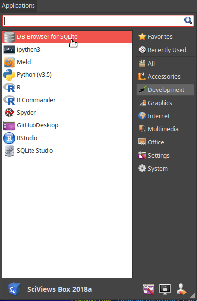
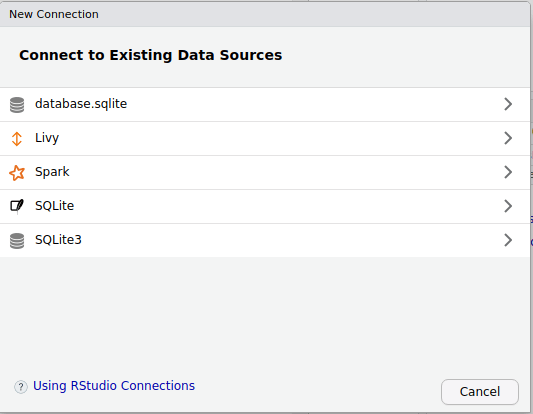
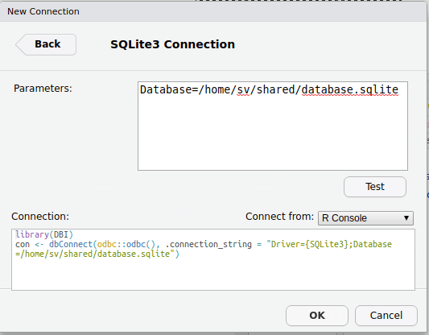
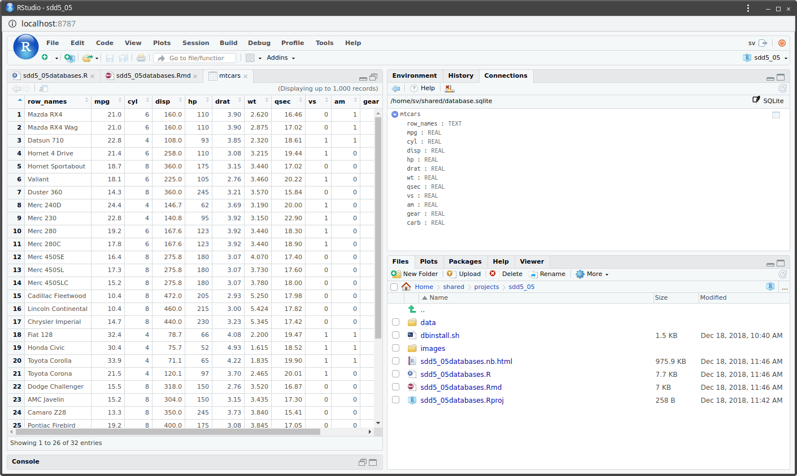
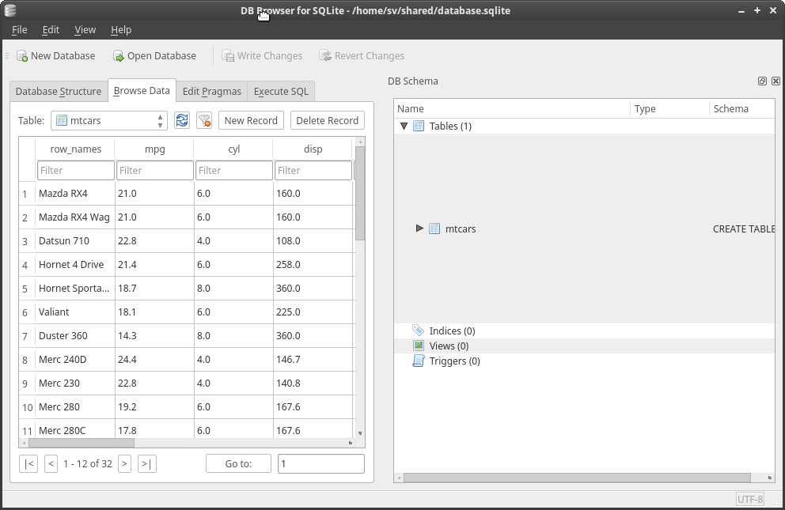

# Bases de données & MDS {#db-mds}

```{r setup, include=FALSE, echo=FALSE, message=FALSE, results='hide'}
SciViews::R("explore")
```

##### Objectifs {.unnumbered}

-   Aller plus loin dans la gestion de gros jeux de données et de données réparties en plusieurs tableaux avec les bases de données relationnelles, la normalisation des données et les modèles de données.

-   Comprendre la représentation d'une matrice de distances sur un carte (ordination) et la réduction de dimensions via le positionnement multidimensionnel MDS.

##### Prérequis {.unnumbered}

La section relative aux bases de données fait suite aux notions vues dans le cadre du traitement de données volumineuses vu à la fin du module 8 et qui doit être donc parfaitement compris et assimilé.

Les techniques MDS étudiées à la fin de ce module étant basées sur des matrices de distances et complémentaires à la classification ascendante hiérarchique, le module \@ref(cah-kmeans-div) doit être assimilé avant de s'attaquer au présent module.

## Accès aux bases de données

Puisque nous traitons de jeux de données multivariés potentiellement très gros, il devient important de pouvoir accéder aux données stockées de manière plus structurée que dans un fichier au format CSV ou Excel, par exemple. Les bases de données, et notamment les **bases de données relationnelles**, sont prévues pour stocker de grandes quantités de données de manière structurée et pour pouvoir en extraire la partie qui nous intéresse à l'aide de **requêtes**. Nous allons ici étudier les rudiments indispensables pour nous permettre de réaliser de telles requêtes depuis R.

```{block2, type='note'}
SQL est un langage dédié aux requêtes et la manipulation de bases de données relationnelles, constituées de tables (équivalent à des tableaux cas par variables en statistiques) reliées entre elles par une ou plusieurs *clés*. Par exemple, le champ `auteur` d'une liste de livres dans la table `Livres` renvoie (est lié à) vers le champs `nom` d'une autre table `Ecrivains` qui fournit plus de détails sur chaque auteur de livres.
```

Il existe différents moteurs de bases de données relationnelles. Les plus courants sont : SQLite, MySQL/MariaDB, PosgreSQL, SQL Server, Oracle, ... La plupart de ces solutions nécessitent d'installer un **serveur** de base de données centralisé. Cependant, SQLite, est une solution légère qui permet d'explorer le langage SQL ([prononcez "S.Q.L." ou "Sequel"](https://www.vertabelo.com/blog/notes-from-the-lab/sql-or-sequel)), y compris avec des petites bases de données test en mémoire ou contenues dans un fichier.

### Installation de SQLite

Dans la SciViews Box, les drivers SQLite pour la version 2 et la version 3 sont préinstallés. Sous R, vous pouvez utiliser le package `RSQLite` pour accéder à des bases de données qui sont de simples fichiers sur le disque. Cependant, l'onglet **Connections** dans RStudio n'est pas compatible avec `RSQLite`. Il fonctionne, par contre avec les **drivers odbc** qui sont un format commun de drivers pour différentes bases de donnes dont SQLite. Les drivers SQLite, MySQL et PosgreSQL sont préinstallés dans la SciViews Box. Nous utiliserons également une interface graphique vers SQLite : **DB Browser for SQLite** disponible depuis le menu principal `Applications`, dans la section `Development`.



### Base de données en mémoire

La simplicité de SQLite tient au fait qu'il n'est pas nécessaire d'installer un serveur de bases de données pour l'utiliser. La version la plus simple permet même de travailler directement en mémoire. Ainsi, nous pouvons facilement placer le contenu d'un jeu de données comme `mtcars` et tester ensuite des **requêtes SQL** (l'équivalent des fonctions d'extraction et de remaniement de tableau dans `dplyr`) sur ces données en mémoire.

Voici un petit aperçu qui vous montre comment créer, et puis manipuler une base de données SQLite en mémoire depuis R.

```{r in-memory}
library('RSQLite')

# Base de données en mémoire
con <- dbConnect(RSQLite::SQLite(), dbname = ":memory:")

# Ne contient encore rien
dbListTables(con)

# Ajoute une table
dbWriteTable(con, "mtcars", mtcars)
dbListTables(con)

# Que contient cette table?
dbListFields(con, "mtcars")

# Lire toute la table
dbReadTable(con, "mtcars")

# Effectuer une requête SQL sur la table
res <- dbSendQuery(con, "SELECT * FROM mtcars WHERE cyl = 4")
dbFetch(res)
dbClearResult(res)

# On peut aussi récupérer les données morceau par morceau
res <- dbSendQuery(con, "SELECT * FROM mtcars WHERE cyl = 4")
while (!dbHasCompleted(res)) {
  chunk <- dbFetch(res, n = 5)
  print(nrow(chunk))
}
dbClearResult(res)

# Se déconnecter de la base de données
dbDisconnect(con)
```

##### À vous de jouer ! {.unnumbered}

`r h5p(111, height = 270, toc = "Stratégie d'utilisation d'une base de données")`

### Base de données dans un fichier

La SciViews Box contient une base de données test dans `~/shared/database.sqlite`. Vous pouvez facilement vous connecter dessus via l'onglet `Connections` de RStudio. Vous pouvez également vous y connecter via du code R directement. Notez que la même syntaxe est utilisée pour **créer une nouvelle base de données** si le fichier n'existe pas encore au moment de la connexion.

```{r dbconstruct, include=FALSE, echo=FALSE, message=FALSE, results='hide'}
if (!file_exists("~/shared/database.sqlite"))
  dir_create("~/shared")
# Make sure we have the iris table intact in it
con <- dbConnect(SQLite(),
dbname = "~/shared/database.sqlite")
dbWriteTable(con, "iris", iris, overwrite = TRUE)
dbDisconnect(con)
```

```{r connection-sqlite}
library('RSQLite')
con <- dbConnect(SQLite(),
  dbname = "~/shared/database.sqlite")
```

##### À vous de jouer ! {.unnumbered}

`r h5p(110, height = 270, toc = "Connection à une base de données")`

Voici quelques instructions typiques pour interroger cette base de données depuis R :

```{r setosa}
# Liste les tables présentes dans la base de données
dbListTables(con)
# Extraction de données à l'aide d'une requête SQL
(setosa <- dbGetQuery(con, "SELECT * FROM iris WHERE Species is 'setosa'"))
```

La dernière instruction nécessite quelques explications supplémentaires. La fonction `dbGetQuery()` envoie une requête sur la base en langage SQL. Ici, nous indiquons les colonnes que nous souhaitons récupérer avec le mot clé `SELECT`. L'utilisation de `*` indique que nous voulons toutes les colonnes, sinon on nomme celles que l'on veut à la place. Ensuite, le mot clé `FROM` nous indique depuis quelle table, ici celle nommée `iris`, et enfin, le mot clé `WHERE` introduit une expression de condition qui va *filtrer* les lignes de la table à récupérer, par exemple `'Sepal.Length' > 1.5` ou comme ici `Species is 'setosa'`.

Il est également possible d'effectuer une requête SQL directement dans un chunk. À la place d'indiquer ```` ```{r} ````, on indiquera ```` ```{sql, connection=con} ````, et nous pourrons alors directement indiquer la requête SQL dans le chunk :

```{sql setosa-direct, connection=con}
SELECT * FROM iris WHERE Species is 'setosa'
```

Par défaut, cette requête est imprimée dans le document, et son résultat est perdu ensuite. Il est cependant possible de l'enregistrer sous un nom avec l'option de chunk `output.var=`. Dans ce cas, rien n'est imprimé, mais comme le résultat de la requête est contenu dans l'objet créé, il est facile de le manipuler dans R ensuite plus loin dans notre document.

```{sql virginica, connection=con, output.var="virginica"}
SELECT * FROM iris WHERE Species is 'virginica'
```

Ensuite, dans un chunk R, vous pouvez manipuler la table contenue dans `virginica` :

```{r}
nrow(virginica)
summary(virginica)
```

Ne pas oublier de se déconnecter de la base de données une fois terminé.

```{r}
dbDisconnect(con)
```

### Driver ODBC dans RStudio

RStudio facilite l'utilisation de bases de données à condition d'utiliser un driver "compatible". Nous avons installé un tel driver ODBC pour les bases de données SQLite. Pour nous connecter à `/home/sv/shared/database.sqlite` depuis RStudio, nous entrons dans l'onglet **Connections** et nous cliquons sur le bouton `New Connection`, ou nous cliquons sur la connexion correspondante si elle est déjà créée dans la liste.



Pour créer une nouvelle connexion, sélectionnons **SQLite3**. Ensuite, nous rentrons `Database=/home/sv/shared/database.sqlite` comme paramètre dans la fenêtre suivante.



Le bouton **Test** permet de vérifier que R/RStudio peut se connecter à cette base de données. Ensuite, dans **Connect from:**, vous pouvez choisir où vous voulez placer l'instruction de connexion. L'option `Clipboard` est intéressante. Elle place l'instruction dans le presse-papier et vous pouvez alors décider vous-même où la placer. Nous la placerons dans un chunk R dans notre notebook.

```{r, eval=FALSE}
library(odbc)
con <- dbConnect(odbc::odbc(), .connection_string = paste0("Driver={SQLite3};Database=/home/", Sys.info()['user'],
  "/shared/database.sqlite"))
```

Une fois connecté, vous pouvez voir le contenu de la base de données dans l'onglet **Connections**. Pour ajouter une table que nous remplissons à partir des données issues du jeu de données `mtcars`, nous écririons dans R :

```{r, eval=FALSE}
dbWriteTable(con, "mtcars", mtcars)
```

À partir de ce moment, vous pouvez voir votre table `mtcars` (il faut peut-être cliquer sur le bouton en forme de flèche qui se mord la queue pour rafraîchir l'affichage). Comme dans **Environnement**, si vous cliquez sur la flèche dans un rond bleu devant le nom de la table, vous pouvez voir les colonnes qu'elle contient. En cliquant sur l'icône tableau à droite, vous visualisez la table directement dans RStudio.



À part cela, vous travaillez avec cette base de données dans R en utilisant l'objet `con` comme d'habitude, et vous pouvez aussi utiliser directement des chunks sql.

### Utilisation de DB Browser

Lancez **DB Browser**. Connectez-vous à `/home/sv/shared/database.sqlite` Vous avez un accès visuel à votre base de données. Explorez les différentes possibilités du logiciel.



### Utilisation de {dplyr}

```{r, echo=FALSE}
#dbWriteTable(con, "iris", iris, overwrite = TRUE)
```

Les fonctions du package {dplyr} fonctionnent aussi très bien sur des bases de données. Les commandes sont converties en interne en requêtes SQL. Il suffit d'utiliser `collect()` à la fin pour exécuter la requête.

```{r dplyr1}
#dbfile <- "~/shared/database.sqlite"
dbfile <- file_temp("database", ext = "sqlite")
my_db <- DBI::dbConnect(RSQLite::SQLite(), dbfile)
my_db
# Ajouter une table iris dans la base de données
iris <- read("iris", package = "datasets")
copy_to(my_db, iris)
# Récupérer toutes les données de la table iris
my_table <- tbl(my_db, sql("SELECT * FROM iris"))
(df2 <- collect_dtx(my_table))
```

Voici maintenant ce que cela donne en utilisant les verbes de {dplyr}. La fonction `explain()` permet d'expliquer ce qui est fait.

```{r}
# Sélectionner des variables
select(my_table, sepal_width, petal_length:species)
# Filtrer les fleurs à gros pétales
filter(my_table, petal_length > 1.5)
# Réarranger les lignes par longueur de pétale croissante et largeur de sépale décroissant
arrange(my_table, petal_length, desc(sepal_width))
# Créer une nouvelle variables
mutate(my_table, logpl = log10(petal_length))
# Résumer les données
explain(summarise(my_table, taille = median(petal_length)))
```

Il est possible de réaliser des choses plus complexes ! On peut naturellement chaîner tout cela avec le pipe `%>.%`, ou combiner les requêtes comme on veut. Rien n'est fait avant de collecter les résultats avec `collect_dtx()` ou l'assignation alternative `%<-%` ou `%->%`.

```{r dplyr2}
my_table %>.%
  filter(., petal_length > 1.5) %>.%
  select(., petal_length, sepal_width, species) %>.%
  mutate(., logpl = log10(petal_length)) -> # Assignation normale, résultats pas encore collectés
  query1
# On peut continuer tant que l'on n'a pas collecté les résultats
query2 <- arrange(query1, petal_length, desc(sepal_width))
query2
# Récupérer le résultat
#res <- collect_dtx(query2) # Plus explicite, mais plus long que:
res %<-% query2
res
```

Enfin, la fonction `sql_translate()` du package {dbply} va indiquer comment une instruction R est convertie en code SQL équivalent. **C'est très pratique aussi pour apprendre SQL quand on connait R !**

```{r, error=TRUE}
dbplyr::translate_sql(x^3 < 15 || y > 20)
dbplyr::translate_sql(mean(x))
dbplyr::translate_sql(mean(x, na.rm = TRUE))
# Tout ne fonctionne pas, car R offre plus de possibilités que SQL
dbplyr::translate_sql(plot(x)) #???
dbplyr::translate_sql(mean(x, trim = TRUE)) # Argument trim= non reconnu
```

Voilà pour ce très rapide tour d'horizon de différentes façons de manipuler des bases de données avec R et RStudio. En pratique, revenez sur cette section, et approfondissez vos connaissances via les ressources proposées ci-dessous lorsque vous serez confrontés "en vrai" à des données présentées dans une base de données relationnelle.

##### À vous de jouer ! {.unnumbered}

`r learnr("B09La_db", title = "Bases de données et data model", toc = "Bases de données et data model")`

##### Pour en savoir plus {.unnumbered}

-   [RStudio et bases de données](https://db.rstudio.com) : tout un site web dédié à l'accès aux bases de données depuis RStudio (en anglais).

-   La [documentation](https://github.com/sqlitebrowser/sqlitebrowser/wiki) de DB Browser for SQLite (en anglais).

-   Une introduction des [requêtes SQL dans R](http://dept.stat.lsa.umich.edu/~jerrick/courses/stat701/notes/sql.html) un peu plus développée (en anglais).

-   Un [tutoriel SQL](https://www.w3schools.com/sql/) avec des exercices (en anglais).

-   Un [cours en ligne sur SQL](https://fr.khanacademy.org/computing/computer-programming/sql/sql-basics/v/welcome-to-sql) par vidéos par la Kahn Academy (en anglais).

-   Un autre [tutoriel complet sur SQL](http://blog.paumard.org/cours/sql/). Remarquez qu'il en existe beaucoup. Faites une recherche via Google et choisissez le tutoriel qui vous plaît le plus.

-   Les [dix commandements d'une base de données réussie](https://thinkr.fr/base-de-donnees-reussie/). Il s'agit ici plutôt de la création d'une base de données que de la requête sur une base de données existante... mais tôt ou tard, vous créerez vos propres bases de données et ces conseils vous seront alors utiles.

## Positionnement multidimensionnel (MDS)

Revenons à présent sur les techniques statistiques d'analyse de données multivariées. Le positionnement multidimensionnel, ou *multidimensional scaling* en anglais, d'où son acronyme fréquemment utilisé en français également : le MDS, est une façon de représenter clairement l'information contenue dans une matrice de distances. Au départ, nous avons *p* colonnes et *n* lignes dans le tableau cas par variables, c'est-à-dire, *p* variables quantitatives mesurées sur *n* individus distincts. Nous voulons déterminer les similitudes ou différences de ces *n* individus en les visualisant sur une carte où la distance d'un individu à l'autre représente cette similitude. Plus deux individus sont proches, plus ils sont semblables. Ces distances entre paires d'individus, nous les avons déjà calculées dans la matrice de distance au module 6. Mais comment les représenter ? En effet, une représentation exacte ne peut se faire que dans un espace à *p* dimensions (même nombre de dimensions que de variables initiales). Donc, afin de réduire les dimensions à seulement deux ou trois, nous allons devoir "tordre" les données tout en acceptant de perdre un peu d'information lors de cette transformation.

`r img("sdd2_06/tenor.gif")`

Ce que nous allons faire avec la MDS correspond exactement à cela : nous allons littéralement "écraser" les données dans un plan (deux dimensions) ou dans un espace à trois dimensions. C'est donc ce qu'on appelle une technique de **réduction de dimensions**. Il existe, en réalité, plusieurs techniques de MDS. Elles répondent toutes au schéma suivant :

-   À partir d'un tableau multivarié de *n* lignes et *p* colonnes, nous calculons une matrice de distances (le choix de la transformation initiale éventuelle et de la métrique de distance utilisée sont totalement libres ici[^09-db-mds-1]).
-   Nous souhaitons représenter une carte (nuage de points) à *k* dimensions (*k* = 2, éventuellement *k* = 3) où les *n* individus seront placés de telle façon que les proximités exprimées par des valeurs faibles dans la matrice de dissimilarité soient respectées *autant que possible* entre tous les points.
-   Pour y arriver les points sont placés successivement sur la carte et réajustés afin de minimiser une **fonction de coût**, encore appelée **fonction de stress** qui quantifie de combien nous avons dû tordre le réseau à *p* dimensions initiales représentant les distances entre toutes les paires. C'est en adoptant différentes fonctions de stress que nous aboutissons aux différentes variantes de MDS. La fonction de stress est représentée graphiquement (voir ci-dessous) pour diagnostiquer le traitement réalisé et décider si la représentation est utilisable (pas trop tordue) ou non.
-   Le positionnement des points faisant intervenir un facteur aléatoire (choix des points à placer en premier, réorganisation ensuite pour minimiser la fonction de stress), le résultat final peut varier d'une fois à l'autre sur les mêmes données, voir ne pas converger vers une solution stable. Il faut en être conscient.

[^09-db-mds-1]: Chaque métrique de distance offre un éclairage différent sur les données. Elles agissent comme autant de filtres différents à votre disposition pour explorer vos données multivariées.

Nous vous épargnons ici les développements mathématiques qui mènent à la définition de la fonction de stress. Nous nous concentrerons sur les principales techniques et sur leurs propriétés utiles en pratique en biologie.

##### À vous de jouer ! {.unnumbered}

`r h5p(96, height = 270, toc = "Objectif du MDS")`

Dans R, il existe plus d'une dizaine de fonctions différentes pour réaliser le MDS. Afin de vous simplifier le travail et de pouvoir traiter votre MDS comme d'autres analyses similaires, nous vous proposons une interface simplifiée au travers de la fonction `mds()` qui est rendue disponible grâce à l'instruction suivante à utiliser systématiquement en tête de script ou de document R Markdown :

```{r}
SciViews::R("explore")
```

### MDS métrique ou PCoA

La forme classique, aussi appelée **MDS métrique** ou **analyse en coordonnées principales** (Principal Coordinates Analysis en anglais ou PCoA), va *projeter* le nuage de points à *p* dimensions dans un espace réduit à *k* = deux dimensions (voire éventuellement à trois dimensions). Cette projection se fait de manière similaire à une ombre chinoise projetée d'un objet tridimensionnel sur une surface plane en deux dimensions.


Notez que l'Analyse en Composantes Principales (ACP) que nous avons étudiée au module 7 est en fait équivalente à une Analyse en Coordonnées Principales sur une matrice de distances euclidiennes (MDS métrique). Nous avons vu que l'ACP se résout par un calcul matriciel optimisé. Dans le cas de la MDS métrique, c'est une approche d'optimisation itérative qui est utilisée pour obtenir un résultat sensiblement proche... et cette approche itérative pourra être réutilisée plus tard sur d'autres métriques pour traiter des cas plus généraux.

##### À vous de jouer ! {.unnumbered}

`r h5p(103, height = 270, toc = "Comparaison entre l'ACP et PCoA")`

Considérons un relevé de couverture végétale en 24 stations concernant 44 plantes répertoriées sur le site de l'étude, par exemple, `Callvulg` est [*Calluna vulgaris*](https://www.tela-botanica.org/bdtfx-nn-12262-synthese), `Empenigr` est [*Empetrum nigrum*](https://www.tela-botanica.org/bdtfx-nn-23935-synthese), etc. Les valeurs sont les couvertures végétales observées pour chaque plante sur le site, exprimées en pour cent. La première colonne nommée `rownames` à l'importation contient les identifiants des stations (chaînes de caractères). Nous la renommons donc pour un intitulé plus explicite : `station`.

```{r}
read("varespec", package = "vegan") %>.%
  srename(., station = .rownames) %->%
  veg
veg
```

Typiquement ce genre de données ne contient pas d'information constructive lorsqu'une plante est simultanément absente de deux stations (doubles zéros). Donc, les métriques de type euclidienne ou Manhattan ne conviennent pas ici. Nous devons choisir entre distance de Bray-Curtis ou Canberra en fonction de l'importance que nous souhaitons donner aux plantes les plus rares (avec couverture végétale faible et/ou absentes de la majorité des stations).

Afin de décider quelle métrique utiliser, visualisons à présent l'abondance ou la rareté des différentes plantes :

```{r, fig.height=8}
veg %>.%
  sselect(., -station) %>.% # Colonne 'station' pas utile ici
  spivot_longer(., everything(), names_to = "espèce", values_to = "couverture") %>.%
  chart(., espèce ~ couverture) +
    geom_boxplot() + # Boites de dispersion
    labs(x = "Espèce", y = "Couverture [%]")
```

Comme nous pouvions nous y attendre, sept ou huit espèces dominent la couverture végétale et les autres données sont complètement écrasées à zéro sur l'axe pour la majorité des stations. Si nous utilisons la distance de Bray-Curtis, l'analyse sera pratiquement réalisée sur seulement ces quelques espèces dominantes. Avec Canberra, nous risquons par contre de donner beaucoup trop d'importance aux espèces extrêmement rares (toutes les espèces ont une importance égale avec cette métrique). Une solution intermédiaire est de transformer les données pour réduire l'écart d'importance entre les espèces abondantes et les rares, soit avec $log(x + 1)$, soit avec $\sqrt{\sqrt{x}}$. Voyons ce que donne la transformation logarithmique ici en utilisant la fonction `log1p()` dans R.

```{r, fig.height=8}
veg %>.%
  sselect(., -station) %>.%
  spivot_longer(., everything(), names_to = "espèce", values_to = "couverture") %>.%
  chart(., espèce ~ log1p(couverture)) + # Transformation log(couverture + 1)
    geom_boxplot() +
    labs(x = "Espèce", y = "Couverture [%]")
```

C'est nettement mieux, car les données concernant les espèces rares ne sont plus totalement écrasées vers zéro sur l'axe horizontal ! La matrice de distances de Bray-Curtis sur nos données transformées log est la **première étape** de l'analyse :

```{r}
veg %>.%
  sselect(., -station) %>.%
  log1p(.) %>.%
  dissimilarity(., method = "bray") %->%
  veg_dist
```

La PCoA va visualiser le contenu -autrement indigeste- de `veg_dist` de manière bien plus utile. La **seconde étape** consiste à calculer notre MDS métrique en utilisant `mds$metric()`

```{r, echo=FALSE}
set.seed(9)
```

```{r}
veg_mds <- mds$metric(veg_dist)
```

Ensuite, **troisième étape**, le but étant de visualiser les distances, nous effectuons immédiatement un graphique comme suit :

```{r}
chart(veg_mds, labels = veg$station, col = veg$station)
```

Ce graphique s'interprète comme suit :

-   Des stations proches l'une de l'autre sur la carte ont des indices de dissimilarité faibles. Ces stations sont semblables du point de vue de la couverture végétale.
-   Plus les stations sont éloignées les unes des autres, plus elles sont dissemblables.
-   Si des regroupements apparaissent sur la carte, il se peut que ce soit des biotopes semblables, et qui diffèrent des autres regroupements. Par exemple ici, les stations 14--16, 20 et 22--25 forment un groupe relativement homogène en haut à gauche du graphique qui s'individualise du reste. Au contraire, les stations 5, 21, ou encore 27 ou 28 sont relativement isolées et constituent donc des assemblages végétaux uniques.
-   Les stations aux extrémités sont des configurations extrêmes ; celles au centre sont des configurations plus courantes.
-   Par contre, ni l'orientation des axes ni les valeurs absolues sur ces axes n'ont de significations particulières ici. N'en tenez pas compte.

```{block2, type='warning'}

Attention : rien ne garantit que notre MDS métrique projettée en deux dimensions soit suffisamment représentative des données dans leur ensemble. Si la méthode n'a pas réussi à représenter fidèlement les données, c'est que ces dernières sont trop complexes et ne s'y prêtent pas. Contrôlez donc toujours les indicateurs que sont les valeurs de "Goodness-of-fit" (GOF, qualité d'ajustement).

```

Les indicateurs "GOF" sont obtenus via la fonction `glance()` :

```{r}
glance(veg_mds)
```

Ici `GOF1` est la somme des valeurs propres obtenues lors du calcul (ces valeurs propres vous seront expliquées dans le module suivant consacré à l'ACP). Retenez simplement que c'est une mesure de la part de variance du jeu de données initial qui a pu être représentée sur la carte. Plus la valeur se rapproche de 1, mieux c'est, avec des valeurs \> 0.7 ou 0.8 qui restent acceptables. Le second indicateur, `GOF2` est la somme uniquement des valeurs propres positives. Certains préfèrent ce dernier indicateur. En principe, les deux sont proches ou égaux. Donc, le choix de l'un ou de l'autre ne devrait pas fondamentalement modifier vos conclusions.

**Ici, avec des valeurs de goodness-of-fit à peine supérieures à 50% nous pouvons considérer que la carte n'est pas suffisamment représentative.** Soit nous tentons de la représenter en trois dimensions (mais c'est rarement plus lisible, car il faut quand même se résigner à présenter ce graphique 3D dans un plan à deux dimensions -l'écran de l'ordinateur, ou une feuille de papier- au final). Une autre solution lorsque la MDS métrique ne donne pas satisfaction est de se tourner vers la MDS non métrique. Ce que nous allons faire ci-dessous.

##### À vous de jouer ! {.unnumbered}

`r h5p(97, height = 270, toc = "Qualité d'ajustement d'un MDS")`

```{block2, type='note'}

Rappelons que la PCoA sur matrice euclidienne après standardisation ou non des données est équivalente à une **Analyse en Composantes Principales** (ACP), ... mais avec un calcul nettement moins efficace. Dans ce contexte, la PCoA n'a donc pas grand intérêt. Elle est surtout utile lorsque vous voulez représenter des métriques de distances *différentes* de la distance euclidienne comme c'est le cas ici avec un choix de distances de Bray-Curtis.

```

### MDS non métrique

La version non métrique de la MDS vise à réaliser une carte sur base de la matrice de distances, mais en autorisant des écarts plus flexibles entre les individus... pour autant que des individus similaires restent plus proches les uns des autres que des individus plus différents, et ce, partout sur la carte. Donc, une dissimilarité donnée pourra être "compressée" ou "dilatée", pour autant que la distorsion garde l'ordre des points intacts. Cela signifie que la distorsion se fera via une fonction monotone croissante (une dissimilarité plus grande ne pouvant pas être représentée par une distance plus petite sur la carte).

La distorsion ainsi introduite est appelée un **stress**. C'est un peu comme si vous écrasiez par la force un objet 3D sur une surface plane, au lieu de juste en projeter l'ombre. Comme il existe différentes fonctions de stress, il existe donc différentes versions de MDS non métriques. Ici, nous nous attacherons à maîtriser une version implémentée dans `mds$nonmetric()`. Il s'agit de l'une des premières formes de MDS non métriques qui a été proposée par le statisticien Joseph Kruskal (on parle aussi du positionnement multidimensionnel de Kruskal).

La logique est la même que pour la MDS métrique :

-   étape 1 : construction d'une matrice de distances,
-   étape 2 : calcul du positionnement des points,
-   étape 3 : réalisation de la carte et vérification de sa validité.

Repartons de la même matrice de distances déjà réalisée pour la MDS métrique qui se nomme `veg_dist`. Le calcul est itératif. Comme il n'est pas garanti de converger ni de donner la meilleure réponse, nous utilisons ici une fonction "intelligente" qui va effectuer une recherche plus poussée de la solution optimale, notamment en partant de différentes configurations au départ. Pour les détails et les paramètres de cet algorithme, voyez l'aide en ligne de la fonction `?vegan::metaMDS`. Dans le cadre de ce cours, nous ferons confiance au travail réalisé et vérifierons juste qu'une solution est trouvée (indication `*** Solution reached` à la fin). Notez toutefois que le stress est quantifié. Il tourne ici autour de 0,126. Plus la valeur de stress est basse, mieux c'est naturellement.

```{r, echo=FALSE}
set.seed(295)
```

```{r}
veg_nmds <- mds$nonmetric(veg_dist) # Calcul
```

À présent, nous pouvons représenter la carte.

```{r}
chart(veg_nmds, labels = veg$station)
```

Nous avons une représentation assez différente de celle de la MDS métrique. Les stations 5, 21, 27 et 28 sont toujours isolées, mais le reste est regroupé de manière plus homogène. Comment savoir si cette représentation est meilleure que la version métrique qui avait une "goodness-of-fit" décevante ? En visualisant les indicateurs de qualité d'ajustement, ainsi que la fonction de stress sur un graphique dit **graphique de Shepard**. Comme d'habitude, `glance()` nous donnent les statistiques voulues.

```{r}
glance(veg_nmds)
```

Le premier indicateur (R^2^ linéaire) est le coefficient de corrélation linéaire de Pearson entre les distances ajustées et les distances sur la carte au carré. Plus cette valeur est proche de 1, moins les distances sont tordues. Le second indicateur, le R^2^ non métrique est calculé comme 1 - S^2^ où S est le stress (tel que quantifié plus haut lors de l'appel à la fonction `mds$nonmetric()`). Cette dernière statistique indique si l'*ordre* des points respecte l'*ordre* des distances partout sur le graphique. Avec 0,98, la valeur est excellente ici. Ensuite le R^2^ linéaire nous indique de combien les différentes distances sont éventuellement distordues. Avec une valeur de 0,92, la distorsion n'est pas trop forte ici.

Le diagramme de Shepard permet de visualiser dans le détail la distorsion introduite pour parvenir à réaliser la carte en deux dimensions.

```{r}
veg_sh <- shepard(veg_dist, veg_nmds)
chart(veg_sh) +
  labs(x = "Dissimilarité observée", y = "Distance sur l'ordination")
```

Sur l'axe des abscisses, nous avons les valeurs de dissimilarité présentes dans la matrice de distances. Sur l'axe des ordonnées, le graphique représente les distances de l'ordination, c'est-à-dire, les distances entre les paires de points sur la carte. Chaque point correspond à la dissimilarité d'une paire d'individus sur X, et à la distance entre cette paire sur la carte en Y. Enfin, le trait en escalier rouge matérialise la fonction monotone croissante choisie pour distordre les distances. C'est la **fonction de stress**.

Ce diagramme se lit comme suit :

-   Plus les points sont proches de la fonction de stress, mieux c'est. Le R^2^ non métrique sera également d'autant plus élevé que les points sont proches de la fonction.
-   Plus la fonction de stress est linéaire, plus les *distances* respectent les valeurs de *dissimilarités*. Le R^2^ linéaire est lié à la plus ou moins bonne linéarité de la fonction de stress.

Vous pouvez très bien décider que seul l'*ordre* des individus sur la carte compte. Dans ce cas, la forme de la fonction de stress et la valeur du R^2^ linéaire importent peu. Seul compte la proximité la plus forte possible des points par rapport à la fonction de stress sur le diagramme de Shepard, ainsi donc que la valeur du R^2^ non métrique.

Si par contre, vous voulez être plus contraignant, alors, les distances seront considérées également comme importantes. Vous rechercherez alors une fonction de stress pas trop éloignée d'une droite, ainsi qu'un R^2^ linéaire élevé. Dans ce cas, nous nous rapprochons des exigences de la MDS métrique.

Ici, nous pouvons constater que les deux critères sont bons. Nous pouvons donc nous fier à la carte obtenue à l'aide de la MDS non métrique de Kruskal.

```{block2, type='warning'}

Restez toujours attentif à la taille du jeu de données que vous utilisez pour réaliser une MDS, en particuliers une MDS non métrique. Quelques centaines de lignes, cela dois passer, plusieurs dizaines de milliers ou plus, cela ne passera pas\ ! La limite dépend bien sûr de la puissance de votre ordinateur et de la quantité de mémoire vive disponible. Retenez toutefois que la quantité de calculs augmente drastiquement avec la taille du jeu de données à traiter.

```

##### Pour en savoir plus {.unnumbered}

-   La fonction `mds()` donne accès à d'autres versions de MDS non métriques également. Ainsi, `mds$isoMDS()` ou `mds$monoMDS()` correspondent toutes deux à la version de Kruskal, mais en utilisant une seule configuration de départ (donc, moins robustes, mais plus rapides à calculer). La `mds$sammon()` est une autre forme de MDS non métrique décrite dans l'aide en ligne de `?MASS::sammon`.

-   Des techniques existent pour déterminer la dimension *k* idéale de la carte. Le **graphique des éboulis** (*screeplot* en anglais) sera abordé au module suivante dans le cadre de l'ACP. Il en existe une version pour le MDS, voyez [ici](https://rpubs.com/YaPi/393252) (en anglais).

##### À vous de jouer ! {.unnumbered}

`r learnr("B09Lb_mds", title = "Positionnement multidimensionnel (MDS)", toc = "Positionnement multidimensionnel (MDS)")`

```{r assign_B09Ia_data_mds, echo=FALSE, results='asis'}
if (exists("assignment"))
  assignment("B09Ia_data_mds", part = NULL,
    url = "https://github.com/BioDataScience-Course/B09Ia_data_mds",
    course.ids = c(
      'S-BIOG-061' = !"B09Ia_{YY}M_data_mds"),
    course.urls = c(
      'S-BIOG-061' = "https://classroom.github.com/a/..."),
    course.starts = c(
      'S-BIOG-061' = !"{W[28]+1} 13:00:00"),
    course.ends = c(
      'S-BIOG-061' = !"{W[29]+1} 23:59:59"),
    term = "Q2", level = 3,
    toc = "Bases de données et analyse MDS")
```

## Récapitulatif des exercices

Ce neuvième module vous a permis de découvrir le travail sur les bases de données ainsi qu'une autre famille d'analyse multivariée: les MDS. Pour évaluer votre compréhension de cette matière, vous aviez les exercices suivants à réaliser :

`r show_ex_toc()`

##### Progression {.unnumbered}

`r launch_report("09", height = 800)`
