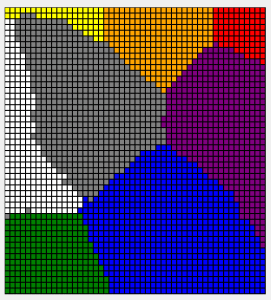

# Données ouvertes & SOM {#open-data-som}

```{r setup, include=FALSE, echo=FALSE, message=FALSE, results='hide'}
SciViews::R("explore")
```

##### Objectifs {.unnumbered}

-   Se sensibiliser aux données ouvertes : quand et pourquoi rendre ses données ouvertes ? Comment le faire correctement (format, métadonnées, dictionnaire des données, licences, principe FAIR, DMP, ...)

-   Être capable de créer des cartes auto-adaptatives ou SOM, de les interpréter et de les utiliser comme autre technique de classification.

##### Prérequis {.unnumbered}

-   Une bonne connaissance des données et des formats de stockage des données, ainsi que du modèle de données dans le cadre des bases relationnelles est un plus qui complémente la section sur les données ouvertes. Ces notions ont été abordées dans les modules 8 et 9.

## Données ouvertes

L'*"Open Data"* ou données ouvertes est un phénomène en pleine expansion. Vous y serez certainement confrontés dans votre carrière. Autant bien comprendre de quoi il s'agit et rendre vos données accessibles et publiques de la meilleure façon qui soit. Cette dernière partie est une brève introduction en la matière, qui devrait vous permettre de bien démarrer.

### Gestion des données

Lors de la préparation d'une expérience, vous devez réfléchir à un plan d'expérience. Vous avez donc défini des protocoles d'expérience, le nombre de répliquas,... Vous devez cependant intégrer à votre réflexion, un plan de gestion de vos données. Dans ce plan, vous aurez à définir l'acquisition, la description ou encore le partage des données.

#### Principe FAIR

Pour assurer une gestion cohérente des données scientifiques, il faut respecter le plus possible l'acronyme en anglais **FAIR** : *Findable, Accessible, Interoperable, Reusable* [@Wilkinson2016].

| Acronyme en anglais | Acronyme en français | Description                                                                                  |
|---------------------|----------------------|----------------------------------------------------------------------------------------------|
| *Findable*          | Facile à trouver     | Les données ont besoin d'un code unique et persistant pour les retrouver                     |
| *Accessible*        | Accessible           | Les données et surtout les métadonnées avec une licence sont mises à disposition.            |
| *Interoperable*     | Interopérable        | Les données et les métadonnées doivent respecter les standards internationaux                |
| *Reusable*          | Réutilisable         | Les données doivent être réutilisables grâce à des métadonnées riches et des licences claires |

##### Facile à retrouver (*Findable*)

Vos données et vos métadonnées détaillées doivent être faciles à retrouver. Vous devez donc fournir un identifiant **unique et permanent**. Il existe de nombreux identifiants comme ISBN, ISSN, DOI, ...

Dans le cadre de la recherche scientifique, Le Digital Object Identifier (*DOI*) est la méthode standardisée conseillée. Vous avez déjà été confronté à des DOI. Par exemple, le DOI suivant <https://doi.org/10.1038/sdata.2016.18> fait référence à l'article *The FAIR Guiding Principles for scientific data management and stewardship*. Ce code est unique et persistant. Ce code va toujours renvoyer vers cet article de la revue Scientific Data. Imaginons que la revue Scientific Data disparaissent, le DOI sera toujours associé à cet article. Ainsi, la publication pourra être retrouvée ailleurs sur Internet grâce à ce DOI.

Le DOI ne couvre pas que les articles scientifiques, il est également utilisé pour les données. Par exemple, le DOI suivant <https://doi.org/10.5281/zenodo.3711592> fait référence aux données intitulées. *Dataset: Number of diagnoses with coronavirus disease (COVID-19) in The Netherlands* publié par Zenodo. Nous reviendrons dans les sections suivantes sur [zenodo](https://zenodo.org).

##### Accessible (*Accessible*)

Les données et les métadonnées que vous collectez doivent de plus en plus souvent être rendues disponibles. Certaines revues scientifiques requièrent la mise à disposition des données. Les recherches financées par des fonds publics (nationaux, Européen,...) requièrent également la mise à disposition des données. Les données ne doivent pas être disponibles à tous. Par contre les métadonnées doivent l'être. Il est, de plus, important de préciser la procédure afin d'obtenir les données.

Il parait presque logique et évident de mettre à disposition ces données afin d'en faire profiter la recherche académique dans son ensemble. La recherche va progresser plus rapidement si les chercheurs collaborent. Un scientifique seul dans son laboratoire ne peut pas espérer progresser plus rapidement que 20 scientifiques qui collaborent et utilisent les données.

Il ne s'agit cependant pas de donner ces données sans aucune sécurité. En effet, il serait frustrant de travailler très dur sur un sujet précis et qu'un autre scientifique vole le fruit de ces nombreuses heures de travail et publie un article avant vous. Il existe une solution pour spécifier les droits d'utilisation de vos données. Vous devez associer une **licence** à vos données et métadonnées.

Vous avez très certainement déjà entendu parler des licences [Creative Commons](https://creativecommons.org). Il est de plus en plus courant de voir apparaître ce genre d'information sur des sites web comme [CC0](https://creativecommons.org/share-your-work/public-domain/cc0), [CC-by](https://creativecommons.org/licenses/by/4.0/), ou encore [CC-by-sa](https://creativecommons.org/licenses/by-sa/4.0/).

Vous êtes peut-être plus familiers avec les logos ci-dessous :

<a rel="license" href="http://creativecommons.org/licenses/by/4.0/"></a>

<a rel="license" href="http://creativecommons.org/licenses/by-sa/4.0/"></a>

<a rel="license" href="http://creativecommons.org/licenses/by-nc-sa/4.0/"></a>

<a rel="license" href="http://creativecommons.org/licenses/by-nc-nd/4.0/"></a>.

**Que se cache-t-il derrière ces logos ? Nous allons détailler ensemble ces abréviations.** Nous pouvons résumer cela de manière simple en nous posant deux questions :

-   Souhaitez-vous autoriser le partage des adaptations de votre œuvre ?
    -   Oui
    -   Non
    -   Oui, sous condition de partage dans les mêmes conditions.
-   Autorisez-vous les utilisations commerciales de votre œuvre ?
    -   Oui
    -   Non

Ces deux questions proviennent de l'outil mis à disposition sur le site [Creative Commons](https://creativecommons.org/choose) pour définir la licence la plus adaptée pour vous.

Dans le cadre de la recherche, tout n'est pas si simple. Vous devez tenir compte l'avis de vos supérieurs hiérarchiques, de votre institution et de la ou des institutions qui financent le travail. La bonne pratique est donc de discuter avec l'ensemble des acteurs pour décider de la bonne licence à employer, *le plus tôt possible, c'est-à-dire, déjà lors de l'élaboration du projet de recherche*.

Repartons de notre jeu de données sur la COVID-19 : [Dataset: Number of diagnoses with coronavirus disease (COVID-19) in The Netherlands](https://doi.org/10.5281/zenodo.3711592). Nous pouvons voir que l'auteur a décidé d'employer la licence

<a rel="license" href="http://creativecommons.org/licenses/by/4.0/"></a><br />Ce(tte) œuvre est mise à disposition selon les termes de la <a rel="license" href="http://creativecommons.org/licenses/by/4.0/">Licence Creative Commons Attribution 4.0 International</a>.

Il est donc autorisé d'adapter l'œuvre et de l'utiliser à des fins commerciales. Il s'agit d'une licence très peu contraignante. Il suffit simplement de créditer l'auteur de l'œuvre originale.

Il existe également des licences plus spécifiques aux bases de données, de la moins contraignante à la plus contraignante [PDDL](https://opendatacommons.org/licenses/pddl/) , [ODC-by](https://opendatacommons.org/licenses/by/) et [ODbL](https://opendatacommons.org/licenses/odbl/)

##### À vous de jouer ! {.unnumbered}

`r h5p(123, height = 270, toc = "Choix des licenses")`

##### Interopérable (*Interoperable*)

Les données sont associées à des métadonnées riches. Sur base des métadonnées, les données doivent être utilisables, compréhensibles et *combinables avec d'autres données*. Le choix du format des données est également important Ce principe est difficile à mettre en place et requiert donc une réflexion approfondie.

##### À vous de jouer ! {.unnumbered}

`r h5p(124, height = 270, toc = "Choix du format des données")`

##### Réutilisable (*Reusable*)

Les données doivent autant que possible être associées à des métadonnées riches avec une licence claire afin de pouvoir être *réutilisées*, nous l'avons déjà vu.

Vous avez certainement le sentiment que ces quatre principes se mélangent un peu. En effet, ils insistent avec des petites nuances sur des concepts particuliers.

En Résumé :

$$Données \ inutilisables = données \ seules$$

$$Données \ utilisables = données + contexte$$

Le contexte c'est :

-   un code unique et persistant associé aux données et au contexte,
-   une description du projet associée aux données,
-   des métadonnées riches (y compris un dictionnaire des données[^10-open-data-som-1]),
-   la licence associée aux données

[^10-open-data-som-1]: Vous avez déjà rédigé un dictionnaire des données lorsque vous avez planifié vos mesures concernant la biométrie humaine l'an dernier au cours de science des données biologiques I.

Dans le cadre de vos futures recherches, un outil comme Zenodo est très intéressant pour publier vos donnes sur l'Internet tout en suivant au mieux le principe **FAIR**.

##### À vous de jouer ! {.unnumbered}

`r h5p(125, height = 270, toc = "Principe FAIR")`

#### DMP

Afin de respecter ces principes **FAIR**, des outils ont été développés. Il s'agit des plans de gestion des données (ou Data Management Plan, **DMP**). L'Université de Mons dispose d'un [DMP](https://dmponline.be). Cet outil est partagé par l'ensemble des universités de Belgique.

Lorsque vous allez concevoir un plan d'expérience, n'oubliez pas de concevoir votre plan de gestion des données en même temps. Voici une check-list pour un plan de gestion des données efficaces <http://www.dcc.ac.uk/sites/default/files/documents/resource/DMP_Checklist_2013.pdf>

### Utilisation de données ouvertes

Il existe de nombreux sites qui regroupent un ensemble de données ouvertes. Nous avons parlé précédemment de Zenodo mais de nombreuses bases de données sont également disponibles comme le [Portail européen de données](https://www.europeandataportal.eu/fr), [Portail belge de données](https://data.gov.be/fr) ...

Afin de connaître la qualité des données, voici une check-list très utile pour appréhender des données ouvertes. Vous devez être capable de trouver facilement :

-   But des données
-   Code unique et persistant des données
-   Licence des données
-   Format des données
-   Qualité des données

**À nouveau, vous vous rendez compte que nous revenons à notre principe FAIR expliqué plus haut.** Prenons notre exemple sur le *Dataset: Number of diagnoses with coronavirus disease (COVID-19) in The Netherlands* et appliquons notre check-list.

-   Le but des données

Une description des données est proposée. Le nom de l'auteur est spécifié. Il est également précisé la date de publication avec la version des données. Le 16 mars 2020, la version est `v2020.3.16`. Les données sont également associées à un dépôt GitHub qui les traite : [J535D165/CoronaWatchNL](https://github.com/J535D165/CoronaWatchNL)

-   Un code unique et persistant

Ces données ont un DOI : [](https://doi.org/10.5281/zenodo.3711592)

-   La licence

Les données sont mises à disposition avec la licence [Creative Commons Attribution 4.0 International](https://creativecommons.org/licenses/by/4.0/legalcode)

-   le format

Les données sont proposées sous le format `csv`. Ce format est un standard très employé. Il est à privilégier par rapport au format `.xls` ou `.xlsx`. Il est à la fois interopérable et réutilisable facilement.

-   La qualité

Ce dernier critère est le plus difficile à déterminer. Une première chose à vérifier concerne les métadonnées associées à chaque variable. Nous pouvons voir que l'auteur peut encore améliorer les métadonnées associées à ses données. Le nom des variables reste cependant tout à fait compréhensible.

Comme vous venez de le voir, Zenodo de par sa structuration permet de remplir très simplement cette check-list.

##### Pour en savoir plus {.unnumbered}

-   [Qu'est-ce que les données ouvertes ?](https://www.europeandataportal.eu/fr/training/what-open-data)

-   [Aide sur l'interprétation et le choix des licences](https://www.europeandataportal.eu/en/training/licensing-assistant)

-   [Choisir la bonne licence Open Source](https://choosealicense.com)

-   [Guide sur les licences Open Data](https://theodi.org/article/publishers-guide-to-open-data-licensing/)

-   Des stockages spécifiques ont été mis en place pour les données scientifiques comme [Zenodo (dépôt des données hébergé par le CERN)](https://zenodo.org), [Dataverse](https://dataverse.org), ou encore [Figshare](https://figshare.com)

<!-- Plus accessible?!   [Data Management Plan](https://www.unil.ch/openscience/fr/home/menuinst/open-research-data/gerer-ses-donnees-de-recherche/data-management-plan-dmp.html) -->

-   Le [Principe FAIR](https://ogsl.ca/fr/principes-fair) expliqué par l'Observatoire Global du Saint-Laurent

-   Article scientifique sur le FAIR plan : [The FAIR Guiding Principles for scientific data management and stewardship](https://www.nature.com/articles/sdata201618)

-   L'outil institutionnel de l'Université de Mons afin de réaliser un plan de gestion de données est disponible [DMPonline.be](https://dmponline.be)

## Cartes auto-adaptatives (SOM)

Pour clore ce cours, nous allons étudier une nouvelle technique multivariée qui n'est pas très couramment employée, mais qui mérite pourtant que l'on s'y intéresse, en particulier pour étudier des données biologiques. Il s'agit d'une approche radicalement différente de l'ACP, AFC, ou encore MDS, qui reste plus générale car non linéaire. C'est la méthode des **cartes auto-adaptatives**, ou encore, **cartes de Kohonen** du nom de son auteur se désignent par "self-organizing map" en anglais. L'acronyme **SOM** est fréquemment utilisé, même en français. Cette technique va encore une fois exploiter une matrice de distances dans le but de représenter les individus sur une carte. Cette fois-ci, la carte contient un certain nombre de cellules qui forment une grille, ou mieux, une disposition en nid d'abeille (nous verrons plus loin pourquoi cette disposition particulière est intéressante). De manière similaire au MDS, nous allons faire en sorte que des individus qui se ressemblent soient proches sur la carte, et des individus différents soient éloignés. La division de la carte en différentes cellules permet de regrouper les individus. Ceci permet une classification comme pour la CAH ou les k-moyennes. Les SOM apparaissent donc comme une technique hybride entre **ordination** (représentation sur des cartes) et **classification** (regroupement des individus).

##### À vous de jouer ! {.unnumbered}

`r h5p(98, height = 270, toc = "Choix des méthodes")`

La théorie et les calculs derrière les SOM sont très complexes. Elles font appel aux **réseaux de neurones adaptatifs** et leur fonctionnement est inspiré de celui du cerveau humain. Tout comme notre cerveau, les SOM vont utiliser l'information en entrée pour aller assigner une zone de traitement de l'information (pour notre cerveau) ou une cellule dans la carte (pour les SOM). Étant donné la complexité du calcul, les développements mathématiques n'ont pas leur place dans ce cours. Ce qui importe, c'est de comprendre le concept, et d'être ensuite capable d'utiliser les SOM à bon escient. Uniquement pour ceux d'entre vous qui désirent comprendre les détails du calcul, vous pouvez lire [ici](https://towardsdatascience.com/kohonen-self-organizing-maps-a29040d688da) ou visionner la vidéo suivante **(facultative et en anglais)** :

```{r, echo=FALSE}
vembedr::embed_youtube("0qtvb_Nx2tA", width = 770, height = 433, query = "end=266")
```

Plutôt que de détailler les calculs, nous vous montrons ici comment un ensemble de pixels de couleurs différentes est organisé sur une carte SOM de Kohonen en un arrangement infiniment plus cohérent... automatiquement (cet exemple est proposé par [Frédéric De Lène Mirouze](https://amethyste16.wordpress.com/about/) dans [son blog](https://amethyste16.wordpress.com/2015/10/24/reseau-de-neurones-les-cartes-auto-adaptatives/)).




Ce qui est évident sur un exemple aussi visuel que celui-ci fonctionne aussi très bien pour ranger les individus dans un tableau multivarié *a priori* chaotique comme ceux que nous rencontrons régulièrement en statistiques multivariées en biologie.

### SOM sur le zooplancton

Reprenons notre exemple du zooplancton.

```{r}
zoo <- read("zooplankton", package = "data.io")
zoo
```

Les 19 premières colonnes représentent des mesures réalisées sur notre plancton et la vingtième est la classe. Nous nous débarrasserons de la colonne classe et transformons les données numériques en **matrice** après avoir standardisé les données (étapes *obligatoires*) pour stocker le résultat dans `zoo_mat`.

```{r}
zoo %>.%
  sselect(., -class) %>.%
  scale(.) %>.%
  as_matrix(.) ->
  zoo_mat
```

Avant de pouvoir réaliser notre analyse, nous devons décider d'avance la topologie de la carte, c'est-à-dire, l'arrangement des cellules ainsi que le nombre de lignes et de colonnes. Le nombre de cellules totales choisies dépend à la fois du niveau de détails souhaité, et du nombre d'individus dans votre jeu de données (il faut naturellement plus de données que de cellules, disons, au moins 5 à 10 fois plus). Pour l'instant, considérons les deux topologies les plus fréquentes : la **grille rectangulaire** et la **grille hexagonale**. Plus le nombre de cellules est important, plus la carte sera détaillée, mais plus il nous faudra de données pour la calculer et la "peupler". Considérons par exemple une grille 7 par 7 qui contient donc 49 cellules au total. Sachant que nous avons plus de 1200 particules de plancton mesurées dans `zoo`, le niveau de détail choisi est loin d'être trop ambitieux.

La grille rectangulaire est celle qui vous vient probablement immédiatement à l'esprit. Il s'agit d'arranger les cellules en lignes horizontales et colonnes verticales. La fonction `somgrid()` du package {kohonen} permet de créer une telle grille.

```{r}
library(kohonen) # Charge le package kohonen
rect_grid_7_7 <- somgrid(7, 7, topo = "rectangular") # Crée la grille
```

Il n'y a pas de graphique `chart` ou `ggplot2` dans le package {kohonen}. Nous utiliserons ici les graphiques de base de R. Pour visualiser la grille, il faut la transformer en un objet **kohonen**. Nous pouvons ajouter plein d'information sur la grille. Ici, nous rajoutons une propriété calculée à l'aide de `unit.distances()` qui est la distance des cellules de la carte par référence à la cellule centrale. Les cellules sont numérotées de 1 à *n* en partant en bas à gauche, en progressant le long de la ligne du bas vers la droite, et en reprenant à gauche à la ligne au-dessus. Donc, la ligne du bas contient de gauche à droite les cellules n°1 à 7. La ligne au-dessus contient les cellules n°8 à 14, et ainsi de suite. La cellule du centre de la grille en en quatrième ligne en partant du bas et en position 4 sur cette ligne, soit trois lignes complètes plus quatre ($3*7+4=25$). C'est la cellule n°25.

```{r}
rect_grid_7_7 %>.%
  # Transformation en un objet de classe kohonen qui est une liste
  structure(list(grid = .), class = "kohonen") %>.% # Objet de classe kohonen
  plot(., type = "property", # Graphique de propriété
    property = unit.distances(rect_grid_7_7)[25, ], # distance à la cellule 25
    main = "Distance depuis la cellule centrale") # Titre du graphique
```

Les cellules de la grille ne sont pas disposées au hasard dans la carte SOM. Des relations de voisinage sont utilisées pour placer les individus à représenter dans des cellules adjacentes s'ils se ressemblent. Avec une grille rectangulaire, nous avons donc deux modalités de variation : en horizontal et en vertical, ce qui donne deux gradients possibles qui, combinés, donnent des extrêmes dans les coins opposés. Une cellule possède huit voisins directs.

L'autre topologie possible est la grille hexagonale. Voyons ce que cela donne :

```{r}
hex_grid_7_7 <- somgrid(7, 7, topo = "hexagonal")

hex_grid_7_7 %>.%
  # Transformation en un objet de classe kohonen qui est une liste
  structure(list(grid = .), class = "kohonen") %>.% # Objet de classe kohonen
  plot(., type = "property", # Graphique de propriété
    property = unit.distances(hex_grid_7_7)[25, ], # distance à la cellule 25
    main = "Distance depuis la cellule centrale") # Titre du graphique
```

Ici, nous n'avons que six voisins directs, mais trois directions dans lesquelles les gradients peuvent varier : en horizontal, en diagonale vers la gauche et en diagonale vers la droite. Cela offre plus de possibilités pour l'agencement des individus. Nous voyons aussi plus de nuances dans les distances (il y a plus de couleurs différentes) pour une grille de même taille 7 par 7 que dans le cas de la grille rectangulaire. **Nous utiliserons donc préférentiellement la grille hexagonale.**

Effectuons maintenant le calcul de notre SOM à l'aide de la fonction `som()` du package {kohonen}. Comme l'analyse fait intervenir le générateur pseudo-aléatoire, nous pouvons utiliser de manière optionnelle `set.seed()` avec un nombre choisi au hasard (et toujours différent à chaque utilisation) pour que cette analyse particulière-là soit reproductible. Sinon, à chaque exécution, nous obtiendrons un résultat légèrement différent.

```{r}
set.seed(8657)
zoo_som <- som(zoo_mat, grid = somgrid(7, 7, topo = "hexagonal"))
summary(zoo_som)
```

Le résumé de l'objet ne nous donne pas beaucoup d'info. C'est normal. La technique étant visuelle, ce sont les représentations graphiques qui sont à utiliser ici. Avec les graphiques R de base, la fonction utilisée est `plot()`. Nous avons plusieurs types disponibles et une large palette d'options. Voyez l'aide en ligne de`?plot.kohonen`. Le premier graphique (`type = "changes"`) montre l'évolution de l'apprentissage au fil des itérations. L'objectif est de descendre le plus possible sur l'axe des ordonnées pour réduire au maximum la distance des individus par rapport aux cellules ("units" en anglais) où ils devraient se placer. Idéalement, nous souhaitons tendre vers zéro. En pratique, nous pourrons arrêter les itérations lorsque la courbe ne diminue plus de manière significative.

```{r}
plot(zoo_som, type = "changes")
```

Ici, il semble que nous ne diminuons plus vraiment à partir de l'itération 85 environ. Nous pouvons nous en convaincre en relançant l'analyse avec un plus grand nombre d'itérations (avec l'argument `rlen =` de `som()`).

```{r}
set.seed(954)
zoo_som <- som(zoo_mat, grid = somgrid(7, 7, topo = "hexagonal"), rlen = 200)
plot(zoo_som, type = "changes")
```

Vous serez sans doute surpris de constater que la diminution de la courbe se fait plus lentement maintenant. En fait, `som()` va adapter son taux d'apprentissage en fonction du nombre d'itérations qu'on lui donne et va alors "peaufiner le travail" d'autant plus. Au final, la valeur n'est pas plus basse pour autant. Donc, nous avons abouti probablement à une solution.

Le second graphique que nous pouvons réaliser consiste à placer les individus dans la carte, en utilisant éventuellement une couleur différente en fonction d'une caractéristique de ces individus (ici, leur `class`e). Ce graphique est obtenu avec `type = "mapping"`. Si vous ne voulez pas représenter la grille hexagonale à l'aide de cercles, vous pouvez spécifier `shape = "straight"`. Nous avons 17 classes de zooplancton et il est difficile de représenter plus de 10-12 couleurs distinctes, mais [ce site](https://sashat.me/2017/01/11/list-of-20-simple-distinct-colors/) propose une palette de 20 couleurs distinctes. Nous en utiliserons les 17 premières...

```{r}
colors17 <- c("#e6194B", "#3cb44b", "#ffe119", "#4363d8", "#f58231", "#911eb4",
  "#42d4f4", "#f032e6", "#bfef45", "#fabebe", "#469990", "#e6beff", "#9A6324",
  "#fffac8", "#800000", "#aaffc3", "#808000", "#ffd8b1")
plot(zoo_som, type = "mapping", shape = "straight", col = colors17[zoo$class])
```

Nous n'avons pas ajouté de légende qui indique à quelle classe correspond quelle couleur. Ce que nous voulons voir, c'est si les cellules arrivent à séparer les classes. Nous voyons que la séparation est imparfaite, mais des tendances apparaissent avec certaines couleurs qui se retrouvent plutôt dans une région de la carte.

Nous voyons donc ici que, malgré que l'information contenue dans `class` n'ait pas été utilisées. Les différents individus de zooplancton ne se répartissent pas au hasard en fonction de ce critère. Nous pouvons également observer les cellules qui contiennent plus ou moins d'individus, mais si l'objectif est de visionner *uniquement* le remplissage des cellules, le `type = "counts"` est plus adapté.

```{r}
plot(zoo_som, type = "counts", shape = "straight")
```

Nous pouvons obtenir la cellule dans laquelle chaque individu est mappé comme suit :

```{r}
zoo_som$unit.classif
```

Par conséquent, nous pouvons créer un tableau de contingence qui répertorie le nombre d'individus mappés dans chaque cellule à l'aide de `table()`. Nous l'enregistrons dans `zoo_som_nb` car nous la réutiliserons plus tard.

```{r}
zoo_som_nb <- table(zoo_som$unit.classif)
zoo_som_nb
```

### Interprétation d'un SOM

De nombreuses autres présentations graphiques sont possibles sur cette base. Nous allons explorer deux aspects complémentaires : (1) représentation des variables, et (2) réalisation et représentation de regroupements.

#### Représentation des variables

La carte SOM est orientée. C'est-à-dire que les cellules représentent des formes différentes de plancton telles qu'exprimées à travers les 19 variables utilisées ici (quantification de la taille, de la forme, de la transparence ...). Le graphique `type = "codes"` permet de visualiser ces différences de manière générale :

```{r, fig.height=7}
plot(zoo_som, type = "codes", codeRendering = "segments")
```

Ce graphique est riche en informations. Nous voyons que :

-   les très grands individus (`ecd`, `area`, `perimeter`, etc.), soit les segments verts sont en haut à gauche de la carte et les petits sont à droite,
-   les individus opaques (variables `mean`, `mode`, `max`, etc.[^10-open-data-som-2]), soit des segments dans les tons jaunes sont en haut à droite. Les organismes plus transparents sont en bas à gauche,
-   au-delà de ces deux principaux critères qui se dégagent prioritairement, les aspects de forme (segments rose-rouge) se retrouvent exprimés moins nettement le long de gradients. La `circularity` mesure la silhouette plus ou moins arrondie des items (sa valeur est d'autant plus élevée que la forme se rapproche d'un cercle). Les organismes circulaires se retrouvent dans le haut de la carte. L'`elongation` et l'`aspect` mesurent l'allongement de la particule et se retrouvent plutôt exprimés positivement dans le bas de la carte.

[^10-open-data-som-2]: Attention : la variable `transparency`, contrairement à ce que son nom pourrait suggérer n'est pas une mesure de la transparence de l'objet, mais de l'aspect plus ou moins régulier et lisse de sa silhouette.

Nous pouvons donc **orienter** notre carte SOM en indiquant l'information relative aux variables. Lorsque le nombre de variables est élevé ou relativement élevé comme ici, cela devient néanmoins difficile à lire. Il est aussi possible de colorer les cartes en fonction d'une et une seule variable pour en faciliter la lecture à l'aide de `type = "property"`. Voici quelques exemples (notez la façon de diviser une page graphique en lignes et colonnes à l'aide de `par(mfrow = ))` en graphiques R de base, ensuite une boucle `for` réalise les six graphiques l'un après l'autre) :

```{r}
par(mfrow = c(2, 3))
for (var in c("size", "mode", "range", "aspect", "elongation", "circularity"))
  plot(zoo_som, type = "property", property = zoo_som$codes[[1]][, var],
    main = var, palette.name = viridis::inferno)
```

Nous pouvons plus facilement inspecter les zones d'influence de différentes variables ciblées. Ici, `size` est une mesure de la taille des particules, `mode` est le niveau d'opacité moyen, `range` est la variation d'opacité (un `range` important indique que la particule a des parties très transparentes et d'autres très opaques), `aspect` est le rapport longueur/largeur, `elongation` est une indication de la complexité du périmètre de la particule, et `circularity` est sa forme plus ou moins circulaire. Pour une explication détaillée des 19 variables, faites `?zooplankton`.

#### Regroupements

Lorsque nous avons réalisé une CAH sur le jeu de données `zooplankton`, nous étions obligés de choisir deux variables parmi les 19 pour visualiser le regroupement sur un graphique nuage de points. C'est peu, et cela ne permet pas d'avoir une vision synthétique sur l'ensemble de l'information. Les méthodes d'ordination permettent de visualiser plus d'information sur un petit nombre de dimensions grâce aux techniques de réduction des dimensions qu'elles implémentent. Les cartes SOM offrent encore un niveau supplémentaire de raffinement. Nous pouvons considérer que chaque cellule est un premier résumé des données et nous pouvons effectuer ensuite une CAH sur ces cellules afin de dégager un regroupement et le visualiser sur la carte SOM. L'intérêt est que l'on réduit un jeu de données potentiellement très volumineux à un nombre plus restreint de cellules (ici 7x7 = 49), ce qui est plus "digeste" pour la CAH. Voici comment ça fonctionne (notez que `dissimilarity()` attend un **data frame** alors que `som()` travaille avec des objets **matrix**, donc une conversion s'impose ici) :

```{r}
SciViews::R("explore")
# Distance euclidienne entre cellules
zoo_som_dist <- dissimilarity(as.data.frame(zoo_som$codes[[1]]),
  method = "euclidean")
zoo_som_cah <- cluster(zoo_som_dist, method = "ward.D2", members = zoo_som_nb)
```

Notre CAH a été réalisée ici avec la méthode D2 de Ward. L'argument `members =` est important. Il permet de pondérer chaque cellule en fonction du nombre d'individus qui y est mappée. Toutes les cellules n'ont pas un même nombre d'individus, et nous souhaitons mettre plus de poids dans l'analyse aux cellules les plus remplies.

Voici le dendrogramme :

```{r}
chart(zoo_som_cah) +
  geom_dendroline(h = 10.5, col = "red") # Niveau de coupure proposé
```

Les V1 à V49 sont les numéros de cellules. Nous pouvons couper à différents endroits dans ce dendrogramme, mais si nous décidons de distinguer les six groupes correspondants au niveau de coupure à une hauteur de 10,5 (comme sur le graphique), voici ce que cela donne :

```{r}
groupes <- predict(zoo_som_cah, h = 10.5)
groupes
```

Visualisons ce découpage sur la carte SOM (l'argument `bgcol =` colorie le fond des cellules en fonction des groupes[^10-open-data-som-3], et `add.cluster.boudaries()` individualise des zones sur la carte en fonction du regroupement choisi).

[^10-open-data-som-3]: Nous avons choisi ici encore une autre palette de couleurs provenant du package {RColorBrewer}, voir [ici](http://www.sthda.com/french/wiki/couleurs-dans-r).

```{r}
plot(zoo_som, type = "mapping", pch = ".", main = "SOM zoo, six groupes",
  bgcol =  RColorBrewer::brewer.pal(5, "Set2")[groupes])
add.cluster.boundaries(zoo_som, clustering = groupes)
```

Grâce à la topographie des variables que nous avons réalisée plus haut, nous savons que :

-   le groupe vert bouteille en bas reprend les petites particules plutôt transparentes,
-   le groupe orange à droite est constitué de particules très contrastées avec des parties opaques et d'autres, transparentes (`range` dans les niveaux de gris important) mais globalement foncées (`mode` correspondant au niveau de gris le plus représenté faible),
-   le groupe du dessus à droite en blanc est constitué d'autres particules très contrastées, mais à dominante claire (`mode` élevé),
-   le groupe bleu est constitué des particules moyennes à grandes ayant une forme complexe (variable `elongation` élevée),
-   les groupes vert clair et rose en haut à gauche reprennent les toutes grandes particules, avec la cellule unique en rose qui reprend les plus grosses.

Nous n'avons fait qu'effleurer les nombreuses possibilités des cartes auto-adaptatives SOM... Il est par exemple possible d'aller mapper de nouveaux individus dans cette carte (données supplémentaires), ou même de faire une classification sur base d'exemples (classification supervisée) que nous verrons au cours de Science des Données Biologiques III. Nous espérons que cela vous donnera l'envie et la curiosité de tester cette méthode sur vos données et d'explorer plus avant ses nombreuses possibilités.

##### Pour en savoir plus {.unnumbered}

-   Une [explication très détaillée en français](https://meritis.fr/ia/cartes-topologiques-de-kohonen/) accompagnée de la résolution d'un exemple fictif dans R.

<!-- Ressource plus disponible?!   Une [autre explication détaillée en français](http://eric.univ-lyon2.fr/~ricco/tanagra/fichiers/fr_Tanagra_Kohonen_SOM_R.pdf) avec exemple dans R. -->

-   Si vous êtes aventureux, vous pouvez vous lancer dans la réimplémentation des graphiques du package {kohonen} en {chart} ou {ggplot2}. Voici [un bon point de départ](http://blog.schochastics.net/post/soms-and-ggplot/) (en anglais).

##### À vous de jouer ! {.unnumbered}

`r learnr("B10La_som", title = "Ordination et regroupement grâce aux cartes auto-adaptatives", toc = "Ordination et regroupement grâce aux cartes auto-adaptatives")`

```{r assign_B10Ga_open_data, echo=FALSE, results='asis'}
if (exists("assignment2"))
  assignment2("B10Ga_open_data", part = NULL,
    url = "https://github.com/BioDataScience-Course/B10Ga_open_data",
    course.ids = c(
      'S-BIOG-061' = !"B10Ga_{YY}M_open_data"),
    course.urls = c(
      'S-BIOG-061' = "https://classroom.github.com/a/..."),
    course.starts = c(
      'S-BIOG-061' = !"{W[32]+1} 10:00:00"),
    course.ends = c(
      'S-BIOG-061' = !"{W[37]+5} 23:59:59"),
    term = "Q2", level = 4, n = 4,
    toc = "Étude libre d'un jeu de données ouvert")
```

## Récapitulatif des exercices

Ce dixième module vous a permis de comprendre ce que sont des données ouvertes et comment partager ses propres données. Vous avez aussi appris à réaliser des cartes auto-adaptatives. Pour évaluer votre compréhension de cette matière, vous aviez les exercices suivants à réaliser :

`r show_ex_toc()`

##### Progression {.unnumbered}

`r launch_report("10", height = 800)`
