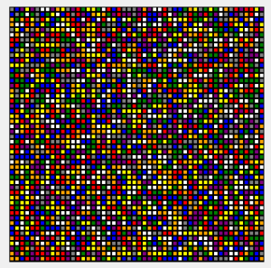
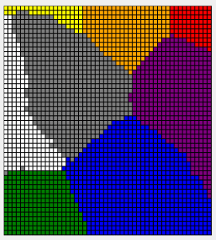

# SOM & indices de diversité {#som-div}

```{r setup, include=FALSE, echo=FALSE, message=FALSE, results='hide'}
SciViews::R
```

##### Objectifs {.unnumbered}

-   Être capable de créer des cartes auto-adaptatives ou SOM, de les interpréter et de les utiliser comme autre technique de classification.

-   Utiliser à bon escient les différents indices de biodiversité.

##### Prérequis {.unnumbered}

TODO...

## Cartes auto-adaptatives (SOM)

Le positionnement multidimensionnel faisant appel à une matrice de distances entre tous les individus, les calculs deviennent vite pénalisants au fur et à mesure que le jeu de données augmente en taille. En général, les calculs sont assez lents. Nous verrons au module suivant que l'**analyse en composantes principales** apporte une réponse intéressante à ce problème, mais nous contraint à étudier des corrélations linéaires et des distances de type euclidiennes.

Une approche radicalement différente, qui reste plus générale car non linéaire, est la méthode des **cartes auto-adaptatives**, ou encore, **cartes de Kohonen** du nom de son auteur se désigne par "self-organizing map" en anglais. L'acronyme **SOM** est fréquemment utilisé, même en français. Cette technique va encore une fois exploiter une matrice de distances dans le but de représenter les individus sur une carte. Cette fois-ci, la carte contient un certain nombre de cellules qui forment une grille, ou mieux, une disposition en nid d'abeille (nous verrons plus loin pourquoi cette disposition particulière est intéressante). De manière similaire au MDS, nous allons faire en sorte que des individus similaires soient proches sur la carte, et des individus différents soient éloignés. La division de la carte en différentes cellules permet de regrouper les individus. Ceci permet une classification comme pour la CAH ou les k-moyennes. Les SOM apparaissent donc comme une technique hybride entre **ordination** (représentation sur des cartes) et **classification** (regroupement des individus).

##### À vous de jouer ! {.unnumbered}

`r h5p(98, height = 270, toc = "Choix des méthodes")`

La théorie et les calculs derrière les SOM sont très complexes. Elles font appel aux **réseaux de neurones adaptatifs** et leur fonctionnement est inspiré de celui du cerveau humain. Tout comme notre cerveau, les SOM vont utiliser l'information en entrée pour aller assigner une zone de traitement de l'information (pour notre cerveau) ou une cellule dans la carte (pour les SOM). Étant donné la complexité du calcul, les développement mathématiques n'ont pas leur place dans ce cours. Ce qui importe, c'est de comprendre le concept, et d'être ensuite capable d'utiliser les SOM à bon escient. Uniquement pour ceux d'entre vous qui désirent comprendre les détails du calcul, vous pouvez lire [ici](https://towardsdatascience.com/kohonen-self-organizing-maps-a29040d688da) ou visionner la vidéo suivante **(facultative et en anglais)** :

```{r, echo=FALSE}
vembedr::embed_youtube("0qtvb_Nx2tA", width = 770, height = 433, query = "end=266")
```

Plutôt que de détailler les calculs, nous vous montrons ici comment un ensemble de pixels de couleurs différentes est organisé sur une carte SOM de Kohonen en un arrangement infiniment plus cohérent... automatiquement (cet exemple est proposé par [Frédéric De Lène Mirouze](https://amethyste16.wordpress.com/about/) dans [son blog](https://amethyste16.wordpress.com/2015/10/24/reseau-de-neurones-les-cartes-auto-adaptatives/)).





Ce qui est évident sur un exemple aussi visuel que celui-ci fonctionne aussi très bien pour ranger les individus dans un tableau multivarié *a priori* chaotique comme ceux que nous rencontrons régulièrement en statistiques multivariées en biologie.

### SOM sur le zooplancton

Reprenons notre exemple du zooplancton.

```{r}
zoo <- read("zooplankton", package = "data.io")
zoo
```

Les 19 premières colonnes représentent des mesures réalisées sur notre plancton et la vingtième est la classe. Nous nous débarrasserons de la colonne classe et transformons les données numériques en **matrice** après avoir standardisé les données (étapes *obligatoires*) pour stocker le résultat dans `zoo_mat`.

```{r}
zoo %>.%
  fselect(., -class) %>.%
  scale(.) %>.%
  as_matrix(.) ->
  zoo_mat
```

Avant de pouvoir réaliser notre analyse, nous devons décider d'avance la topologie de la carte, c'est-à-dire, l'arrangement des cellules ainsi que le nombre de lignes et de colonnes. Le nombre de cellules totales choisies dépend à la fois du niveau de détails souhaité, et du nombre d'individus dans votre jeu de données (il faut naturellement plus de données que de cellules, disons, au moins 5 à 10 fois plus). Pour l'instant, considérons les deux topologies les plus fréquentes : la **grille rectangulaire** et la **grille hexagonale**. Plus le nombre de cellules est important, plus la carte sera détaillée, mais plus il nous faudra de données pour la calculer et la "peupler". Considérons par exemple une grille 7 par 7 qui contient donc 49 cellules au total. Sachant que nous avons plus de 1200 particules de plancton mesurées dans `zoo`, le niveau de détail choisi est loin d'être trop ambitieux.

La grille rectangulaire est celle qui vous vient probablement immédiatement à l'esprit. Il s'agit d'arranger les cellules en lignes horizontales et colonnes verticales. La fonction `somgrid()` du package {kohonen} permet de créer une telle grille.

```{r}
library(kohonen) # Charge le package kohonen
rect_grid_7_7 <- somgrid(7, 7, topo = "rectangular") # Crée la grille
```

Il n'y a pas de graphique `chart` ou `ggplot2` dans le package {kohonen}. Nous utiliserons ici les graphiques de base de R. Pour visualiser la grille, il faut la transformer en un objet **kohonen**. Nous pouvons ajouter plein d'information sur la grille. Ici, nous rajoutons une propriété calculée à l'aide de `unit.distances()` qui est la distance des cellules de la carte par référence à la cellule centrale. Les cellules sont numérotées de 1 à *n* en partant en bas à gauche, en progressant le long de la ligne du bas vers la droite, et en reprenant à gauche à la ligne au dessus. Donc, la ligne du bas contient de gauche à droite les cellules n°1 à 7. La ligne au dessus contient les cellules n°8 à 14, et ainsi de suite. La cellule du centre de la grille en en quatrième ligne en partant du bas et en position 4 sur cette ligne, soit trois lignes complètes plus quatre ($3*7+4=25$). C'est la cellule n°25.

```{r}
rect_grid_7_7 %>.%
  # Transformation en un objet de classe kohonen qui est une liste
  structure(list(grid = .), class = "kohonen") %>.% # Objet de classe kohonen
  plot(., type = "property", # Graphique de propriété
    property = unit.distances(rect_grid_7_7)[25, ], # distance à la cellule 25
    main = "Distance depuis la cellule centrale") # Titre du graphique
```

Les cellules de la grille ne sont pas disposées au hasard dans la carte SOM. Des relations de voisinage sont utilisées pour placer les individus à représenter dans des cellules adjacentes s'ils se ressemblent. Avec une grille rectangulaire, nous avons donc deux modalités de variation : en horizontal et en vertical, ce qui donne deux gradients possibles qui, combinés donnent des extrêmes dans les coins opposés. Une cellule possède huit voisins directs.

L'autre topologie possible est la grille hexagonale. Voyons ce que cela donne :

```{r}
hex_grid_7_7 <- somgrid(7, 7, topo = "hexagonal")

hex_grid_7_7 %>.%
  # Transformation en un objet de classe kohonen qui est une liste
  structure(list(grid = .), class = "kohonen") %>.% # Objet de classe kohonen
  plot(., type = "property", # Graphique de propriété
    property = unit.distances(hex_grid_7_7)[25, ], # distance à la cellule 25
    main = "Distance depuis la cellule centrale") # Titre du graphique
```

Ici, nous n'avons que six voisins directs, mais trois directions dans lesquelles les gradients peuvent varier : en horizontal, en diagonale vers la gauche et en diagonale vers la droite. Cela offre plus de possibilités pour l'agencement des individus. Nous voyons aussi plus de nuances dans les distances (il y a plus de couleurs différentes) pour une grille de même taille 7 par 7 que dans le cas de la grille rectangulaire. **Nous utiliserons donc préférentiellement la grille hexagonale.**

Effectuons maintenant le calcul de notre SOM à l'aide de la fonction `som()` du package {kohonen}. Comme l'analyse fait intervenir le générateur pseudo-aléatoire, nous pouvons utiliser de manière optionnelle `set.seed()` avec un nombre choisi au hasard (et toujours différent à chaque utilisation) pour que cette analyse particulière-là soit reproductible. Sinon, à chaque exécution, nous obtiendrons un résultat légèrement différent.

```{r}
set.seed(8657)
zoo_som <- som(zoo_mat, grid = somgrid(7, 7, topo = "hexagonal"))
summary(zoo_som)
```

Le résumé de l'objet ne nous donne pas beaucoup d'info. C'est normal. La technique étant visuelle, ce sont les représentations graphiques qui sont à utiliser ici. Avec les graphiques R de base, la fonction utilisée est `plot()`. Nous avons plusieurs types disponibles et une large palette d'options. Voyez l'aide en ligne de`?plot.kohonen`. Le premier graphique (`type = "changes"`) montre l'évolution de l'apprentissage au fil des itérations. L'objectif est de descendre le plus possible sur l'axe des ordonnées pour réduire au maximum la distance des individus par rapport aux cellules ("units" en anglais) où ils devraient se placer. Idéalement, nous souhaitons tendre vers zéro. En pratique, nous pourrons arrêter les itérations lorsque la courbe ne diminue plus de manière significative.

```{r}
plot(zoo_som, type = "changes")
```

Ici, il semble que nous ne diminuons plus vraiment à partir de l'itération 85 environ. Nous pouvons nous en convaincre en relançant l'analyse avec un plus grand nombre d'itérations (avec l'argument `rlen =` de `som()`).

```{r}
set.seed(954)
zoo_som <- som(zoo_mat, grid = somgrid(7, 7, topo = "hexagonal"), rlen = 200)
plot(zoo_som, type = "changes")
```

Vous serez sans doute surpris de constater que la diminution de la courbe se fait plus lentement maintenant. En fait `som()` va adapter son taux d'apprentissage en fonction du nombre d'itérations qu'on lui donne et va alors "peaufiner le travail" d'autant plus. Au final, la valeur n'est pas plus basse pour autant. Donc, nous avons aboutit probablement à une solution.

Le second graphique que nous pouvons réaliser consiste à placer les individus dans la carte, en utilisant éventuellement une couleur différente en fonction d'une caractéristique de ces individus (ici, leur `class`e). Ce graphique est obtenu avec `type = "mapping"`. Si vous ne voulez pas représenter la grille hexagonale à l'aide de cercles, vous pouvez spécifier `shape = "straight"`. Nous avons 17 classes de zooplancton et il est difficile de représenter plus de 10-12 couleurs distinctes, mais [ce site](https://sashat.me/2017/01/11/list-of-20-simple-distinct-colors/) propose une palette de 20 couleurs distinctes. Nous en utiliserons les 17 premières...

```{r}
colors17 <- c("#e6194B", "#3cb44b", "#ffe119", "#4363d8", "#f58231", "#911eb4",
  "#42d4f4", "#f032e6", "#bfef45", "#fabebe", "#469990", "#e6beff", "#9A6324",
  "#fffac8", "#800000", "#aaffc3", "#808000", "#ffd8b1")
plot(zoo_som, type = "mapping", shape = "straight", col = colors17[zoo$class])
```

Nous n'avons pas ajouté de légende qui indique à quelle classe correspond quelle couleur. Ce que nous voulons voir, c'est si les cellules arrivent à séparer les classes. Nous voyons que la séparation est imparfaite, mais des tendances apparaissent avec certaines couleurs qui se retrouvent plutôt dans une région de la carte.

Nous voyons donc ici que, malgré que l'information contenue dans `class` n'ait pas été utilisées. Les différents individus de zooplancton ne se répartissent pas au hasard en fonction de ce critère. Nous pouvons également observer les cellules qui contiennent plus ou moins d'individus, mais si l'objectif est de visionner *uniquement* le remplissage des cellules, le `type = "counts"` est plus adapté.

```{r}
plot(zoo_som, type = "counts", shape = "straight")
```

Nous pouvons obtenir la cellule dans laquelle chaque individu est mappé comme suit :

```{r}
zoo_som$unit.classif
```

Par conséquent, nous pouvons créer un tableau de contingence qui répertorie le nombre d'individus mappés dans chaque cellule à l'aide de `table()`. Nous l'enregistrons dans `zoo_som_nb` car nous la réutiliserons plus tard.

```{r}
zoo_som_nb <- table(zoo_som$unit.classif)
zoo_som_nb
```

### Interprétation d'un SOM

De nombreuses autres présentations graphiques sont possibles sur cette base. Nous allons explorer deux aspects complémentaires : (1) représentation des variables, et (2) réalisation et représentation de regroupements.

#### Représentation des variables

La carte SOM est orientée. C'est-à-dire que les cellules représentent des formes différentes de plancton telles qu'exprimées à travers les 19 variables utilisées ici (quantification de la taille, de la forme, de la transparence, ...). Le graphique `type = "codes"` permet de visualiser ces différences de manière générale :

```{r, fig.height=7}
plot(zoo_som, type = "codes", codeRendering = "segments")
```

Ce graphique est riche en informations. Nous voyons que :

-   les très grands individus (`ecd`, `area`, `perimeter`, etc.), soit les segments verts sont en haut à gauche de la carte et les petits sont à droite,
-   les individus opaques (variables `mean`, `mode`, `max`, etc.[^10-som-div-1]), soit des segments dans les tons jaunes sont en haut à droite. Les organismes plus transparents sont en bas à gauche,
-   au delà de ces deux principaux critères qui se dégagement prioritairement, les aspects de forme (segments rose-rouges) se retrouvent exprimés moins nettement le long de gradients. La `circularity` mesure la silhouette plus ou moins arrondie des items (sa valeur est d'autant plus élevée que la forme se rapproche d'un cercle). Les organismes circulaires se retrouvent dans le haut de la carte. L'`elongation` et l'`aspect` mesurent l'allongement de la particule et se retrouvent plutôt exprimés positivement dans le bas de la carte.

[^10-som-div-1]: Attention : la variable `transparency`, contrairement à ce que son nom pourrait suggérer n'est pas une mesure de la transparence de l'objet, mais de l'aspect plus ou moins régulier et lisse de sa silhouette.

Nous pouvons donc **orienter** notre carte SOM en indiquant l'information relative aux variables. Lorsque le nombre de variables est élevé ou relativement élevé comme ici, cela devient néanmoins difficile à lire. Il est aussi possible de colorer les cartes en fonction d'une et une seule variable pour en faciliter la lecture à l'aide de `type = "property"`. Voici quelques exemples (notez la façon de diviser une page graphique en lignes et colonnes à l'aide de `par(mfrow = ))` en graphiques R de base, ensuite une boucle `for` réalise les six graphiques l'un après l'autre) :

```{r}
par(mfrow = c(2, 3))
for (var in c("size", "mode", "range", "aspect", "elongation", "circularity"))
  plot(zoo_som, type = "property", property = zoo_som$codes[[1]][, var],
    main = var, palette.name = viridis::inferno)
```

Nous pouvons plus facilement inspecter les zones d'influence de différentes variables ciblées. Ici, `size` est une mesure de la taille des particules, `mode` est le niveau d'opacité moyen, `range` est la variation d'opacité (un `range` important indique que la particule a des parties très transparentes et d'autres très opaques), `aspect` est le rapport longueur/largeur, `elongation` est une indication de la complexité du périmètre de la particule, et `circularity` est sa forme plus ou moins circulaire. Pour une explication détaillée des 19 variables, faites `?zooplankton`.

#### Regroupements

Lorsque nous avons réalisé une CAH sur le jeu de données `zooplankton`, nous étions obligés de choisir deux variables parmi les 19 pour visualiser le regroupement sur un graphique nuage de points. C'est peu, et cela ne permet pas d'avoir une vision synthétique sur l'ensemble de l'information. Les méthodes d'ordination permettent de visualiser plus d'information sur un petit nombre de dimensions grâce aux techniques de réduction des dimensions qu'elles implémentent. Les cartes SOM offrent encore un niveau supplémentaire de raffinement. Nous pouvons considérer que chaque cellule est un premier résumé des données et nous pouvons effectuer ensuite une CAH sur ces cellules afin de dégager un regroupement et le visualiser sur la carte SOM. L'intérêt est que l'on réduit un jeu de données potentiellement très volumineux à un nombre plus restreint de cellules (ici 7x7 = 49), ce qui est plus "digeste" pour la CAH. Voici comment ça fonctionne (notez que `dissimilarity()` attend un **data frame** alors que `som()` travaille avec des objets **matrix**, donc une conversion s'impose ici) :

```{r, include=FALSE}
# CAH for SciViews, version 1.2.0
# Copyright (c) 2021, Philippe Grosjean (phgrosjean@sciviews.org)

SciViews::R

# dist is really a dissimilarity matrix => we use dissimilarity() as in the
# {cluster} package, i.e., class is c("dissimilarity", "dist")
# TODO: also make a similarity object and convert between the two
# fun can be stats::dist, vegan::vegdist, vegan::designdist, cluster::daisy
# factoextra::get_dist and probably other dist-compatible functions
# Depending on method =, use either vegan::vegdist or stats::dist as default fun
dissimilarity <- function(data, formula = ~ ., subset = NULL,
  method = "euclidean", scale = FALSE, rownames.col = "rowname",
  transpose = FALSE, fun = NULL, ...) {
  # TODO: get more meaningful warnings and errors by replacing fun by actual
  # name of the function
  if (is.null(fun)) {# Default function depends on the chosen method
    if (method %in% c("maximum", "binary", "minkowski")) {
      fun <- stats::dist
    } else {
      fun <- vegan::vegdist # Note: euclidean/manhattan/canberra in both, but
      # we prioritize vegdist, and canberra is not calculated the same in dist!
    }
  }
  # We accept only formulas with right-hand side => length must be two
  if (length(formula) == 3)
    stop("The formula cannot have a left-hand term")

  # With matrices, we don't use rownames.col: rownames are already correctly set
  if (!is.matrix(data)) {# row names may be in a column (usual for tibbles)
    data <- as.data.frame(data)
    if (rownames.col %in% names(data)) {
      rownames(data) <- data[[rownames.col]]
      data[[rownames.col]] <- NULL
    } else {# rownames.col is NOT used
      rownames.col <- NULL
    }
    if (as.character(formula[2] != ".")) {
      # Subset the columns
      data <- model.frame(formula, data = data, subset = subset)
    } else if (!is.null(subset)) {
      data <- data[subset, ]
    }
  } else {# A matrix
    rownames.col <- NULL
    if (as.character(formula[2] != ".")) {
      # Subset the columns (and possibly the rows)
      if (is.null(subset)) {
        data <- data[, all.vars(formula)]
      } else {
        data <- data[subset, all.vars(formula)]
      }
    }
  }

  if (isTRUE(transpose))
    data <- t(data)

  # Arguments method =/metric = and stand = not always there
  if (!is.null(as.list(args(fun))$metric)) {# metric = instead of method =
    dst <- fun(data, metric = method, stand = scale, ...)
  } else if (isTRUE(scale)) {
    if (is.null(as.list(args(fun))$stand)) {# fun has no stand = argument
      data <- scale(data)
      dst <- fun(data, method = method, ...)
    } else {# We don't standardise ourself because there may be also qualitative
      # or binary data (like for cluster::daisy, for instance)
      dst <- fun(data, method = method, stand = scale, ...)
    }
  } else {# Just method = and scale = FALSE
    dst <- fun(data, method = method, ...)
  }
  attr(dst, "call") <- match.call()
  # Depending if it is a dist or dissimilarity object, the method is stored in
  # method or in Metric, but we use metric in our own version to avoid a clash
  # with the method item in cluster()/hclust() further on (hclust change it
  # into dist.method, but it is better to have the right name right now)
  attr(dst, "metric") <- method
  # dist or dissimilarity object use Labels, but we use labels everywhere else
  # including in cluster()/hclust()
  # So, we make sure labels is present (in hclust, it is labels anyway!)
  attr(dst, "labels") <- rownames(data)
  # Default values for Diag and Upper set to FALSE
  if (is.null(attr(dst, "Diag"))) attr(dst, "Diag") <- FALSE
  if (is.null(attr(dst, "Upper"))) attr(dst, "Upper") <- FALSE
  # Keep info about how raw data were transformed
  attr(dst, "rownames.col") <- rownames.col
  attr(dst, "transpose") <- transpose
  attr(dst, "scale") <- scale
  class(dst) <- unique(c("dissimilarity", class(dst)))
  dst
}

as.dissimilarity <- function(x, ...)
  UseMethod("as.dissimilarity")
as_dissimilarity <- as.dissimilarity # Synonym

as.dissimilarity.matrix <- function(x, ...) {
  dst <- as.dist(x, ...)
  attr(dst, "call") <- match.call()
  attr(dst, "metric") <- attr(dst, "method") # Make sur metric is used
  class(dst) <- unique(c("dissimilarity", class(dst)))
  dst
}

# We want to print only the first few rows and columns
print.dissimilarity <- function(x, digits.d = 3L, rownames.lab = "labels",
...) {
  mat <- as.matrix(x)
  mat <- format(round(mat, digits.d))
  diag(mat) <- ""
  mat[upper.tri(mat)] <- ""
  class(mat) <- c("dst", "matrix")
  tbl <- tibble::as_tibble(mat)
  #tbl <- tibble::add_column(tbl, {{rownames.lab}} = rownames(mat), .before = 1)
  # I prefer this
  tbl <- dplyr::bind_cols(
    as_tibble_col(rownames(mat), column_name = rownames.lab), tbl)
  tbl <- tbl[, -ncol(tbl)]
  more_info <- ""
  if (isTRUE(attr(x, "scale"))) {
    if (isTRUE(attr(x, "transpose"))) {
      more_info <- " (transposed then scaled data)"
    } else {# Only scaled
      more_info <- " (scaled data)"
    }
  } else {
    if (isTRUE(attr(x, "transpose")))
      more_info <- " (transposed data)"
  }
  cat("Dissimilarity matrix with metric: ", attr(x, "metric"),
    more_info, "\n", sep = "")
  print(tbl)
  invisible(x)
}

labels.dissimilarity <- function(object, ...) {
  labs <- object$labels
  if (is.null(labs)) object$Labels
}

nobs.dissimilarity <- function(object, ...)
  attr(object, "Size")

# TODO: `[` by first transforming into a matrix with as.matrix()

autoplot.dissimilarity <- function(object, order = TRUE, show.labels = TRUE,
lab.size = NULL, gradient = list(low = "red", mid = "white", high = "blue"),
...) {
  factoextra::fviz_dist(object, order = order, show_labels = show.labels,
    lab_size = lab.size, gradient = gradient)
}

chart.dissimilarity <- function(data, ...,
type = NULL, env = parent.frame())
  autoplot(data, type = type, ...)

# cluster object (inheriting from hclust)
cluster <- function(x, ...)
  UseMethod("cluster")

cluster.default <- function(x, ...)
  stop("No method for object of class ", class(x)[1])

# Cluster uses hclust() by default, ... but it looks first for a faster
# implementation in either {fastcluster} or {flashClust} before falling back
# to the {stats} version.
# The functions cluster::agnes() and cluster::diana() should be compatible too,
# as well as any function that returns an object convertible into hclust
# by as.hclust() (but not tested yet)
# Also, a version where the raw data are provided and the disimilarity matrix
# is internally calculated should be also provided (see cluster::agnes)
# See also {ape} for phylogenetic trees methods
cluster.dist <- function(x, method = "complete", fun = NULL, ...) {
  if (is.null(fun)) {
    # We try fastcluster, then flashClust, then stats
    fun <- try(fastcluster::hclust, silent = TRUE)
    if (inherits(fun, "try-error"))
      fun <- try(flashClust::hclust, silent = TRUE)
    if (inherits(fun, "try-error"))
      fun <- try(stats::hclust, silent = TRUE)
  }
  clst <- fun(x, method = method, ...)
  clst <- as.hclust(clst)
  clst$call <- match.call()
  # hclust has to give a different name to the distance metric: dist.method
  # but we use metric. Again, keep both for maximum compatibility
  clst$metric <- clst$dist.method
  # If the original data were scaled or transposed, get the info also
  clst$rownames.col <- attr(x, "rownames.col")
  clst$scale <- attr(x, "scale")
  clst$transpose <- attr(x, "transpose")
  class(clst) <- unique(c("cluster", class(clst)))
  clst
}

# A couple of useful methods for our cluster object
# str() method is gathered from a dendrogram object
str.cluster <- function(object, max.level = NA, digits.d = 3L, ...)
  str(as.dendrogram(object), max.level = max.level, digits.d = digits.d, ...)

labels.cluster <- function(object, ...)
  object$labels

nobs.cluster <- function(object, ...)
  length(object$order)

# Other methods by first transforming into dendrogram: rev, reorder, order, [[

# cutree() is an explicit name, but it does not follow the rule of using
# known methods... and here, it really something that predict() is made for,
# except it cannot handle newdata =, but that argument is not in its definition
predict.cluster <- function(object, k = NULL, h = NULL, ...)
  cutree(object, k = k, h = h)

# There is no broom::glance() or broom::tidy() yet (what to put in it?),
# but broom:augment() should be nice = add the clusters as .fitted in the tibble
library(broom)
augment.cluster <- function(x, data, k = NULL, h = NULL, ...) {
  # Should we transpose the data (note: this is against augment() rules, but...)
  if (isTRUE(x$transpose)) {
    # We first have to make sure rownames are correct before the transposition
    if (!is.matrix(data) && !is.null(data[[x$rownames.col]])) {
      rownames(data) <- data[[x$rownames.col]]
      data[[x$rownames.col]] <- NULL
    }
    data <- t(data)
    msg <- "transposed data"
  } else {
    msg <- "data"
  }
  data <- as_tibble(data)

  # Get clusters
  clst <- predict(x, k = k, h = h, ...)
  if (nrow(data) != length(clst)) {
    stop("Different number of items in ", msg, " (",nrow(data) ,
      ") and in the clusters (", length(clst), ")")
  }
  tibble::add_column(data, .fitted = clst)
}

# Instead of the default plot.hclust(), we prefer the plot.dendrogram() version
# that allows for more and better variations of the dendrogram (horizontal or
# circular), see http://www.sthda.com/english/wiki
# /beautiful-dendrogram-visualizations-in-r-5-must-known-methods
# -unsupervised-machine-learning
plot.cluster <- function(x, y, labels = TRUE, hang = -1, check = TRUE,
type = "vertical", lab = "Height", ...) {
  type <- match.arg(type[1], c("vertical", "horizontal", "circular"))
  # type == "circular" is special because we need to transform as ape::phylo
  if (type == "circular") {
    if (!missing(hang))
      warning("'hang' is not used with a circular dendrogram")
    phylo <- ape::as.phylo(x)
    plot(phylo, type = "fan", font = 1, show.tip.label = labels, ...)
  } else {# Use plot.dendrogram() instead
    # We first convert into dendrogram objet, then we plot it
    # (better that plot.hclust())
    if (isTRUE(labels)) leaflab <- "perpendicular" else leaflab <- "none"
    dendro <- as.dendrogram(x, hang = hang, check = check)
    if (type == "horizontal") {
      plot(dendro, horiz = TRUE, leaflab = leaflab, xlab = lab, ...)
    } else {
      plot(dendro, horiz = FALSE, leaflab = leaflab, ylab = lab, ...)
    }
  }
}

# This is to draw circles in a plot (where to cut in a circular dendrogram)
# TODO: should be nice to do similar function for other symbols too in SciViews
circle <- function(x = 0, y = 0, d = 1, col = 0, lwd = 1, lty = 1, ...)
  symbols(x = x, y = y, circles = d / 2, fg = col, lwd = lwd, lty = lty,
    inches = FALSE, add = TRUE, ...)

# TODO: make sure the dendrogram is correct with different ggplot themes
autoplot.cluster <- function(object, labels = TRUE, type = "vertical",
circ.text.size = 3, theme = theme_sciviews(), xlab = "", ylab = "Height", ...) {
  if (is.null(type))
    type <- "vertical"
  type <- match.arg(type[1], c("vertical", "horizontal", "circular"))

  # Create the dendrogram
  ddata <- ggdendro::dendro_data(object, type = "rectangle")
  dendro <- ggplot(ggdendro::segment(ddata)) +
    geom_segment(aes(x = x, y = y, xend = xend, yend = yend)) +
    theme + xlab(xlab) + ylab(ylab)

  if (type == "circular") {
    if (isTRUE(labels)) {
      # Get labels (need one more to avoid last = first!)
      label_df <- tibble::tibble(labels = c(labels(object)[object$order], ""))
      xmax <- nobs(object) + 1
      label_df$id <- 1:xmax
      angle <-  360 * (label_df$id - 0.5) / xmax
      # Left or right?
      label_df$hjust <- ifelse(angle < 270 & angle > 90, 1, 0)
      # Angle for more readable text
      label_df$angle <- ifelse(angle < 270 & angle > 90, angle + 180, angle)
    }

    # Make the dendrogram circular
    dendro <- dendro +
      scale_x_reverse() +
      scale_y_reverse() +
      coord_polar(start = pi/2)
    if (isTRUE(labels))
      dendro <- dendro +
        geom_text(data = label_df,
          aes(x = id, y = -0.02, label = labels, hjust = hjust),
          size = circ.text.size, angle = label_df$angle, inherit.aes = FALSE)
    dendro <- dendro +
      theme(panel.border = element_blank(),
        axis.text = element_blank(),
        axis.line = element_blank(),
        axis.ticks.y = element_blank()) +
      ylab("")

  } else if (type == "vertical") {# Vertical dendrogram
    dendro <- dendro +
      scale_x_continuous(breaks = seq_along(ddata$labels$label),
        labels = ddata$labels$label) +
      scale_y_continuous(expand = expansion(mult = c(0, 0.02))) +
      theme(panel.border = element_blank(),
        axis.text.x = element_text(angle = 90, hjust = 1, vjust = 0.5),
        axis.line.x = element_blank(),
        axis.ticks.x = element_blank(),
        axis.text.y = element_text(angle = 90, hjust = 0.5))
    if (!isTRUE(labels))
      dendro <- dendro +
        theme(axis.text.x = element_blank())

  } else {# Horizontal dendrogram
    dendro <- dendro +
      scale_x_continuous(breaks = seq_along(ddata$labels$label),
        labels = ddata$labels$label, position = "top") +
      scale_y_reverse(expand = expansion(mult = c(0.05, 0))) +
      coord_flip() +
      theme(panel.border = element_blank(),
        axis.line.y = element_blank(),
        axis.ticks.y = element_blank())
    if (!isTRUE(labels))
      dendro <- dendro +
        theme(axis.text.y = element_blank())
  }
  dendro
}

chart.cluster <- function(data, ...,
  type = NULL, env = parent.frame())
  autoplot(data, type = type, ...)

# To indicate where to cut in the dendrogram, one could use `geom_hline()`,
# but when the dendrogram is horizontal or circular, this is suprizing. So,
# I define geom_dendroline(h = ....)
geom_dendroline <- function(h, ...)
  geom_hline(yintercept = h, ...)
```

```{r}
# Distance euclidienne entre cellules
zoo_som_dist <- dissimilarity(as.data.frame(zoo_som$codes[[1]]),
  method = "euclidean")
zoo_som_cah <- cluster(zoo_som_dist, method = "ward.D2", members = zoo_som_nb)
```

Notre CAH a été réalisée ici avec la méthode D2 de Ward. L'argument `members =` est important. Il permet de pondérer chaque cellule en fonction du nombre d'individus qui y sont mappés. Toutes les cellules n'ont pas un même nombre d'individus, et nous souhaitons mettre plus de poids dans l'analyse aux cellules les plus remplies.

Voici le dendrogramme :

```{r}
chart(zoo_som_cah) +
  geom_dendroline(h = 10.5, col = "red") # Niveau de coupure proposé
```

Les V1 à V49 sont les numéros de cellules. Nous pouvons couper à différents endroits dans ce dendrogramme, mais si nous décidons de distinguer les six groupes correspondants au niveau de coupure à une hauteur de 10,5 (comme sur le graphique), voici ce que cela donne :

```{r}
groupes <- predict(zoo_som_cah, h = 10.5)
groupes
```

Visualisons ce découpage sur la carte SOM (l'argument `bgcol =` colorie le fond des cellules en fonction des groupes[^10-som-div-2], et `add.cluster.boudaries()` individualise des zones sur la carte en fonction du regroupement choisi).

[^10-som-div-2]: Nous avons choisi ici encore une autre palette de couleurs provenant du package {RColorBrewer}, voir [ici](http://www.sthda.com/french/wiki/couleurs-dans-r).

```{r}
plot(zoo_som, type = "mapping", pch = ".", main = "SOM zoo, six groupes",
  bgcol =  RColorBrewer::brewer.pal(5, "Set2")[groupes])
add.cluster.boundaries(zoo_som, clustering = groupes)
```

Grâce à la topographie des variables que nous avons réalisée plus haut, nous savons que :

-   le groupe vert bouteille en bas reprend les petites particules plutôt transparentes,
-   le groupe orange à droite est constitué de particules très contrastées avec des parties opaques et d'autres transparentes (`range` dans les niveaux de gris important) mais globalement foncées (`mode` correspondant au niveau de gris le plus représenté faible),
-   le groupe du dessus à droite en blanc est constitué d'autres particules très contrastées, mais à dominante claire (`mode` élevé),
-   le groupe bleu est constitué des particules moyennes à grandes ayant une forme complexe (variable `elongation` élevée),
-   les groupes vert clair et rose en haut à gauche reprend les toutes grandes particules, avec la cellule unique en rose qui reprend les plus grosses.

Nous n'avons fait qu'effleurer les nombreuses possibilités des cartes auto-adaptatives SOM... Il est par exemple possible d'aller mapper des nouveaux individus dans cette carte (données supplémentaires), ou même de faire une classification sur base d'exemples (classification supervisée) que nous verrons au cours de Science des Données Biologiques III. Nous espérons que cela vous donnera l'envie et la curiosité de tester cette méthode sur vos données et d'explorer plus avant ses nombreuses possibilités.

##### Pour en savoir plus {.unnumbered}

-   Une [explication très détaillée en français](https://meritis.fr/ia/cartes-topologiques-de-kohonen/) accompagnée de la résolution d'un exemple fictif dans R.

-   Une [autre explication détaillée en français](http://eric.univ-lyon2.fr/~ricco/tanagra/fichiers/fr_Tanagra_Kohonen_SOM_R.pdf) avec exemple dans R.

-   Si vous êtes aventureux, vous pouvez vous lancer dans la réimplémentation des graphiques du package {kohonen} en {chart} ou {ggplot2}. Voici [un bon point de départ](http://blog.schochastics.net/post/soms-and-ggplot/) (en anglais).

##### À vous de jouer ! {.unnumbered}

`r learnr("B06Lc_som", title = "Ordination et regroupement grâce aux cartes auto-adaptatives", toc = "Ordination et regroupement grâce aux cartes auto-adaptatives")`

```{r assign_B06Ia_fish_market_III, echo=FALSE, results='asis'}
if (exists("assignment"))
  assignment("B06Ia_fish_market", part = "III",
    url = "https://github.com/BioDataScience-Course/B06Ia_fish_market",
    course.ids = c(
      'S-BIOG-061' = !"B06Ia_{YY}M_fish_market",
      'S-BIOG-937-958-959' = !"B06Ia_{YY}C_fish_market"),
    course.urls = c(
      'S-BIOG-061' = "https://classroom.github.com/a/...",
      'S-BIOG-937-958-959' = "https://classroom.github.com/a/..."),
    course.starts = c(
      'S-BIOG-061' = !"{W[24]+1} 15:00:00"),
    course.ends = c(
      'S-BIOG-061' = !"{W[26]+1} 23:59:59"),
    term = "Q2", level = 3,
    toc = "Analyse multivarée sur 7 poissons (III)")
```

## Récapitulatif des exercices

Ce dixième module vous a permis de comprendre les cartes auto-adaptatives et les indices de biodiversité. Pour évaluer votre compréhension de cette matière vous aviez les exercices suivants à réaliser :

`r show_ex_toc()`

##### Progression {.unnumbered}

`r launch_report("06", height = 800)`
